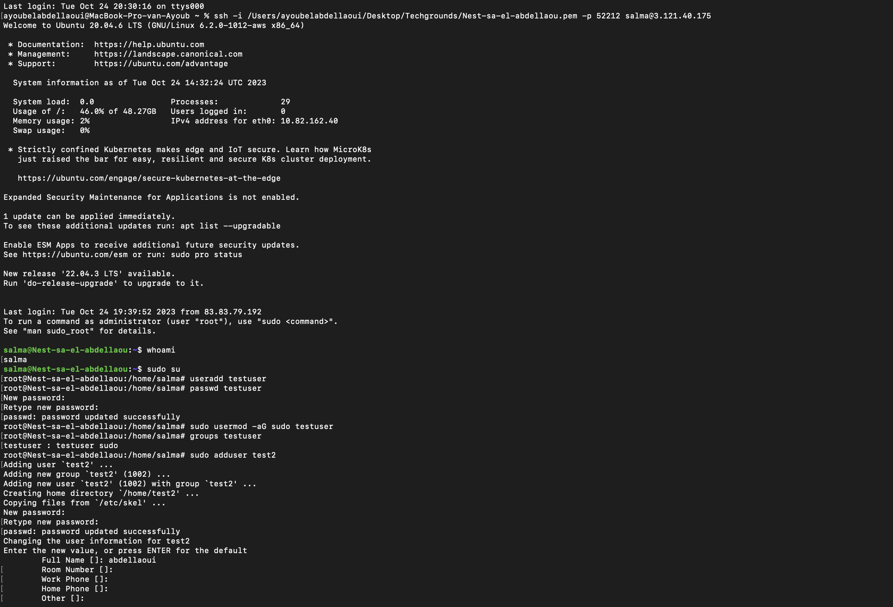
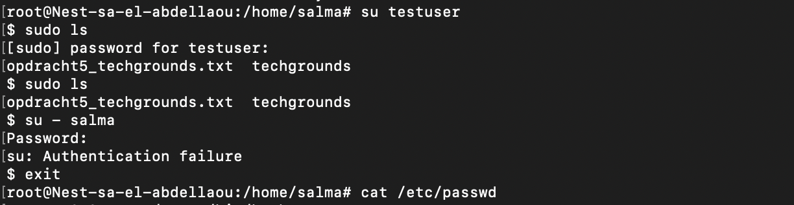
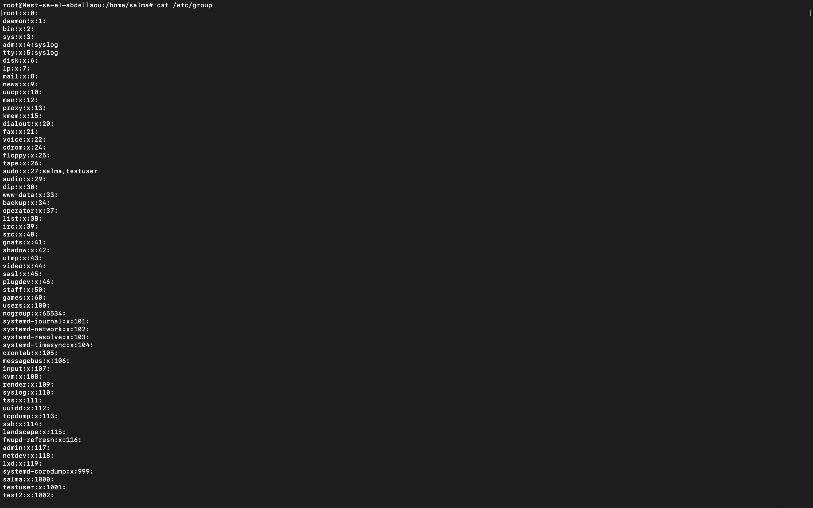
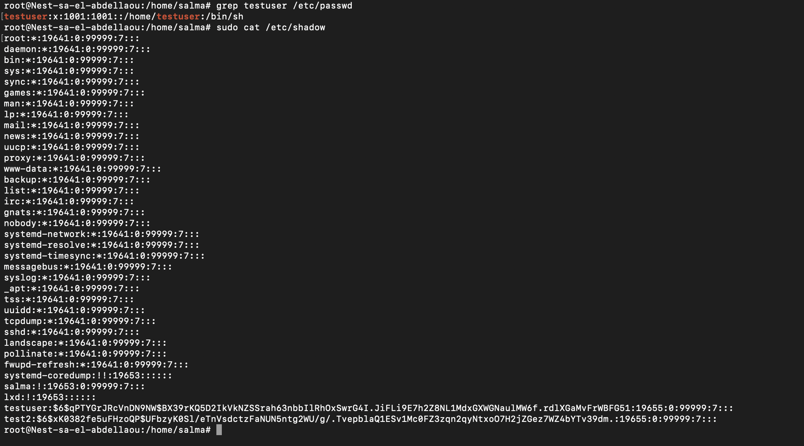
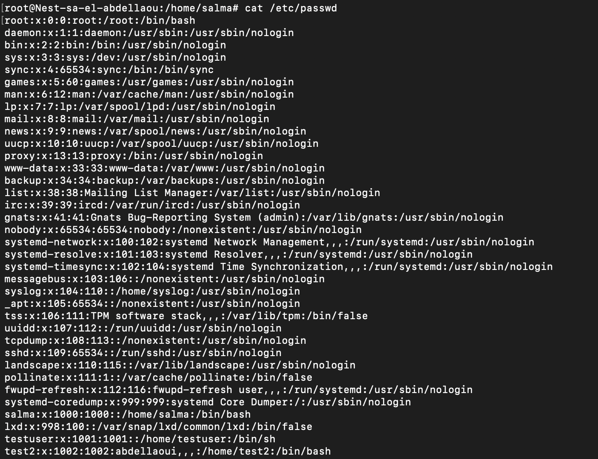

# Gebruikers en Groeps
Linux maakt gebruik van gebruikers. Elke gebruiker heeft zijn eigen thuismap. Gebruikers kunnen ook deel uitmaken van groepen. Er is een speciale gebruiker genaamd 'root'. Root heeft de bevoegdheid om alles te doen.  

## Key-terms
* __Root gebruiker:__  
De rootgebruiker heeft volledige controle over het systeem en heeft onbeperkte bevoegdheden. Dit betekent dat ze wijzigingen kunnen aanbrengen in elk aspect van het besturingssysteem, bestanden kunnen aanmaken of verwijderen, systeembronnen kunnen beheren en alle handelingen kunnen uitvoeren zonder beperkingen.  
  
    De volgende commando geeft jouw de functie Root, hiermee kan je users toevoegen en eventueel rechten verlenen:
  
  ```
  commando: sudo su 
  ```  
* __sudo:__    
In Linux kunnen gebruikers tijdelijke rootmachtigingen verkrijgen door het sudo-commando te gebruiken. Dit is handig om veilig systeembeheertaken uit te voeren zonder voortdurend als root ingelogd te zijn. Het gebruik van sudo vereist echter de juiste rechten.    

  Met de volgende commando kan men een user toevoegen:  
   ```
  commando: useradd <gebruiker>
  ```  
  Met de volgende commando kan men de nieuwe gebruiker een wachtwoord geven:
  ```
  commando: passwd <gebruiker>
  ``` 
  Om de nieuwe gebruiker sudo rechten te verlenen, gebruik je de volgende commando:   
  ```
  commando: sudo usermod -aG sudo <gebruiker>
  ```   
  Om erachter te komen of de gebruiker sudo rechten heeft gekregen, zou het systeem automatosch een map moeten aanmaken met 'sudo' ervoor. Dit kan je achterhalen door de volgende commando te typen:  
    
    ```
  commando: groups <gebruiker>
  ```   
  Om een user meteen te koppelen aan een admin kan je de volgende commando gebruiken:  
   ```
  commando: sudo useradd -g users -G admin <gebruiker>
  ```     

* __Lokaliseren van files:__     
Je kunt bestanden lokaliseren binnen een terminal of opdrachtregelomgeving in Linux met behulp van opdrachten zoals find, locate, en grep.   
  
  de volgende commando's worden gebruikt om de gebruikers, groepen en wachtwoorden te vinden en te openen:   
    
     ```
  commando: sudo cat/etc/passwd [gebruikers]
  ```   
   ```
  commando: sudo cat/etc/shadow [wachtwoorden]
  ```   
   ```
  commando: sudo cat/etc/group [groepen]
  ```   

## Opdracht  
  Maak een nieuwe gebruiker aan en geef deze sudo rechten en voeg deze gebruiker meteen toe aan een admin groep. Ook dient deze gebruiker een wachtwoord te krijgen. localiseer vervolgens de files waar de gebruikers, wachtwoorden en groepen in te vinden zijn. 

### Gebruikte bronnen
* https://chat.openai.com  
 

### Resultaat  
Het aanmaken van een nieuwe user + wachtwoord en het toekennen van sudo rechten:   

    

De nieuwe user voert sudo commando's uit:  
   
  
Hierbij is de commando gebruikt die de gebruikers toont:
        

Hierbij is de commando gebruikt om de wachtwoorden file naar boven te halen:   
   
    
Hierbij is de commando gebruikt om de gebruikers file naar boven te halen:
    

  

   

