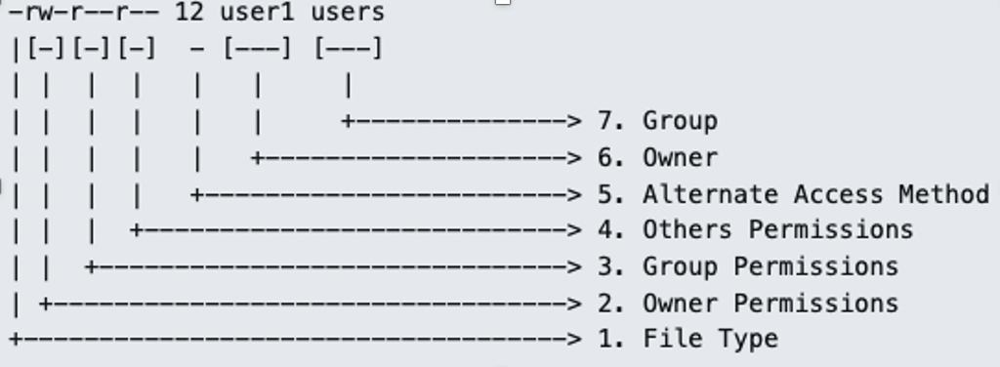
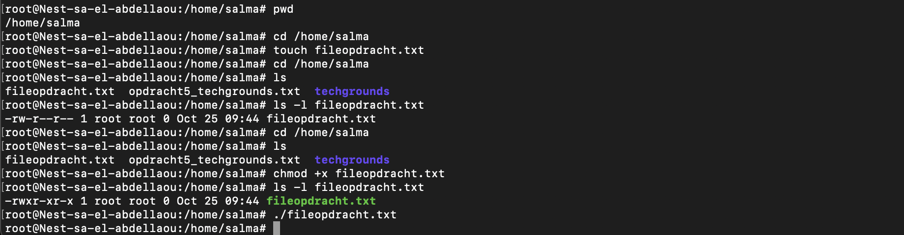
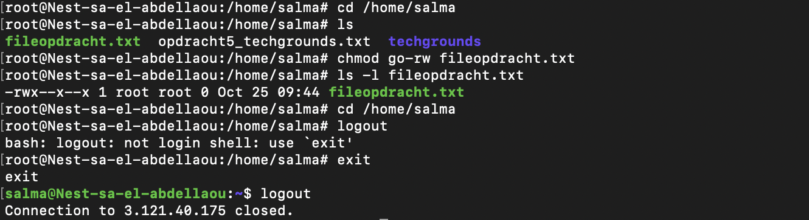
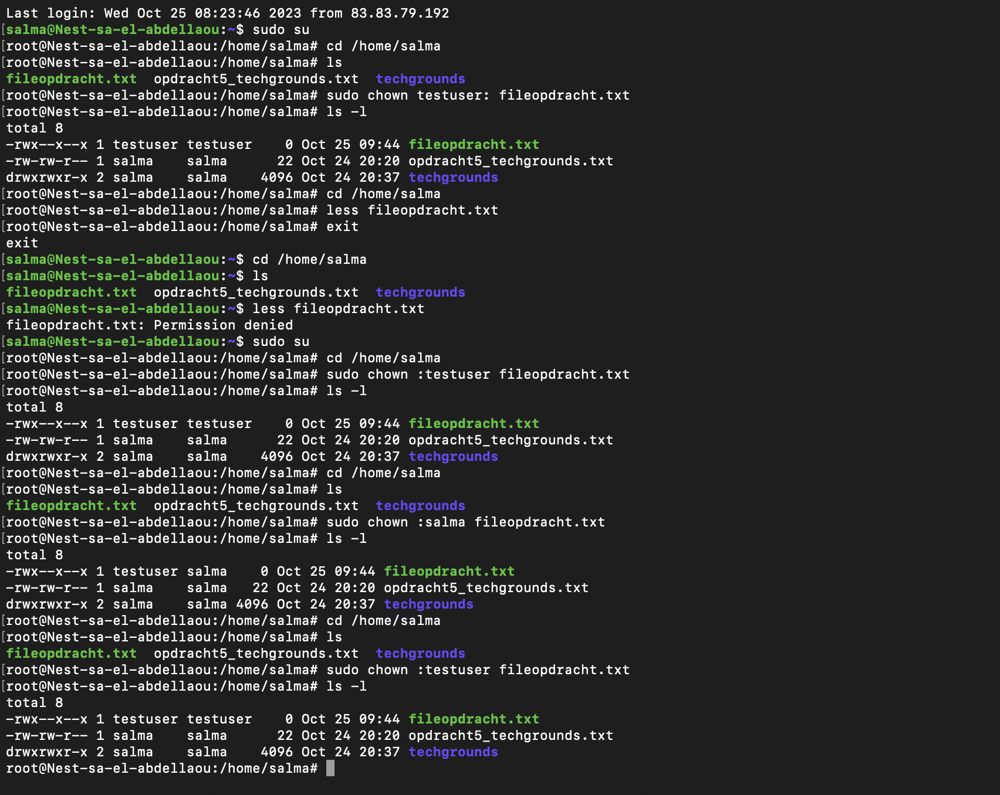

# Permissies 
Ieder bestand in Linux bevat een reeks machtigingen. Er zijn afzonderlijke machtigingen voor lezen, schrijven en uitvoeren van bestanden (rwx). Er zijn ook drie soorten entiteiten die verschillende machtigingen kunnen hebben: de eigenaar van het bestand, een groep en alle anderen. Root heeft geen machtigingen nodig om een bestand te lezen, schrijven of uitvoeren.

Je kunt de machtigingen van een bestand bekijken door een 'long list' te maken. De machtigingen van een bestand, evenals de eigenaar en groep, kunnen ook worden gewijzigd.

## Key-terms
* __Long list:__     
Een "long listing" (lange lijst) in de terminal verwijst naar een uitvoerformaat dat wordt gegenereerd wanneer je de ls-opdracht gebruikt met bepaalde opties om gedetailleerde informatie over bestanden en mappen weer te geven. Dit formaat toont niet alleen de namen van bestanden en mappen, maar ook aanvullende informatie, zoals machtigingen, eigenaar, groep, bestandsgrootte, wijzigingsdatum en meer. Een lange lijst is handig om een dieper inzicht te krijgen in de eigenschappen van bestanden en mappen in een directory.   

  Om een lange lijst van bestanden en mappen in de huidige directory weer te geven, kun je het volgende commando gebruiken:  
    
    ```
    commando: ls -l <filename>
  ```      
  Vervolgens ziet de long list er als volgt uit:    
  ```
    -rw-r--r-- 12 <user> <group>  <datum> <tijd> <filename>
  ```   
  Met de volgende afbeelding kan men achterhalen wat alles betekent in de long list.   
         
    
    De volgende manier laat zien hoe je rechten kunt verwijderen van groep en andere: 

     ```
    commando: chmod go-rw <file>    |  commando: chmod 700 <file>
  ```  
    
    Het veranderen van de owner van de file doe je als volgt: 
     ```
    commando: sudo chown :<new_user>  <filename>   
  ```   
  Het veranderen van de groep rechten doe je als volgt:
    ```
    commando: sudo chgrp <new_group> <filename>    
  ```   
  r= read w = write rw= reads + writes  
+r adds read permission  |  -r removes read permission.
  

* __Executabel:__   
Een bestand uitvoerbaar maken in de terminal betekent dat het bestand kan worden uitgevoerd als een programma of script. In Linux en op Unix-gebaseerde systemen moet een bestand de "uitvoer" machtiging hebben om te kunnen worden uitgevoerd. Wanneer je een bestand als uitvoerbaar markeert, vertel je in feite aan het besturingssysteem dat het kan worden uitgevoerd als een programma.  
  
   ```
    commando: chmod +x <file>    |  Commando: chmod 760 <file>
  ```


## Opdracht  
Maak een file en maak deze executabel. Maak van deze file een long list aan en bekijk de permissies. verwijder de rechten van de groep en overige betreft het lezen en schrijven. Verander de owner van de file en verander de groep owner. 

### Gebruikte bronnen
* https://chat.openai.com  
* https://manpages.ubuntu.com/manpages/jammy/man1/virt-ls.1.html  
* https://www.atatus.com/blog/ls-command-in-linux-with-example/#:~:text=The%20%22ls%20%2Dl%22%20option,as%20some%20of%20the%20attributes   
* https://linuxconfig.org/understanding-of-ls-command-with-a-long-listing-format-output-with-permission-bits   
* https://www.guru99.com/file-permissions.html 

### Resultaat
  
  In de volgende screenshot is te zien hoe ik een new file heb aangemaakt en hoe ik deze executabel heb gemaakt: 
     

In de volgende screenshot is te zien hoe ik rechten afneem van de groep en overige:   
     

  In de volgende screenshot is te zien hoe ik de ownership van de groep aanpas en de owner:     
    
   

