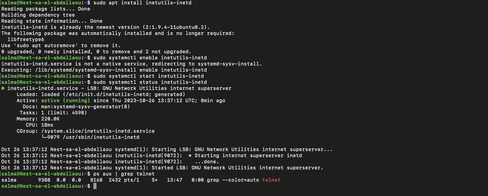
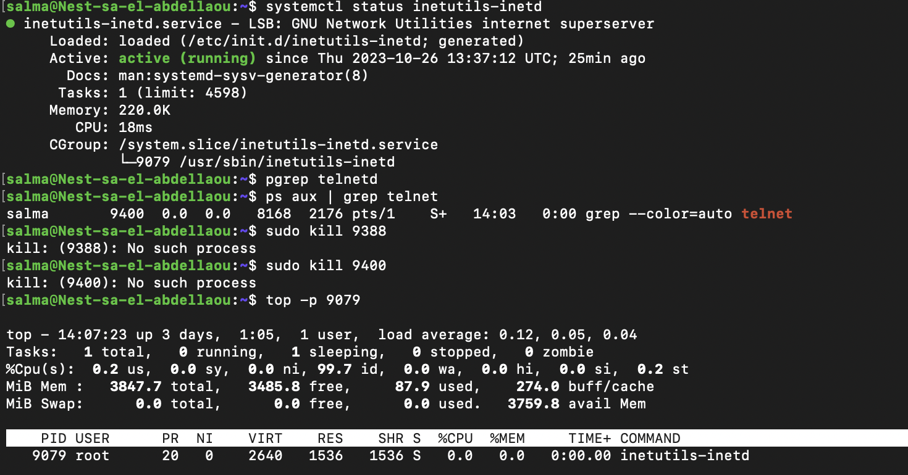
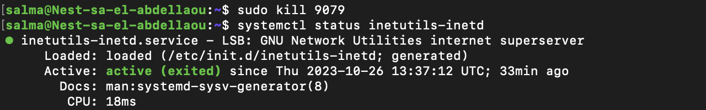

# Processes
Processen in Linux kunnen worden onderverdeeld in drie categorieën: Daemons (achtergrondprocessen), Services (diensten) en Programma's. Een daemon draait op de achtergrond en is niet-interactief. Een dienst reageert op verzoeken van programma's.

Om verbinding te maken met externe Linux-machines (virtueel of niet), kun je ssh (secure shell) gebruiken. Om deze verbinding met je machine mogelijk te maken, moet je de ssh-dienst starten door de ssh-daemon te starten. Voordat ssh er was, was er telnet, wat in feite hetzelfde doet, behalve dat de verbinding niet versleuteld is, dus het is niet veilig. 

## Key-terms
* __Daemons | Telnet:__  
Een "telnet daemon" in een Linux-terminal verwijst naar een dienst of programma dat de Telnet-communicatieprotocol implementeert en toegang biedt tot een systeem via het Telnet-protocol. Telnet is een oud netwerkprotocol dat wordt gebruikt voor externe toegang tot computers en servers via een opdrachtregelinterface. Een "daemon" in dit verband is een achtergrondproces dat draait en wacht op inkomende Telnet-verbindingsverzoeken.  
  
  Doormiddel van de volgende commands te gebruiken kan je de telnet Daemon instaleren, enabelen, starten en de status ervan checken:   
    
   ```
   Commando: sudo apt install inetutils-inetd
   ```   
   ```
   Commando: sudo systemct1 enable inetutils-inetd
   ```   
   ```
   Commando: sudo systemct1 start inetutils-inetd
   ```   
   ```
   Commando: sudo systemct1 status inetutils-inetd
   ```     
   Het opvragen van de PID (process ID) van de telnet kan uitgelezen worden middels het gebruik van de status commando.  
     
     Om alle actieve programma's aan te tonen kan er gebruik worden gemaakt van de volgende commando (daar vind je tevens de PID ook):   
     ```
   Commando: ps auxf
   ```   
   Om heel specifiek 1 programma aan te tonen en de PID ervan op te vragen kan er gebruik worden gemaakt van de volgende commando:   
   ```
   Commando: ps aux | grep <programma>
   ```  
   Om de memory van de programma te achterhalen kan je gebruik maken van de volgende commando: 
  
  ```
   Commando: top -p <PID>
   ```    
   Om uiteindelijk het programma te stoppen kan gebruik worden gemaakt van de volgende commando: 

   ```
   Commando: sudo kill <PID>
   ```  

* __Shell:__  
Om te achterhalen in welke shell je werkt kan je de volgende commando gebruiken: 

  ```
   Commando: echo $SHELL
   ```  
* __$PATH variabel:__


## Opdracht  
Start de telnet daemon en kom erachter wat de PID is en hoeveel geheugen die in gebruik neemt. Vervolgens kill je het proces.   

### Gebruikte bronnen
* https://chat.openai.com   
* https://www.scaler.com/topics/linux-process/ 
* https://www.baeldung.com/linux/telnet 

### Ervaren problemen
Mijn service naam van telnet is niet de gebruikelijke 'telnetd'. Ik moest erachter zien te komen welke linux distributer ik heb en dat is Ubuntu 20.04.6 LTS. Het vreemde aan dit verhaal is, is dat telnetd er dan wel op zou moeten zitten, maar mijn systeem gaf continue 'file does not exist aan'. Dit bleef die aangeven ook na het updaten en installeren van het pakket. Uiteindelijk ben ik erachter gekomen dat sommige linux pakketen uit veiligheidsredenen telnetd niet hebben opgenomen in hun pakket. Hierdoor heb ik inetutils-inetd geïnstalleerd, deze beschikt over de inetd service.

### Resultaat
In de volgende screenshot is te zien hoe de telnet programma is geïnstalleerd, enabled, gestart en de status van het programma: 
    
  
  In de volgende screenshot is te zien hoe de status us opgevraagd en de geheugen die het in beslag neemt:   
     
    
In de laatste screenshot is te zien hoe het programma gestopt wordt en de status ervan om het te bevestigen: 
 

  