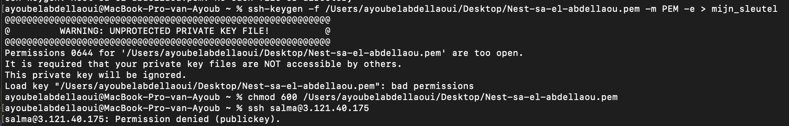
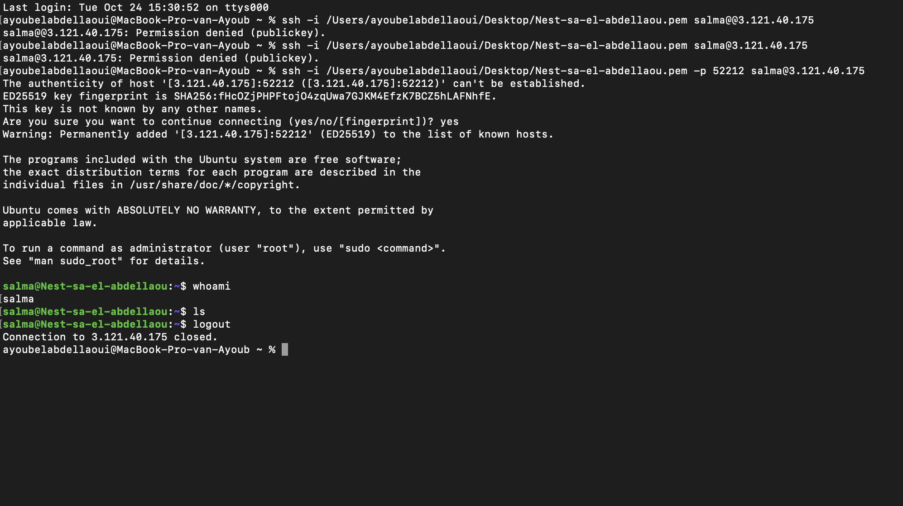

# Het aanmaken van een SSH-Key
Een SSH-sleutel (Secure Shell-sleutel) is een cryptografische sleutel die wordt gebruikt voor beveiligde communicatie via het SSH-protocol. SSH is een veelgebruikt protocol voor het veilig inloggen op externe servers en het versleutelen van gegevensoverdracht. 

## Key-terms
* __VM:__  
 Een VM simuleert de hardware van een echte computer en kan een volledig besturingssysteem en toepassingen uitvoeren, net als een fysieke machine.
* __IP:__  
Een IP (Internet Protocol) adres voor een virtuele machine (VM) is een numerieke identificatie die wordt toegewezen aan die VM in een netwerk. Dit adres wordt gebruikt om de VM te identificeren en ermee te communiceren binnen dat netwerk en op het bredere internet.   
* __PEM-file:__  
Een PEM-bestand (Privacy Enhanced Mail) is een formaat voor het opslaan en overdragen van gegevens, zoals certificaten en privésleutels, met een focus op beveiliging en privacy. In de context van het maken van een verbinding met een virtuele machine (VM) wordt een PEM-bestand vaak gebruikt  voor SSH-authenticatie. De inhoud van een PEM-bestand is vaak Base64-gecodeerd en kan tekstuele representaties bevatten van certificaten, sleutels en andere beveiligingsinformatie.
* __Portaal:__  
In de context van SSH, verwijst het "portaalnummer" naar de poort die wordt gebruikt voor SSH-verbindingen. Het veranderen van de SSH-poort kan een beveiligingsmaatregel zijn om bruteforce-aanvallen te verminderen, maar het is belangrijk om ervoor te zorgen dat je de juiste poort opgeeft bij het opzetten van een SSH-verbinding.
```
ssh -p 2222 gebruiker@server-ip  
```

* __Permissies:__    
Het verlenen van permissies voor je SSH-sleutel in een virtuele machine (VM) heeft betrekking op het configureren van de juiste toegangsrechten voor de SSH-sleutelbestanden. Dit is een belangrijk aspect van SSH-beveiliging, omdat het bepaalt wie toegang heeft tot de VM en wie niet.  
```
chmod 600 ~/.ssh/id_rsa 
```  
De cijfers die worden gebruikt bij het instellen van bestandsrechten met het chmod-commando in Linux en Unix-systemen vertegenwoordigen de permissies die zijn toegewezen aan een bestand of map. Deze cijfers bestaan meestal uit drie cijfers, en elk cijfer vertegenwoordigt een groep van permissies:

Het eerste cijfer staat voor de permissies voor de eigenaar (user) van het bestand of de map.
Het tweede cijfer staat voor de permissies voor de groep (group) waartoe het bestand of de map behoort.
Het derde cijfer staat voor de permissies voor anderen (others), wat betekent iedereen die geen eigenaar is van het bestand of de map en niet behoort tot de groep.
Elk van deze cijfers kan een waarde hebben tussen 0 en 7, waarbij elke waarde overeenkomt met specifieke permissies:

```
0: Geen toegang (geen permissies).
1: Uitvoeren (x).
2: Schrijven (w).
3: Schrijven en uitvoeren (w en x).
4: Lezen (r).
5: Lezen en uitvoeren (r en x).
6: Lezen en schrijven (r en w).
7: Lezen, schrijven en uitvoeren (r, w en x).  
```

## Opdracht  

Maak door middel van de aangeleverde credentials en files connectie met jouw VM in Linux, om opdrachten uit te voeren.  
  

### Gebruikte bronnen
* https://chat.openai.com   
* https://superuser.com/questions/215504/permissions-on-private-key-in-ssh-folder   
* https://www.ssh.com/academy/ssh/command 

### Ervaren problemen
Ik ondervond problemen bij het inloggen op mijn Linux VM, wat te wijten was aan mijn gebrek aan begrip van de PEM-bestand die deel uitmaakt van de SSH-sleutel. Na het uitvoeren van enig onderzoek en communicatie met teamleden, slaagde ik erin de oorzaak van het probleem te achterhalen.

### Resultaat
  
  De screenshot hieronder geeft bij het gebruik van mijn PEM file aan dat het gaat om een unprotected private key. Door middel van de chmod 600 command heb ik de juiste toegangsrechten verleend. 

   
  
In de volgende screenshot is te zien dat bij gebruik van mijn PEM (die nu de juiste toegangsrechten heeft), mijn protaal nummer en mijn username@IP adres, ik ben ingelogd in mijn VM.     

 


 
 

