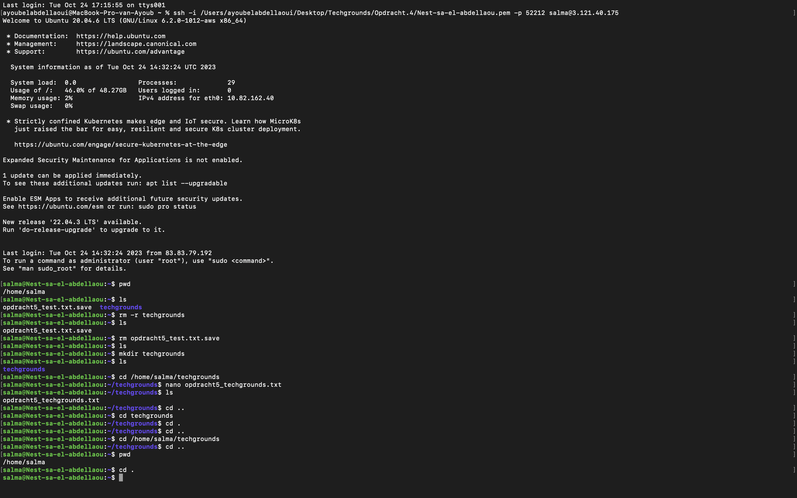

# Files and Directories 
In een Linux virtuele machine (VM), zoals in elk ander Linux-besturingssysteem, spelen directories (mappen) en bestanden een essentiële rol in het organiseren en beheren van gegevens en programma's.

## Key-terms
* __Directory (Map):__    
Een directory, ook wel map genoemd, is een virtuele container voor het organiseren en opslaan van bestanden en subdirectories. Directories vormen een hiërarchische structuur, vergelijkbaar met mappen in een fysiek bestandssysteem.  
  
  Typ het volgende commando om je huidige werkmap te vinden. 
``` 
commando: pwd  
```

* __Bestand:__    
Een bestand is een individuele eenheid van gegevens of informatie. Bestanden kunnen tekst, afbeeldingen, programma's, configuratiegegevens, enzovoort bevatten. Bestanden kunnen zich binnen directories bevinden en worden geïdentificeerd door een naam. De bestandsnaam kan letters, cijfers en speciale tekens bevatten.    

lijst van bestanden en mappen in je thuismap genereren.
```
commando: ls ~
```
  Gebruik het volgende commando om een nieuwe map met de naam 'techgrounds' in je thuismap te maken.   
```
mkdir ~/techgrounds
```
* __Bestandsrechten en -machtigingen:__   
Linux-bestanden hebben toegangsrechten die bepalen wie ze kan lezen, schrijven en uitvoeren. Deze permissies zijn essentieel voor de beveiliging en privacy van bestanden. Ze kunnen worden ingesteld voor de eigenaar van het bestand, de groep waartoe de eigenaar behoort en anderen.

```
Permissies worden ingesteld met behulp van commando's zoals chmod, chown, en chgrp.
```
* __Bestandsbewerking en -beheer:__    
De bestandsstructuur is cruciaal voor het organiseren van gegevens en programma's, en de Linux-commandoregel biedt krachtige gereedschappen voor bestandsbeheer.
```
In een Linux VM kun je bestanden aanmaken, bewerken, kopiëren, verplaatsen, verwijderen en hernoemen met behulp van commando's zoals touch, nano, cp, mv, en rm.  
```  
Het maken van een bestand met wat tekst kan met behulp van een teksteditor. 
```
commando: nano voorbeeld.txt
```  

* __Absolute en relatieve paden:__   
Om een bestand of directory te identificeren, kun je absolute paden gebruiken die beginnen bij de root-directory, bijvoorbeeld:   

```
commando cd /home/gebruiker/documenten/bestand.txt  
```  

  Je kunt ook relatieve paden gebruiken die relatief zijn aan je huidige werkdirectory, bijvoorbeeld *"documenten/bestand.txt".* Hierbij wordt ervan uitgegaan dat de "documenten" directory zich in de huidige werkdirectory bevindt.

```
commando cd ~
```

## Opdracht  
Orienteer in jouw VM, vindt je huidige werkmap, maak een lijst van alle bestanden en mappen in je thuismap, Maak binnen je thuismap een nieuwe map met de naam 'techgrounds', Binnen de 'techgrounds' map, maak een bestand aan met wat tekst en Navigeer door je mappenstructuur met zowel absolute als relatieve paden. 
### Gebruikte bronnen
* https://chat.openai.com  

### Ervaren problemen
Ik heb hier geen problemen ervaren.

### Resultaat
  


