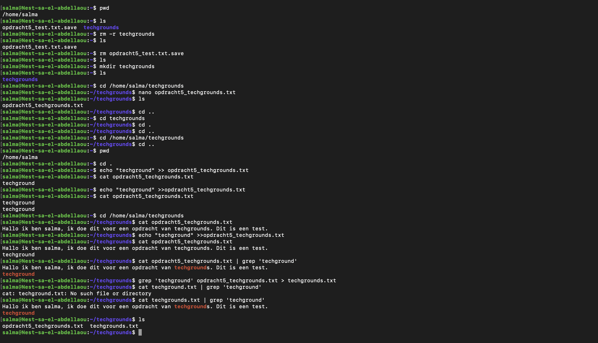

# CLI
"CLI" staat voor "Command Line Interface," wat zich vertaalt naar "Commandoregelinterface." Het is een tekstgebaseerde interface waarmee gebruikers opdrachten kunnen invoeren om interactie te hebben met een computerbesturingssysteem of software.

## Key-terms
* __stdin (standaardinvoer):__   
stdin is het standaardinvoerkanaal waardoor gegevens de terminal binnenkomen. Het is meestal gekoppeld aan het toetsenbord. Wanneer je gegevens typt in een terminalvenster en op Enter drukt, gaat deze invoer via stdin naar het actieve programma of de opdracht.  
  
* __stdout (Standaarduitvoer):__  
stdout is het standaarduitvoerkanaal waardoor gegevens de terminal verlaten en aan jou worden getoond. Wanneer een programma of opdracht wordt uitgevoerd, wordt de uitvoer, zoals resultaten, berichten en tekst, via stdout weergegeven in het terminalvenster.

```
commando: echo your_text_here
```
Het echo-commando in een terminal wordt gebruikt om tekst weer te geven of uitvoerberichten naar de terminal of standaarduitvoer (stdout) te tonen. Het is een eenvoudige opdracht die de door jou verstrekte tekst neemt en deze naar de terminal afdrukt.    

Je kunt het cat-commando gebruiken om de volledige inhoud van een tekstbestand weer te geven.
 ```
commando: cat jouw_bestand.txt
```   
  Om de uitvoer te filteren en alleen de regels te tonen die het woord 'voorbeeld' bevatten, kun je het grep-commando gebruiken.
 ```
commando: cat jouw_bestand.txt | grep 'voorbeeld'
```   
Om een tekstbestand te lezen en te filteren op een woord 'voorbeeld', en vervolgens de uitvoer door te sturen naar een nieuw bestand met de naam 'voorbeeld.txt', kun je de volgende opdracht gebruiken:  
  
   ```
commando: cat jouw_bestand.txt | grep 'techgrounds' > techgrounds.txt
```   

## Opdracht  
Maak gebruik van de echo commando, maak gebruik van een commando die de output kan filteren en redirect de output van een file naar een andere file. 
### Gebruikte bronnen
* https://chat.openai.com  

### Ervaren problemen
Ik heb geen problemen ervaren. 

### Resultaat
 

