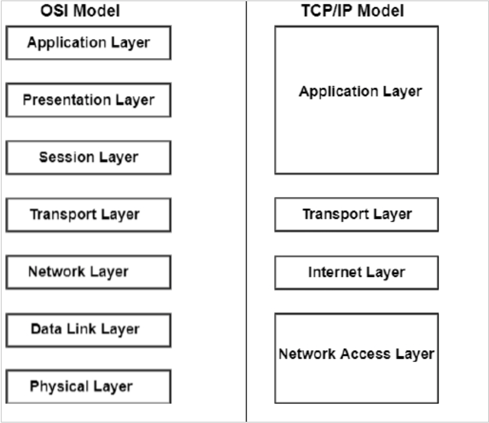
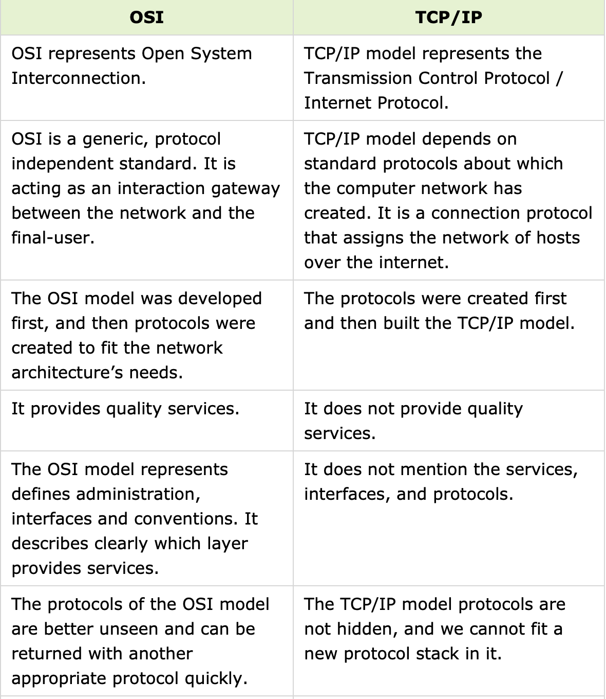
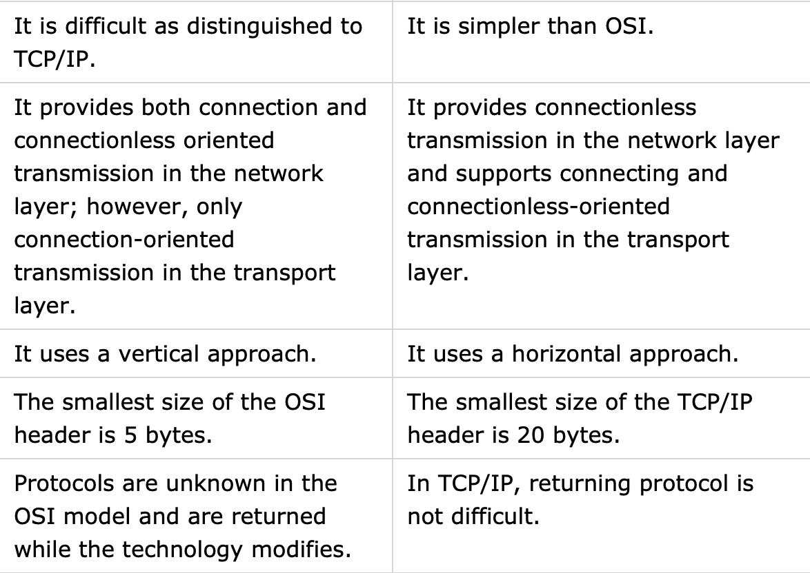

# OSI model en TCP/IP model
Het OSI-model is een abstracte architectuur die is ontwikkeld om netwerkcommunicatie te standaardiseren en te begrijpen. Het model bestaat uit zeven lagen, elk met een specifieke functie.    

Het TCP/IP-model is een meer praktische en wijdverbreide netwerkarchitectuur die ten grondslag ligt aan het internet

## Key-terms
OSI-model (open systems interconnction-model):  
* Fysieke laag (Physical Layer): Deze laag behandelt de fysieke overdracht van gegevens, zoals elektrische signalen en kabeltypen.  

* Datalinklaag (Data Link Layer): Deze laag is verantwoordelijk voor de toegang tot het fysieke medium, adresoplossing en foutdetectie en -correctie.  

* Netwerklaag (Network Layer): Hier vindt routing plaats, waarbij gegevenspakketten worden doorgestuurd naar hun bestemming via verschillende netwerken.  

* Transportlaag (Transport Layer): Deze laag regelt end-to-end-communicatie, inclusief foutcontrole en gegevensstroombeheer.  

* Sessielaag (Session Layer): De sessielaag beheert de communicatie tussen applicaties, stelt sessies in en handhaaft deze.  

* Presentatielaag (Presentation Layer): Deze laag behandelt gegevensrepresentatie, codering en compressie.  

* Toepassingslaag (Application Layer): Dit is de bovenste laag waar applicaties en services worden uitgevoerd, en het is het punt waar gebruikers met het netwerk interageren.    
  
TCP/IP-model (Transmission Control Protocol/Internet Protocol-model):   
* Netwerktoegangslaag (Network Access Layer): Deze laag is vergelijkbaar met de fysieke en datalinklagen van het OSI-model en behandelt de fysieke transmissie van gegevens op het lokale netwerk.  

* Internetlaag (Internet Layer): Dit is analoog aan de netwerklaag van het OSI-model en omvat IP-adressering, routing en pakketdoorvoer.  

* Transportlaag (Transport Layer): De transportlaag komt overeen met de transportlaag van het OSI-model en is verantwoordelijk voor end-to-end-communicatie en foutcontrole.  

* Toepassingslaag (Application Layer): Deze laag integreert functies van de sessie-, presentatie- en toepassingslagen van het OSI-model en biedt diensten voor toepassingen, inclusief applicatieprotocollen zoals HTTP, FTP en SMTP.    
  
  De verschillen tussen de OSI-model en de TCP/IP model:
  
      
     
     
  

## Opdracht  
Doe kennis op over de OSI-model en de TCP/IP-model. 
### Gebruikte bronnen
* https://www.geeksforgeeks.org/tcp-ip-model/
* https://www.cloudflare.com/learning/ddos/glossary/*open-systems-interconnection-model-osi/
* https://www.tutorialspoint.com/difference-between-osi-and-tcp-ip-reference-model    
* https://www.youtube.com/watch?v=vv4y_uOneC0   
* https://www.youtube.com/watch?v=2QGgEk20RXM 

### Ervaren problemen
Ik heb hier geen problemen ervaren. 

### Resultaat
Ik heb de nodige kennis opgedaan om te begrijpen wat de modellen inhouden en wat de verschillen zijn binnen de twee modellen. 