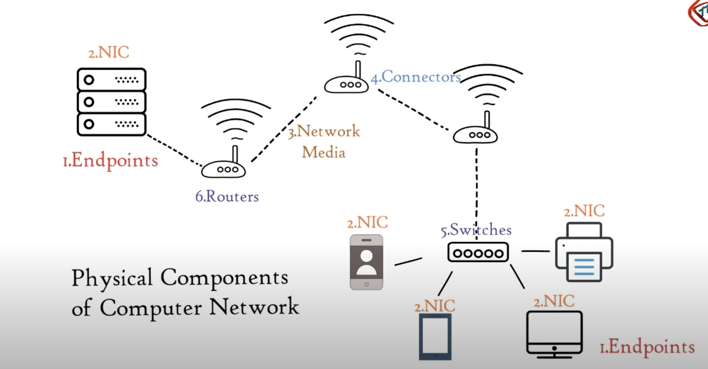
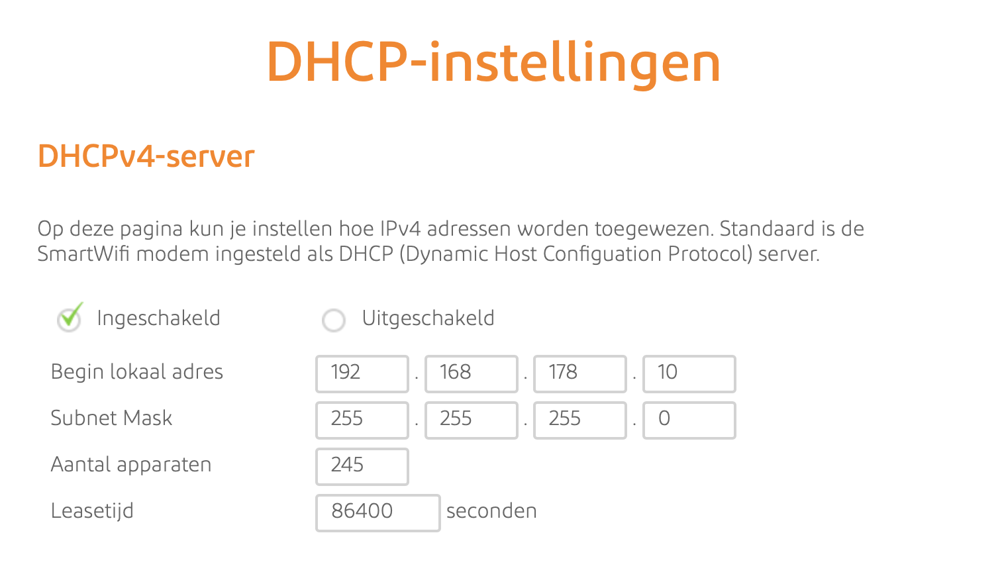

# Networking Devices 
De apparaten die worden gebruikt voor communicatie tussen verschillende hardware die in het computernetwerk wordt gebruikt, worden netwerkapparaten genoemd. Deze apparaten zijn ook bekend als fysieke apparaten, netwerkhardware en netwerkapparatuur.  

## Key-terms
Het OSI-model helpt fabrikanten van netwerkapparatuur en leveranciers van netwerksoftware:

* Apparaten en software te creëren waarmee kan worden gecommuniceerd met producten van elke andere leverancier, waardoor open interoperabiliteit mogelijk is.
* Te bepalen met welke delen van het netwerk hun producten moeten werken.
* Aan gebruikers te communiceren op welke netwerklagen hun product werkt, bijvoorbeeld alleen op de toepassingslaag of over de hele stack.   
  
      
   
Netwerkapparaten dienen de volgende algemene doelen:

* Gegevensoverdracht en communicatie tussen apparaten vergemakkelijken
* Efficiënte en veilige netwerkconnectiviteit mogelijk maken
* Netwerkprestaties verbeteren en verkeersstromen optimaliseren
* Netwerkbeveiliging bieden door toegangscontrole en bedreigingspreventie af te dwingen
* Netwerkbeheer en configuratie vereenvoudigen
* Netwerkdekking uitbreiden en signaalbeperkingen overwinnen  

## Opdracht  
Benoem en beschrijf de functies van veelvoorkomende netwerkapparaturen. De meeste routers hebben een overzicht van alle verbonden apparaten, vind deze lijst. Welke andere informatie heeft de router over aangesloten apparatuur?
Waar staat je DHCP server op jouw netwerk? Wat zijn de configuraties hiervan?  

### Gebruikte bronnen
* https://nl.jf-parede.pt/what-are-network-devices  
* https://www.youtube.com/watch?v=gVrXLq5E-CQ  
* https://www.imperva.com/learn/application-security/osi-model/#:~:text=The%20OSI%20model%20helps%20network,their%20products%20should%20work%20with.   
* https://chat.openai.com  

### Ervaren problemen
Ik heb hier geen problemen ervaren. 

### Resultaat
Er zijn verschillende type netwerken, hieronder zullen er 8 worden opgenoemd:   
1. Switches: een netwerkswitch is een apparaat dat wordt gebruikt om gegevenspakketten van het ene netwerkapparaat naar het andere door te sturen in een lokaal netwerk (LAN).  
2. Bridge: is een apparaat of softwarecomponent die wordt gebruikt om twee of meer netwerksegmenten met elkaar te verbinden en verkeer tussen hen mogelijk te maken. Een bridge werkt op de datalinklaag van het OSI-model (laag 2) en is ontworpen om het verkeer te filteren en door te sturen op basis van de fysieke MAC-adressen van apparaten.  
3. Router: een router is een netwerkapparaat dat wordt gebruikt om gegevenspakketten tussen verschillende netwerken door te sturen. Het belangrijkste doel van een router is het bepalen van de meest efficiënte route voor gegevens om van het ene netwerk naar het andere te reizen.  
4. Firewall: een firewall is een netwerkbeveiligingsapparaat of software dat wordt gebruikt om het netwerk te beschermen door ongeautoriseerd verkeer te blokkeren en te controleren. Het hoofddoel van een firewall is het creëren van een beveiligingsbarrière tussen een intern netwerk (bijvoorbeeld een bedrijfsnetwerk of thuisnetwerk) en externe netwerken, zoals het internet.  
5. Repeater: Een repeater is een netwerkapparaat dat wordt gebruikt om het bereik van een netwerk uit te breiden door signalen te versterken en door te sturen.  
6. Gateway: Een gateway is een netwerkapparaat of software dat fungeert als een interface tussen verschillende netwerken met verschillende protocollen. Het vertaalt en routeert gegevens tussen deze netwerken.  
7. Hub: Een hub is een eenvoudig netwerkapparaat dat wordt gebruikt om apparaten in een lokaal netwerk met elkaar te verbinden. Het fungeert als een gedeelde mediaconnector.  
8. Modum: Een modem, wat een afkorting is voor "modulator-demodulator," is een essentieel netwerkapparaat dat wordt gebruikt om digitale gegevens om te zetten in analoge signalen voor verzending over analoge communicatielijnen en vice versa.   
  
  Naast dat mijn lijst aangeeft wie er allemaal gebruik maakt van de router, zie je ook de volgende elemneten erbij staan.   
       
       
Mijn DHCP server is als volgt:  
  
