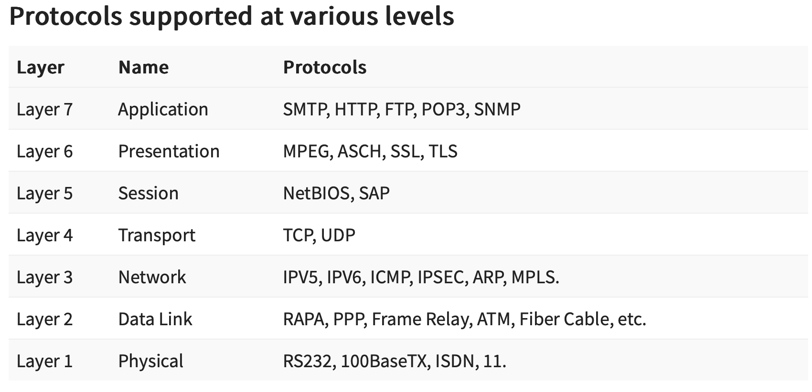
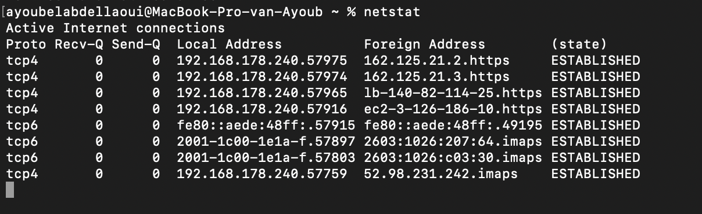
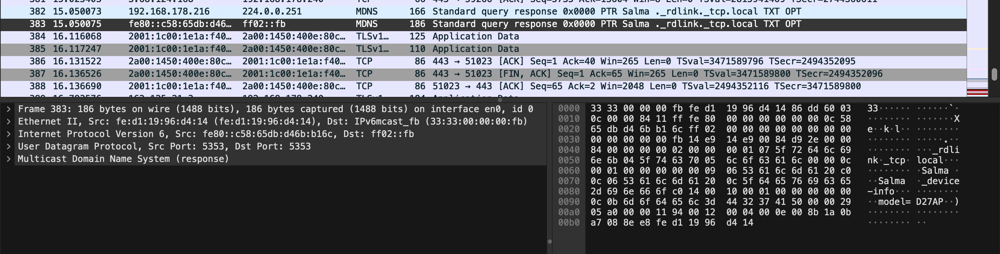

# Protocols
[Geef een korte beschrijving van het onderwerp]

## Key-terms
* Wireshark:  
Wireshark is een zeer populaire en krachtige netwerkanalysetool, ook wel een "packet sniffer" genoemd. Het stelt je in staat om het netwerkverkeer op een computernetwerk te vast te leggen en te analyseren.  
  
 Actieve netwerkverbindingen:  
 ```
 Commando: Netstat
 ```  

  Dit is hoe je het moet aflezen:  

* Proto: Dit geeft het protocol aan, in dit geval, TCP (Transmission Control Protocol).
* Recv-Q en Send-Q: Deze kolommen geven de wachtrijen aan voor ontvangen en verzonden data. 
* Local Address: Dit is het lokale IP-adres en poortnummer. 
* Foreign Address: Dit is het externe IP-adres en poortnummer waarmee je systeem is verbonden. 
* (state): Dit geeft de toestand aan van de verbinding. 

## Opdracht
### Gebruikte bronnen
* https://chat.openai.com    
* https://www.guru99.com/layers-of-osi-model.html 

### Ervaren problemen
[Geef een korte beschrijving van de problemen waar je tegenaan bent gelopen met je gevonden oplossing.]

### Resultaat    
  
Hieronder zijn alle OSI layers benoemd met hun bijbehorende servers:   
  
      
  
  De onderstaande screenshot geeft actieve TCP verbindingen weer op mijn computer. De onderliggende TCP-verbinding bevindt zich op OSI-laag 4 (transportlaag).
      

1. Proto: in dit geval, TCP (Transmission Control Protocol).
Recv-Q en Send-Q: In dit geval is de wachtrij voor zowel ontvangen als verzonden data leeg (0).
2. Local Address: In dit voorbeeld, is het lokale IP-adres 192.168.178.240 en het lokale poortnummer is 57975 (voor de eerste regel) en 57974 (voor de tweede regel).
3. Foreign Address: In dit voorbeeld, is het externe IP-adres 162.125.21.2 (voor de eerste regel) en 162.125.21.3 (voor de tweede regel), en de externe poortnummers zijn beiden https (poort 443).
4. (state): In dit geval is de toestand "ESTABLISHED," wat betekent dat de verbinding actief is en gegevens worden uitgewisseld tussen de lokale host en de externe host.  
  
__Wie bepaald welke protocollen we gebruiken:__  
De keuze van welke protocollen te gebruiken in een netwerk of systeem wordt doorgaans bepaald door verschillende factoren, waaronder standaardisatieorganisaties, sectorpraktijken en de specifieke vereisten van het netwerk of systeem.    

__Wat heb je daarvoor nodig indien je een eigen protocol wilt opstellen?__    
Het introduceren van een aangepast protocol vereist een diepgaand begrip van netwerkprincipes en een duidelijke rationale waarom een bestaand protocol ontoereikend is. Het ontwikkelen van een nieuw protocol omvat meestal de volgende stappen:
1. Ontwerp: Definieer het doel, de kenmerken en het gedrag van het protocol. Dit omvat het specificeren van hoe gegevens worden geformatteerd, verzonden en geïnterpreteerd.
2. Implementatie: Ontwikkel het protocol, meestal als software of firmware die op netwerkapparaten of systemen kan worden geïnstalleerd.
3. Testen: Test het protocol grondig om ervoor te zorgen dat het werkt zoals bedoeld, betrouwbaar is en geen kwetsbaarheden of beveiligingsproblemen introduceert.
4. Documentatie: Maak uitgebreide documentatie die de functionaliteit van het protocol, het gebruik en eventuele gerelateerde beveiligingsoverwegingen uitlegt.
5. Implementatie: Implementeer het protocol in de gewenste systemen of apparaten.
6. Validatie: Valideer het protocol in realistische scenario's om ervoor te zorgen dat het aan de verwachtingen voldoet.   
  
In de volgende screenshot is te zien hoe wireshark eruit ziet als ik mijn eigen netwerk data 'opneem':
  

