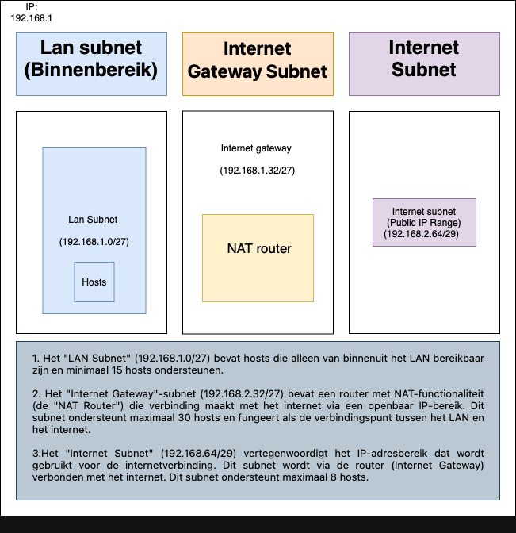
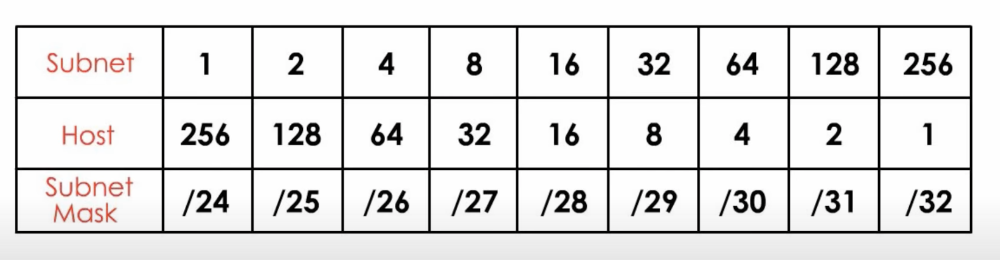

# Subnetting
Subnetting is het proces waarbij een enkel IP-netwerk wordt opgedeeld in meerdere kleinere subnets. Dit wordt vaak gedaan om efficiënter gebruik te maken van IP-adresruimte, verkeer te segmenteren en beheer van netwerken te vereenvoudigen. Door het toepassen van subnetmaskers kun je bepalen welke delen van een IP-adres het netwerkadres en het hostadres aangeven. Met deze kennis kun je IP-adressen en subnetmaskers configureren om subnets te creëren. Subnetting is een essentieel concept in netwerken en wordt vaak gebruikt in zowel lokale netwerken (LAN's) als in grotere internetwerken.

## Key-terms
* __LAN:__  
LAN staat voor Local Area Network. Het is een type computernetwerk dat beperkt is tot een klein geografisch gebied, zoals een enkel gebouw, kantoor, campus of thuisnetwerk. LAN's worden meestal gebruikt om lokale communicatie tussen apparaten en computers mogelijk te maken.    

  In het kader van subnetting verwijst LAN naar het lokale netwerk dat wordt opgedeeld in verschillende subnets. Subnetting wordt vaak toegepast binnen een LAN om het netwerkverkeer te organiseren, IP-adressen efficiënt te beheren en beveiligingsmaatregelen te implementeren. Hierdoor kunnen apparaten binnen hetzelfde LAN nog steeds communiceren, maar kan het verkeer worden gescheiden en beheerd volgens de vereisten van de organisatie.    
      

* __Subnet mask (prefix):__    
Een subnetmasker, vaak aangeduid als een "subnet mask," is een numerieke code die wordt gebruikt in computernetwerken om te bepalen welke delen van een IP-adres het netwerkadres en welke delen het hostadres vertegenwoordigen. Het subnetmasker fungeert als een filter om het IP-adresruimte te verdelen in netwerken en hosts binnen die netwerken. Het vertelt netwerkapparaten welke delen van een IP-adres voor de netwerk-ID staan en welke delen bestemd zijn voor de host-ID.  
  
  Het subnetmasker bestaat uit een reeks opeenvolgende "1"-bits gevolgd door een reeks opeenvolgende "0"-bits. De "1"-bits in het subnetmasker markeren de netwerk-ID en de "0"-bits markeren de host-ID. Hoe langer de reeks "1"-bits, hoe groter het deel van het IP-adres dat is toegewezen aan de netwerk-ID.  
    
Een veelvoorkomend subnetmasker is bijvoorbeeld 255.255.255.0 voor IPv4. In binair formaat ziet dit er als volgt uit:  
```
11111111.11111111.11111111.00000000
```  
Dit subnetmasker geeft aan dat de eerste 24 bits (3 octetten) worden gebruikt voor de netwerk-ID, terwijl het laatste octet wordt gebruikt voor de host-ID. In dit geval kunnen er 256 mogelijke hostadressen (0-255) zijn in hetzelfde netwerk.  
* __CIDR notation:__   
CIDR (Classless Inter-Domain Routing) notatie is een compacte manier om IP-adressen en subnetmaskers weer te geven. Het wordt vaak gebruikt om IP-adresbereiken en subnets te beschrijven. In CIDR-notatie wordt een schuine streep ("/") gevolgd door een getal geplaatst na het IP-adres om het subnetmasker aan te geven. Dit getal geeft aan hoeveel bits van het IP-adres aan de netwerk-ID zijn toegewezen. Hier is een voorbeeld:

  IP-adres: 192.168.1.0
Subnetmasker: 255.255.255.0
CIDR-notatie: 192.168.1.0/24
In dit voorbeeld heeft "/24" betrekking op het feit dat de eerste 24 bits van het IP-adres worden gebruikt voor de netwerk-ID, wat overeenkomt met het subnetmasker 255.255.255.0.   
   
  __Enkele andere voorbeelden van CIDR-notatie:__

  10.0.0.0/8: Dit vertelt ons dat de eerste 8 bits zijn toegewezen voor de netwerk-ID, wat betekent dat er een groot bereik aan IP-adressen beschikbaar is.  

  172.16.0.0/16: Hier worden de eerste 16 bits gebruikt voor de netwerk-ID, wat een kleiner subnet oplevert dan het vorige voorbeeld.

## Opdracht  
Maak een netwerkarchitectuur die voldoet aan de volgende eisen:  

* 1 subnet dat alleen van binnen het LAN bereikbaar is. Dit subnet moet minimaal 15 hosts kunnen plaatsen.
* 1 subnet dat internet toegang heeft via een router met NAT-functionaliteit. Dit subnet moet minimaal 30 hosts kunnen plaatsen (de 30 hosts is exclusief de router).
* 1 subnet met een network gateway naar het internet. Dit subnet moet minimaal 5 hosts kunnen plaatsen (de 5 hosts is exclusief de internet gateway).  

Plaats de architectuur die je hebt gemaakt inclusief een korte uitleg in de Github repository die je met de learning coach hebt gedeeld.
### Gebruikte bronnen
* https://chat.openai.com   
* https://www.techopedia.com/nl/8-stappen-om-ip-subnetten-te-begrijpen   
* https://app.diagrams.net   
* https://www.calculator.net/ip-subnet-calculator.html  
* https://www.youtube.com/watch?v=ecCuyq-Wprc

### Ervaren problemen
Ik heb hier geen problemen ervaren.

### Resultaat
   
  
Dit is mijn netwerkarchitectuur met uitleg over de subnets onder aan de afbeelding.     

Uitleg:  
De originele IP adres is boven in de afbeelding weergegeven, het gaat om de volgende ip adres: 192.168.1. 192.168 geeft aan dat het gaat om een prive adres.   
  
  LAN staat natuurlijk voor Local Area Network voor een bepaald gebied (kantoor ruimte etc.). In de opdracht wordt aangegeven dat er een subnet aangemaakt dient te worden die alleen van binnen de LAN bereikbaar is en waar minimaal 15 hostst aan kunnen deelnemen. Vandaar dat ik mijn hostst binnen in de LAN subnet heb geplaats (mijn netwerkarchitectuur afbeelding). De subnet die ik heb gebruikt is 0/27 (CIDR notatie). Ik heb de volgende tabel geraadpleegd om dit te achterhalen:   
    
   
  
Hierin is duidelijk te zien dat de subnetmask van /27 32 hostst kan hebben, dit voldoet aan de eis gesteld in de opdracht. Omdat dit de eerste subnet groep is begint het bij 0. vandaar dat je 0/27 krijgt, er zijn namelijk nog geen hostst account gebruikt van de 256.   
  
In de volgende opdracht wordt gevraagd om een subnet aan te maken die toegang heeft tot het internet middels een router met NAT functionaliteiten en deze subnet dient plek te hebben voor minimaal 30 hostst. Mijn antwoordt hierop is, 192.168.1.32/27.   
  
Dit keer begint het niet bij 0 maar bij 32, dit omdat er al 32 hosts gebruik maken van de algemene IP adres. De keuze voor /27 als subnetmask heeft te maken met het aantal hostst die het kan hebben en dat is 32. Dit voldoet aan de gestelde eis in de opdracht.   
  
In de volgende opdracht wordt er gevraagd naar een subnet met een network gateway naar het internet en die minimaal 5 hostst kan hebben. Ik heb gekozen voor de volgende IP adres, 192.168.1.64/29. Dit keer start het host gedeelte van de IP adres niet bij 0 of bij 16 maar bij 64. Dit omdat er al 64 hosts onderdeel zijn van dezelfde IP adres. Ik heb gekozen voor de subnet mask /29 omdat die 8 hosts kan dienen en dit voldoet aan de eisen gesteld in de opdracht. 