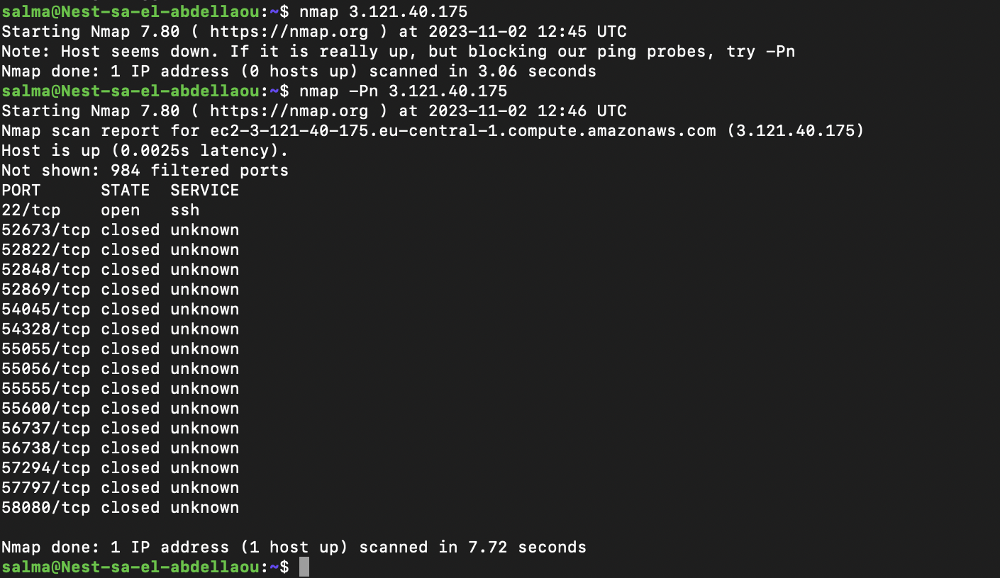
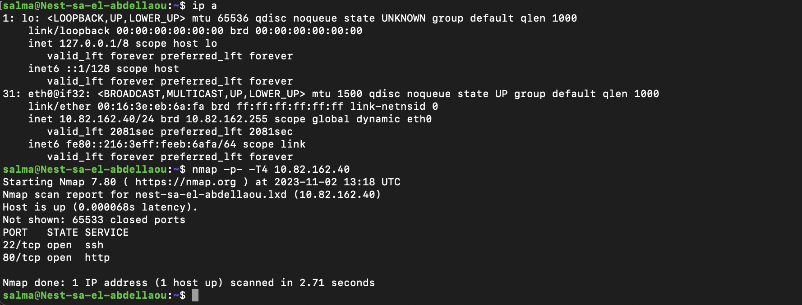
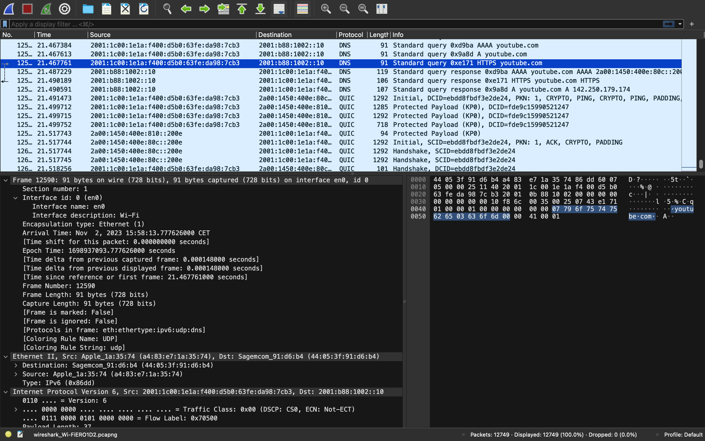

# Network Detection
Netwerkdetectie met behulp van nmap en Wireshark zijn twee verschillende benaderingen voor het analyseren van een netwerk:

__Nmap (Network Mapper):__  

* Functie: Nmap is een krachtige netwerkscanner die wordt gebruikt om hosts en services in een netwerk te ontdekken en te analyseren.
* Werkwijze: Het scant het netwerk op basis van opgegeven doelen en poorten om te achterhalen welke hosts en services actief zijn.
* Gebruik: Het wordt vaak gebruikt voor netwerkdetectie, beveiligingsevaluaties en systeembeheer.  

__Wireshark:__  

* Functie: Wireshark is een netwerkprotocolanalyzer waarmee je netwerkverkeer kunt vastleggen en analyseren.
* Werkwijze: Het "luistert" naar het netwerkverkeer en ontleedt de pakketten om inzicht te bieden in de communicatie tussen apparaten en de gebruikte protocollen.
* Gebruik: Het wordt vaak gebruikt om netwerkproblemen op te lossen, beveiligingslekken op te sporen en de communicatie tussen apparaten te begrijpen.  

Beide tools zijn waardevol voor netwerkanalyse, maar ze hebben verschillende toepassingen. Nmap wordt vooral gebruikt om hostinformatie en open poorten te ontdekken, terwijl Wireshark dieper in het netwerkverkeer duikt om de communicatie tussen apparaten te begrijpen. Ze vullen elkaar aan om een uitgebreider beeld van een netwerk te geven.

## Key-terms
__Nmap (Network Mapper):__   
NMap staat voor “Network MAPper” en is een opensource netwerkscanner. NMap is van origine gemaakt als poortscanner voor Linux systemen.  
  
Nmap wordt vaak gebruikt voor:

* Het identificeren van open poorten
* Netwerk inventarisatie en network mapping
* Security testing van network devices zoals firewalls
* Identificeren van nieuwe servers
* Vinden van vulnerabilities in het netwerk  
  
NMap kan IP adressen, ranges en hostnames scannen
NMap kan overweg met IPv4 en IPv6, NMap kan (vooral v.a. versie 7) gebruikt worden om DOS aanvallen te lancerenen en NMap kan doelcomputers exploiten. 


## Opdracht   
Scan de netwerk van jou eigen Linux machine met behulp van nmap.   

Open Wireshark op je Windows/MacOS-machine. Analyseer wat er gebeurt wanneer je een internetbrowser opent. (Tip: je zult merken dat Zoom voortdurend pakketten over het netwerk verzendt. Je kunt Zoom gedurende een minuut uitschakelen of op zoek gaan naar de pakketten die door de browser worden verzonden tussen de pakketten die door Zoom worden verzonden.)  

### Gebruikte bronnen
* https://nl.wikipedia.org/wiki/Nmap   
* https://jarnobaselier.nl/nmap-commandos-en-scripts/   
* https://chat.openai.com    
* https://www.youtube.com/watch?v=lb1Dw0elw0Q

### Ervaren problemen
[Geef een korte beschrijving van de problemen waar je tegenaan bent gelopen met je gevonden oplossing.]

### Resultaat
Om met Nmap te werken moet het eerst gedownload worden mijn VM linux. Door middel van de volgende commando's kan je het downloaden:

```
sudo apt update
sudo apt install nmap
```  
Vervolgens heb ik de lokale IP adres in mijn ssh key getraceerd met behulp van de volgende commando: 

```
nmap 3.121.40.175
```  
De output op mijn terminal geeft aan dat deze IP adres achter een firewall zit, waarna ik de volgende commando heb gebruikt om meer informatie te krijgen:    
  
(Voer alle scanopdrachten uit zonder pre-controle of de host online is (ignore discovery). Bijvoorbeeld als de host zich achter een firewall bevindt:)  

```
nmap -Pn 3.121.40.175
```   
Dit was mijn uitslag:  
   
  
Samenvattend, deze Nmap-scan toont aan dat het doeldoel op 3.121.40.175 reageert, met de SSH-service (poort 22) open, terwijl veel andere poorten gesloten of gefilterd zijn en de bijbehorende services niet konden worden bepaald. Gesloten poorten zijn doorgaans die poorten die niet actief luisteren naar inkomende verbindingen.  
  
Met de volgende commando kan men zijn/haar eigen IP adres ophalen binnen de VM (linux):   
```
ip a
```    
Dit was mijn uitslag:  

   
  
* Loopback Interface (lo):
IP Address: 127.0.0.1 (IPv4) and ::1 (IPv6)  

Deze interface wordt gebruikt voor lokale, interne communicatie binnen de virtuele machine. Het wordt meestal gebruikt voor processen die op dezelfde machine draaien om met elkaar te communiceren.

* Ethernet Interface (eth0):  
IP Address: 10.82.162.40 (IPv4) and fe80::216:3eff:feeb:6afa (IPv6)  

Dit is de primaire netwerkinterface die wordt gebruikt voor externe communicatie. Het IP-adres 10.82.162.40 wordt dynamisch toegewezen (waarschijnlijk door DHCP), en het IPv6-adres is een link-local adres.  
  
Vervolgens heb ik de volgende commando gebruikt om middels Nmap mijn netwerk te traceren: 

```
nmap -p- -T4 10.82.162.40
```   
Dit zal alle TCP porten scannen die aanwezig zijn op mijn VM met deze specifieke IP adres. Uitslag is te vinden in de screenshot die eerder gedeeld is.     

Uitleg:   
De Nmap-scanresultaten geven aan dat mijn Linux-VM (10.82.162.40) twee open poorten heeft:

Poort 22 (SSH): Dit wordt gebruikt voor beveiligde shell-toegang en wordt typisch gebruikt voor externe terminalverbindingen.

Poort 80 (HTTP): Dit is de standaardpoort voor HTTP-webdiensten.

Je kunt zien dat zowel de SSH- als HTTP-diensten actief zijn en toegankelijk zijn op je Linux-VM. De andere poorten zijn gesloten, wat betekent dat er geen actieve diensten op draaien.  
  
Met Wireshark heb ik mijn netwerk gedetecteerd, hieronder een screenshot van wat ik heb verkregen: 
   
  
In deze screenshot is te zien dat ik youtube heb gebruikt in mijn browser. De No. geeft de nummer weer van het pakket. Time geeft aan wanneer de pakket verstuurd is, source is vanwaar het pakket wordt gestuurd en hier is dan ook de IP te zien, vervolgens heb je destination, dit geeft aan waar het pakket naar gestuurd wordt en de bijbehorende IP adres. Bij protocol zie je welke protocol is gebruikt om het tot stand te brengen, de length geeft aan uit hoeveel het pakket bestaat en info geeft extra informatie over het pakket.   
  
In mijn voorbeeld zie je DNS staan bij youtube. DNS wordt gebruikt voor het omzetten van domeinnamen naar IP-adressen in netwerkcommunicatie. Je ziet ook in mijn voorbeeld QUIC staan, QUIC is een modern transportprotocol voor gegevensoverdracht.   
  
Wat je uiteindelijk hieruit kan krijgen is de pakketten die heen en weer worden verzonden van de ene IP adres naar de ander met hun bijbehorende protocollen. 