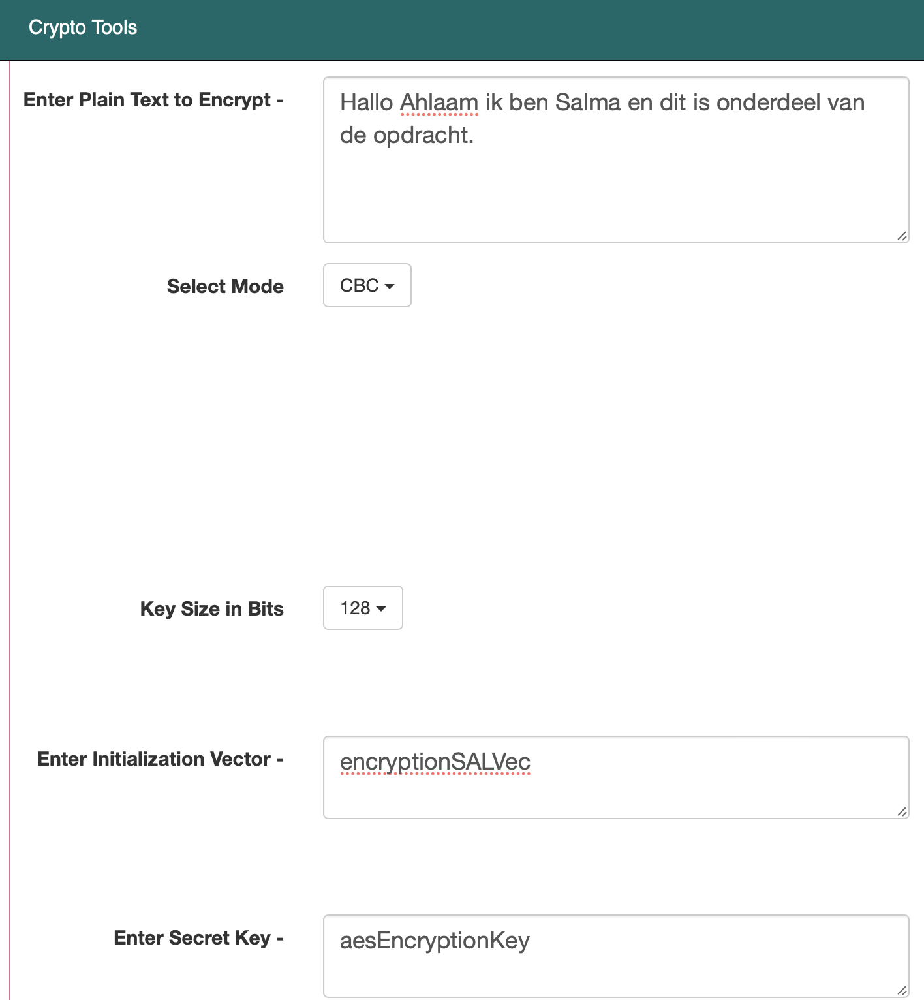

# Symmetrical encryption
Encryptie is van essentieel belang als het gaat om gegevensbeveiliging en privacy. Het doel van encryptie is om gegevens onleesbaar te maken voor onbevoegden door ze om te zetten in een gecodeerde vorm met behulp van algoritmen.

## Key-terms
Er zijn verschillende soorten encryptie, waaronder:

1. __Symmetrische Encryptie:__ Hierbij wordt dezelfde sleutel gebruikt voor zowel versleuteling als ontsleuteling. Voorbeelden zijn AES (Advanced Encryption Standard) en DES (Data Encryption Standard).
2. __Asymmetrische Encryptie:__ Hierbij worden twee verschillende sleutels gebruikt: een openbare sleutel voor versleuteling en een privésleutel voor ontsleuteling. Voorbeelden zijn RSA en ECC (Elliptic Curve Cryptography).
3. __Hashing:__ Hoewel geen traditionele encryptie, wordt hashing gebruikt om gegevens in een vaste lengte te veranderen. Het wordt vaak gebruikt voor wachtwoordopslag en gegevensintegriteitscontrole. Voorbeelden zijn MD5 en SHA-256.
4. __End-to-End Encryptie:__ Dit wordt vaak gebruikt in communicatie-applicaties, waarbij berichten alleen leesbaar zijn voor de afzender en de ontvanger. Voorbeelden zijn Signal en WhatsApp.
5. __Transport Layer Security (TLS) en Secure Sockets Layer (SSL):__ Deze protocollen worden gebruikt om de communicatie tussen een webbrowser en een webserver te versleutelen. Ze worden vaak gebruikt voor beveiligde online transacties en communicatie.  

Het juiste type encryptie hangt af van de specifieke beveiligingsbehoeften en het gebruiksscenario. In veel gevallen worden verschillende encryptiemethoden gecombineerd om meerdere beveiligingslagen te bieden. Het gebruik van sterke, bijgewerkte encryptie is van cruciaal belang om de gegevens en privacy van individuen en organisaties te beschermen.

* __Cipher text:__  
Ciphertext (of cipher text) is de gecodeerde vorm van gegevens nadat ze zijn versleuteld met behulp van een encryptie-algoritme en een sleutel. Ciphertext is bedoeld om onleesbaar te zijn voor iedereen behalve degenen met de juiste decryptiesleutel.

  Om de gegevens te ontsleutelen en terug te brengen naar hun oorspronkelijke leesbare vorm, is de juiste decryptiesleutel nodig. Alleen degenen die over de juiste sleutel beschikken, kunnen de ciphertext ontcijferen en toegang krijgen tot de oorspronkelijke gegevens. Dit is de kern van het concept van gegevensversleuteling, dat wordt gebruikt om gevoelige informatie te beschermen en de vertrouwelijkheid en beveiliging van gegevens te waarborgen.

## Opdracht  
  
Verstuur een symmetrisch versleuteld bericht naar een van je collega's via het openbare Slack-kanaal. Ze moeten in staat zijn om het bericht te decoderen met een sleutel die je met hen deelt. Probeer een manier te bedenken om deze versleutelingssleutel te delen zonder deze aan iedereen bloot te stellen. Je mag geen privéberichten of andere communicatiekanalen gebruiken, behalve het openbare Slack-kanaal. Analyseer de tekortkomingen van symmetrische encryptie voor het versturen van berichten.
### Gebruikte bronnen
* https://chat.openai.com
* https://www.youtube.com/watch?v=Z3FwixsBE94 
* https://www.youtube.com/watch?v=AQDCe585Lnc     
* https://www.techtarget.com/whatis/definition/ciphertext#:~:text=Ciphertext%20is%20encrypted%20text%20transformed,the%20ciphertext%20back%20into%20plaintext.
* https://en.wikipedia.org/wiki/Vigenère_cipher#:~:text=The%20Vigenère%20cipher%20is%20therefore,until%201863%2C%20three%20centuries%20later.  
* https://vpndiensten.nl/security/wat-is-een-cipher/


### Ervaren problemen
Ik heb hier geen problemen ervaren. 

### Resultaat
Naast de Caesar-codering heb je ook de De Vigenère-codering. Het werd voor het eerst beschreven door Giovan Battista Bellaso in 1553 en de code is eenvoudig te begrijpen en te implementeren, maar hij weerstond alle pogingen om hem te breken tot 1863, drie eeuwen later.

__De meest gebruikte ciphers van deze tijd zijn:__    

1. __Advanced Encryption Standard (AES)__ is de meest gebruikte methode en de opvolger van de Data Encryption Standard (DES). AES zou lastiger te kraken moeten zijn dan DES en werkt met een blokgrootte van 128 bits en een sleutellengte van 128, 192 of 256 bits.
2. __Hypertext Transfer Protocol Secure (HTTPS)__ wordt door websites gebruikt om gegevens op een veilige manier uit te wisselen. De versleuteling wordt toegepast op basis van TLS en zorgt ervoor dat uitgewisselde data voor andere partijen onleesbaar is.  
  
Ik heb de symmetrische versleutelde bericht gemaakt middels de volgende site: https://www.javainuse.com/aesgenerator   

Ik heb daarin het volgende bericht encrypt, een vector en een key aangemaakt. Deze key die is aangemaakt moet mijn peer ook kunnen gebruiken om het bericht te achterhalen. In de volgende screenshot is dit allemaal te zien:

    
  
Vervolgens heeft de site mij de volgende symmetrische encryptie gegeven: 
```
KPcC2nk8AEga+odvkAl4/v2LaIFWGhxwH3ZxKRCrxMttNzdf8PXS/Zum1iFZomWcswiIS6Tw9xrtWm0ovIHbzQ==
```
Het is nu de bedoeling om mijn peer (Ahlaam) de key te geven om de boodschap te achterhalen. Maar deze Key dien ik versleuteld naar haar te sturen in verband met veiligheid. Dit doe ik middels de asymmetrische manier van versleutelen. 

Hiervoor heb ik haar Public Key nodig, zodat zij later mijn asymmetrische bericht kan ontcijferen met haar private key. Haar public Key heeft ze gedeeld via de openbare slack account van onze groep. 
 
   

Ik heb vervolgens haar public key, de key van mijn symmetrische bericht, de vector en de gebruikte website naar haar gestuurd middels de volgende webiste: https://www.devglan.com/online-tools/rsa-encryption-decryption   
  
    
  
In het bericht geef ik de key, vector en de gebruikte webist van mijn symmetrische bericht door aan Ahlaam. Zij weet vervolgens wat ze moet doen om daar te komen en welke key ze moet gebruiken. Ik heb haar public key gebruikt, zodat zij dit bericht kan openen met haar private key. Ik heb haar de volgende asymmetrische bericht opgestuurd om het allemaal te ontcijferen: 

```
jKsK9rSfSV1Sn396uUx+mVoIHkkCZmaXcgvqrt9c2eE1Qa8u2a4bTGJ7UtdbDzVdx9yrOEwXtB99i4zErcLgDlsJRrYMB1RD59iO09tKLGMIIwJ7qhjsPl8Gq9jteczEA33LiM8MGErqBO7k8FMG/G8SSlnV2twQkpBHwtcC/ao=
```  
   

Ik heb beide symmetrische en asymmetrische versleutelingen naar haar gestuurd via de openbare slack account.    

  

Het is haar vervolgens gelukt om met de key die doorgestuurd is via de asymmetrische bericht de symmetrische bericht te ontcijferen.   

