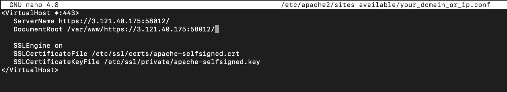
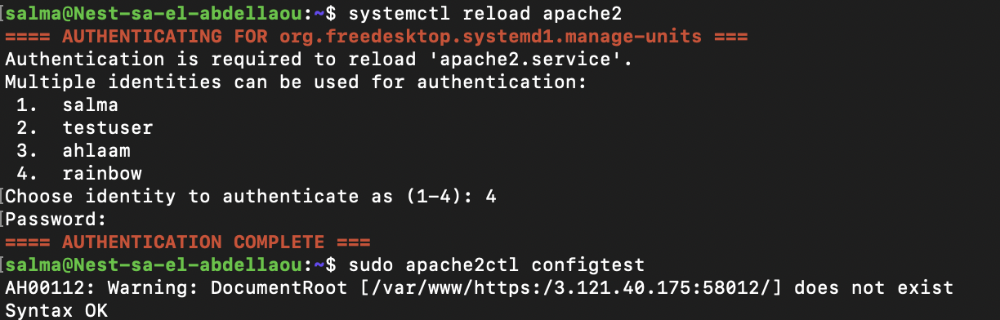
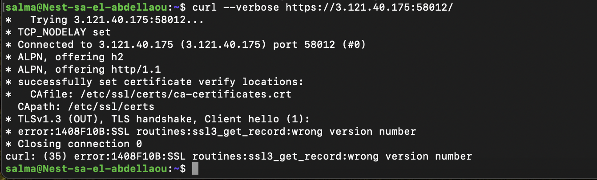
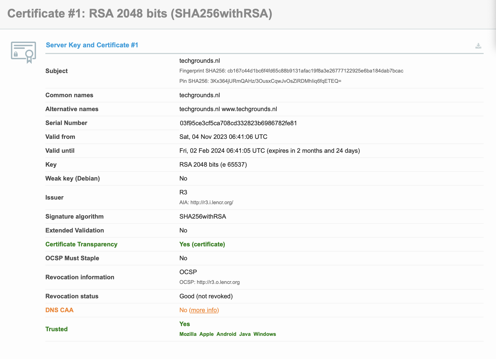
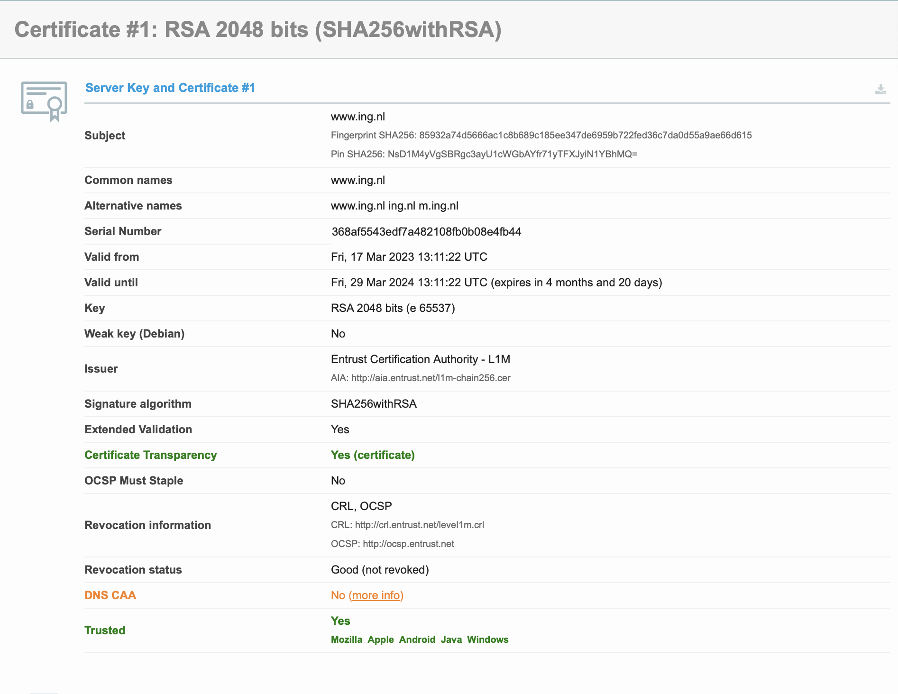
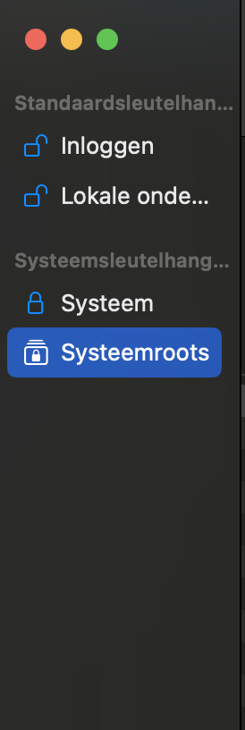
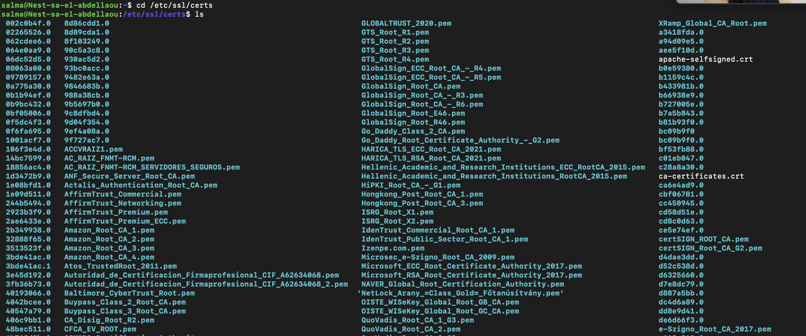

# Public key infrastructure
Een Public Key Infrastructure (PKI) is een verzameling van rollen, beleidsregels, hardware, software en procedures die nodig zijn om digitale certificaten te creëren, beheren, verspreiden, gebruiken, opslaan en intrekken, en om public key-encryptie te beheren.
Het bestaat uit drie entiteiten die ervoor zorgen dat je veilig kunt communiceren over een onveilig netwerk, zoals het openbare internet.

## Key-terms
* __X.509:__ Een X.509-certificaat is een digitaal certificaat dat de internationaal erkende X.509-infrastructuur voor openbare sleutels (PKI) gebruikt om te verifiëren dat een openbare sleutel behoort tot de gebruiker, computer of service-identiteit die in het certificaat is opgenomen.  
  
  Het X.509-certificaat wordt gedefinieerd door de Telecommunication Standardization Sector (ITU-T) van de International Telecommunication Union.

  In de cryptografie koppelt het X.509-certificaat op een veilige manier cryptografische sleutelparen van openbare en privésleutels aan websites, individuen of organisaties. Het certificaat wordt doorgaans gebruikt voor het beheer van identiteit en beveiliging in computernetwerken en op internet. Voor internet wordt het gebruikt in tal van protocollen om te voorkomen dat een kwaadwillende website een webbrowser misleidt. Het X.509-certificaat wordt ook gebruikt voor de beveiliging van e-mail, apparaatcommunicatie en digitale handtekeningen.

## Opdracht  
1. Maak een zelfondertekend certificaat op je VM.

2. Analyseer enkele certificeringspaden van bekende websites (bijv. techgrounds.nl / google.com / ing.nl).

3. Vind de lijst van vertrouwde certificaatwortels op je pc/laptop (bonuspunten als je het ook in je VM kunt vinden).

### Gebruikte bronnen
* https://www.globalsign.com/nl-nl/blog/informatiebeveiliging-eenvoudig-als-pki 
* https://www.youtube.com/watch?v=i-rtxrEz_E8
* https://www.techtarget.com/searchsecurity/definition/X509-certificate   
* https://www.digitalocean.com/community/tutorials/how-to-create-a-self-signed-ssl-certificate-for-apache-in-ubuntu-20-04  
* https://www.atlantic.net/dedicated-server-hosting/how-to-create-and-install-a-self-signed-ssl-certificate-on-ubuntu-20-04/
* https://support.networkoptix.com/hc/en-us/articles/16635062678039-How-to-generate-and-add-a-self-signed-trusted-certificate
### Ervaren problemen
[Geef een korte beschrijving van de problemen waar je tegenaan bent gelopen met je gevonden oplossing.]

### Resultaat 
  
De volgende stappen laten zien hoe je zelf een zelfondertekend SSL-certificaat met de Apache-webserver op Ubuntu 20.04 kunt maken.   

   
  
Als eerst moet je de openssl pakket installeren. Dit heb ik gedaan middels de volgende commando:

```
sudo apt install openssl
```
Vervolgens heb ik een updat uitgevoerd binnen mijn linux systeem, middels de volgende commando:  
```
sudo apt update
```  
Vervolgens heb ik middels de volgende commando de http en https servers geopend in mijn firewall. 
```
sudo ufw allow "Apache Full"
```
Vervolgens heb ik de status opgevraagd en gekeken of de juiste poorten openstaan. Zoals te zien is in de screenshot staan de juiste portalen open. 

      
  
Voordat we SSL-certificaten kunnen gebruiken, moeten we eerst mod_ssl inschakelen, een Apache-module die ondersteuning biedt voor SSL-encryptie. In de volgende screenshot is dit te zien. Ook is de apache gerestart om de module te activeren. 
  
   

Nu Apache gereed is om versleuteling te gebruiken, kunnen we doorgaan met het genereren van een nieuw SSL-certificaat. We kunnen de SSL-sleutel- en certificaatbestanden aanmaken met het openssl-commando:

      

1. __openssl:__ Dit is de opdrachtregeltool voor het maken en beheren van OpenSSL-certificaten, sleutels en andere bestanden.  
2. __req -x509:__ Hiermee geven we aan dat we X.
509-certificaatondertekeningsverzoeken (CSR) willen gebruiken. X.509 is een standaard voor openbare sleutelinfrastructuur waaraan SSL en TLS voldoen voor sleutel- en certificaatbeheer.
3. __nodes:__ Hiermee vertellen we OpenSSL om de optie om ons certificaat te beveiligen met een wachtwoord over te slaan. We moeten Apache in staat stellen het bestand te lezen zonder tussenkomst van de gebruiker bij het opstarten van de server. Een wachtwoord zou dit voorkomen, omdat we het na elke herstart zouden moeten invoeren.
4. __days 365:__ Deze optie stelt de geldigheidsduur van het certificaat in. We hebben het hier ingesteld op één jaar. Veel moderne browsers zullen certificaten die langer geldig zijn dan één jaar, afwijzen.
5. __newkey rsa:2048:__ Hiermee geven we aan dat we tegelijkertijd een nieuw certificaat en een nieuwe sleutel willen genereren. We hebben de sleutel die vereist is om het certificaat te ondertekenen niet aangemaakt in een eerdere stap, dus we moeten deze samen met het certificaat aanmaken. Het gedeelte rsa:2048 vertelt dat het een RSA-sleutel van 2048 bits lang moet maken.
6. __keyout:__ Deze regel vertelt OpenSSL waar het gegenereerde privésleutelbestand moet worden geplaatst dat we aan het maken zijn.
7. __out:__ Dit vertelt OpenSSL waar het certificaat moet worden geplaatst dat we aan het maken zijn.      
  
In de volgende screenshot is te zien waar ik mijn private key kan vinden en mijn gemaakte certificaat. 

 

Als ik mijn certificaat open zie ik het volgende: 


   
  
Nu ik mijn zelfondertekende certificaat en sleutel heb, moeten ik mijn Apache-configuratie bijwerken om het te gebruiken. 

Open een nieuw bestand in de /etc/apache2/sites-available directory en ik heb de volgende tekst erin geplaatst.

```
sudo nano /etc/apache2/sites-available/your_domain_or_ip.conf
```
     

 Zorg ervoor dat de common name die je hebt opgegeven in jouw certificaat hetzelfde is als de servername. 

 Laten we nu een DocumentRoot maken en er een HTML-bestand in plaatsen, voor testdoeleinden: 

```
sudo mkdir /var/www/your_domain_or_ip
```
```
sudo nano /var/www/your_domain_or_ip/index.html
```
Nu moet het configuratiebestand ingeschakeld worden met de a2ensite-tool. 
  
```
sudo a2ensite your_domain_or_ip.conf
```
Vervolgens vraagt het systeem om een reload om het te activeren. 
```
sudo systemctl reload apache2
```
En om te kijken of het goed geconfigureerd is gebruik ik de volgende commando: 
```
sudo apache2ctl configtest
```
 
  

De eerste regel is een bericht dat aangeeft dat de ServerName-directive niet globaal is ingesteld. Als ik van dat bericht af wil, kan ik de ServerName instellen op het domein of IP-adres van mijn server in /etc/apache2/apache2.conf. Dit is optioneel, aangezien het bericht geen schade zal aanrichten.

Mijn uitvoer bevat Syntax OK, dus mijn configuratiebestand bevat geen syntaxisfouten.  

Hiermee heb ik mijn certificaat geconfigureerd in mijn Apache server. 

Met de volgende commando heb ik mijn certificaat nogmaals gecheckt. 

```
curl --verbose https://3.121.40.175:58012/
```

 

Daaruit is te zien dat er een connectie heeft plaats gevonden en dat mijn certificaat is gelokaliseerd. 

De commando geeft aan dat er een probleem is met de SSL-handshake. Het specifieke foutbericht is "error:1408F10B:SSL routines:ssl3_get_record:wrong version number". Dit kan duiden op een mismatch in de SSL-versies tussen de client (curl) en de server.

__Trouble shooting:__
Mogelijke oorzaken kunnen zijn dat de server SSL/TLS versie 1.3 gebruikt, terwijl de gebruikte versie van curl niet compatibel is met die versie. Een andere mogelijke oorzaak is dat er iets mis is met de SSL-configuratie op de server. 

Opdracht 2: __Analyseer enkele certificeringspaden van bekende websites (bijv. techgrounds.nl / google.com / ing.nl).__
 
 

Opdracht 3: __Vind de lijst van vertrouwde certificaatwortels op je pc/laptop (bonuspunten als je het ook in je VM kunt vinden).__  


De vertrouwde lijst met certificaten op mijn macbook kan hier gevonden worden:

 

De vertrouwde lijst met certificaten in mijn Linux kan met de volgende commando's gevonden worden:
  