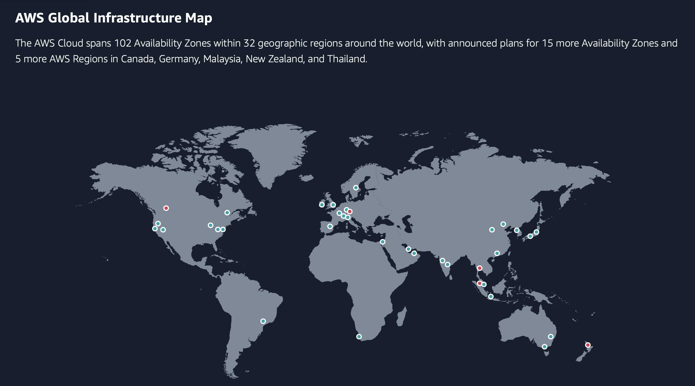
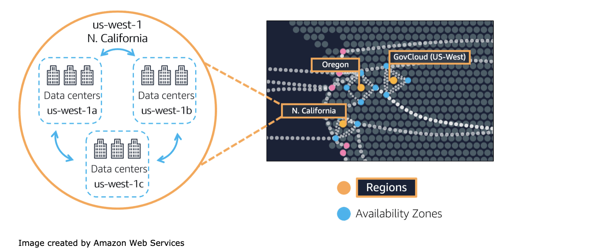

# AWS Global Infrastructure
The AWS Global Infrastructure consists of multiple geographical locations which are called Regions. AWS Regions are divided up in Availability Zones which consist of one or more psychically separated data centers.

 

There are different reasons to choose a specific region. Those reasons could be:

1. Data regulations
2. Customer proximity
3. Service availability
4. Pricing

Availability Zone is a single Data Center or a group of Data Centers in a region. In an Availability Zone the Data Centers are located many miles apart from each other. Having them apart reduces the risk of them all going down if a disaster happens in the region. Simultaneously, have the Data Center(s) close enough to have low latency. 

  

Edge Location is the Data Center used to deliver content fast to your users. It is the site that is nearest to your users. The AWS Edge Locations uses a service called CloudFront. CloudFront is used to store cached copies of your content. Caching helps the software to deliver content faster and cheaper. Cache is fast storage that copies and stores parts of data. Resulting in fast delivery of your content.

The cache saves subsets of the data, making it available. Once someone requests the data, it is copied and stored at the Edge Location. When the next person requests the same data, it will be delivered faster from the nearest Edge Location.

__Why would you choose one region over another? (e.g. eu-central-1 (Frankfurt) over us-west-2 (Oregon))?__ 

I would choose Frankfurt because of the following reason:

1. it's generally advisable to choose the one that is geographically closer to your physical location or where your primary user base is located. This is because the proximity can affect latency and overall performance. I am based in the Netherlands, so that means Frankfurt would be a better option for me. 

   However, the final decision may also depend on other factors such as specific services offered in each region, pricing, and any compliance or regulatory requirements that might affect my choice. 

### Sources
* https://www.w3schools.com/aws/aws_cloudessentials_awsavailabilityzones.php
* https://aws.amazon.com/about-aws/global-infrastructure/ 
* https://chat.openai.com  
