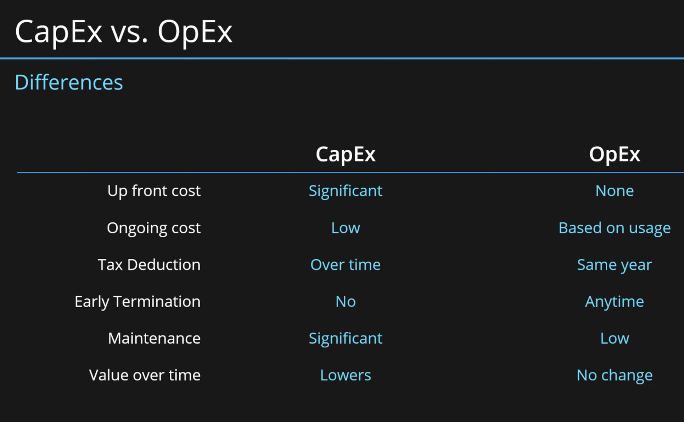

# Advantages of the cloud
Cloud computing is the on-demand delivery of compute power, database, storage, applications, and other IT resources through a cloud services platform via the internet with pay-as-you-go pricing.

AWS lists six advantages of cloud computing. These are basic characteristics of the cloud that make it attractive for companies to use. It is also a marketing tool for AWS to introduce the cloud to new customers. As such, it is an important part of the AWS Cloud Practitioner exam.
The six advantages listed are:

1. Trade Capital expense (CapEx) for variable expense (OpEx)  
  
  
2. Benefit from massive economies of scale  
By using cloud computing, you can achieve a lower variable cost than you can get on your own. Because usage from hundreds of thousands of customers is aggregated in the cloud, providers such as AWS can achieve higher economies of scale, which translates into lower pay as-you-go prices.  

3. Stop guessing capacity  
Eliminate guessing on your infrastructure capacity needs. When you make a capacity decision prior to deploying an application, you often end up either sitting on expensive idle resources or dealing with limited capacity. With cloud computing, these problems go away. You can access as much or as little capacity as you need, and scale up and down as required with only a few minutes’ notice.  

4. Increase speed and agility  
In a cloud computing environment, new IT resources are only a click away, which means that you reduce the time to make those resources available to your developers from weeks to just minutes. This results in a dramatic increase in agility for the organization, since the cost and time it takes to experiment and develop is significantly lower.  

5. Stop spending money on running and maintaining data centers  
Focus on projects that differentiate your business, not the infrastructure. Cloud computing lets you focus on your own customers, rather than on the heavy lifting of racking, stacking, and powering servers.  

6. Go global in minutes  
Easily deploy your application in multiple regions around the world with just a few clicks. This means you can provide lower latency and a better experience for your customers at minimal cost.

### Gebruikte bronnen
* https://www.youtube.com/watch?v=7KEygnLtRyE 
* https://docs.aws.amazon.com/whitepapers/latest/aws-overview/six-advantages-of-cloud-computing.html# 

