# S3
Amazon Simple Storage Service (Amazon S3) is an object storage service that offers industry-leading scalability, data availability, security, and performance. Amazon S3 provides management features so that you can optimize, organize, and configure access to your data to meet your specific business, organizational, and compliance requirements.

* __Storage classes:__ Amazon S3 offers a range of storage classes designed for different use cases.   

    1. S3 Standard for frequent access
    2. S3 Standard-IA or S3 One Zone-IA
    3. S3 Glacier Instant Retrieval, S3 Glacier Flexible Retrieval, and S3 Glacier Deep Archive

You can store data with changing or unknown access patterns in S3 Intelligent-Tiering, which optimizes storage costs by automatically moving your data between four access tiers when your access patterns change.

### Sources
* https://www.youtube.com/watch?v=77lMCiiMilo
* https://docs.aws.amazon.com/AmazonS3/latest/userguide/Welcome.html 
* https://www.youtube.com/watch?v=i4YFFWcyeFM
* https://docs.aws.amazon.com/AmazonS3/latest/userguide/HostingWebsiteOnS3Setup.html 

### Results
I created a new S3 bucket in the Frankfurt region (eu-central-1). I uploaded an image of a cat to the bucket and adjusted the file permissions to allow anyone with an AWS account to view the image by using the link in their web browser. 

In the following image you can see my new S3 bucket. 

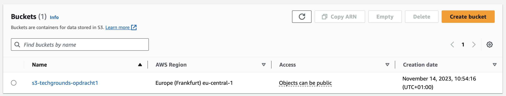

The settings of my bucket can be seen in the following image:

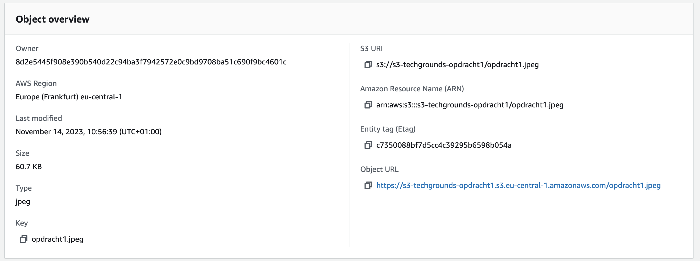 

In the next image the permissions settings are shown:

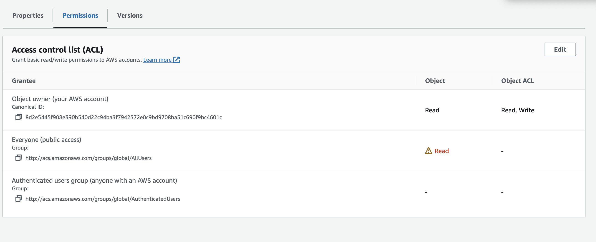 

I have sent my URL to my peer and requested a screenshot. 

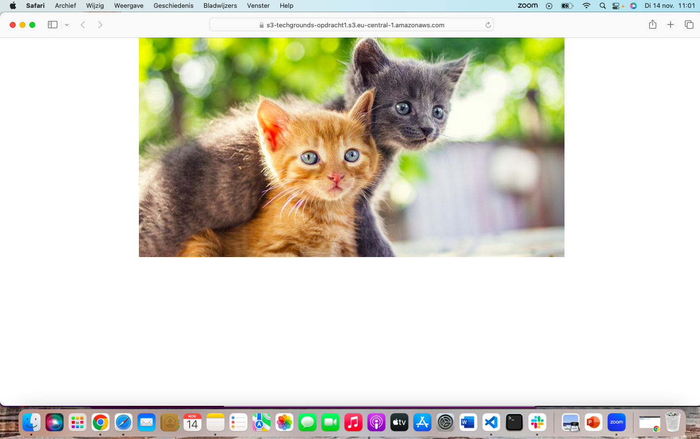   
  
For the next assignment I created a S3 bucket for the AWS demo website. I was able to host a static website in this bucket and my peer was also able to see it (by using the URL). 

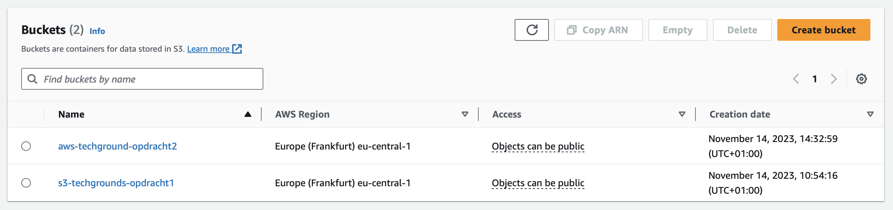 

After creating the S3 bucket, I uploaded the files provided by Techgrounds to illustrate the AWS website demo.

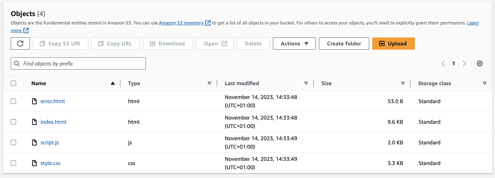 

To view the website, I had to modify some settings for both the bucket and the files used. I chose Frankfurt as the region for creating the bucket, as required by the assignment.

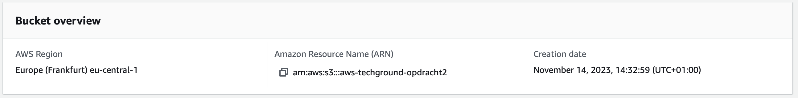 

I also made sure that there was public acces. 

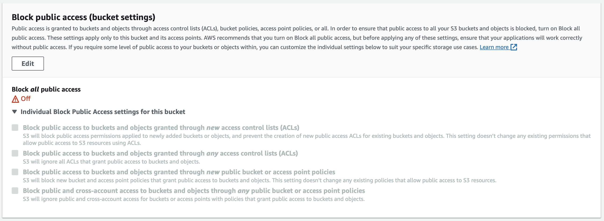

I also ensured that the object ownership was set to 'bucket owner preferred.' I did this to allow access to the files within this bucket.

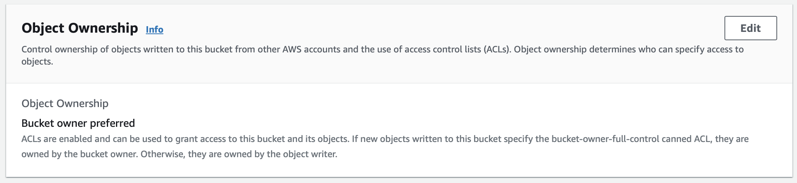 

I also neede to set the permissions of the file open. I did this using the action button. 

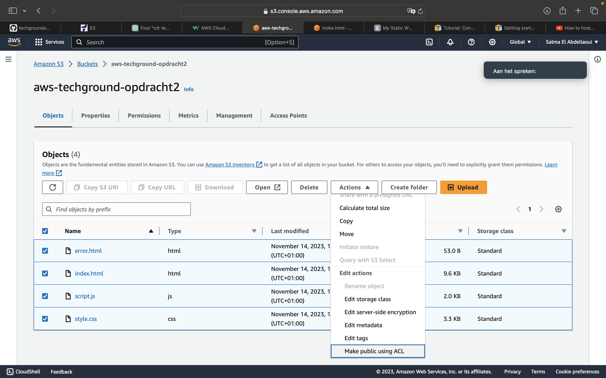

My peer checked the given URL of this website and it worked. 

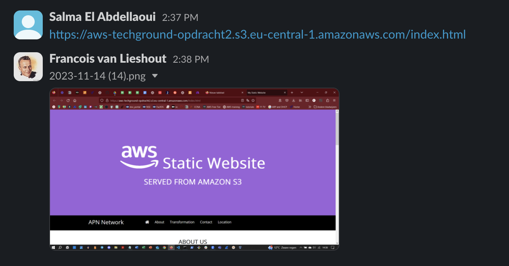 

