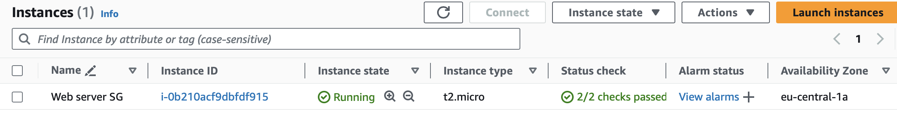
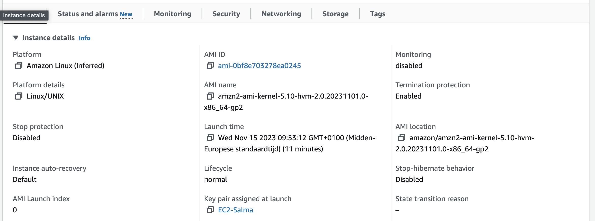
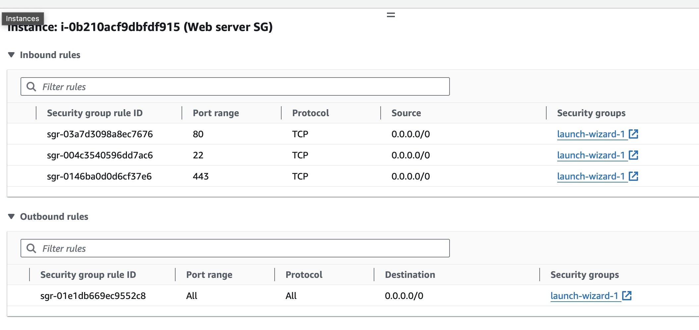
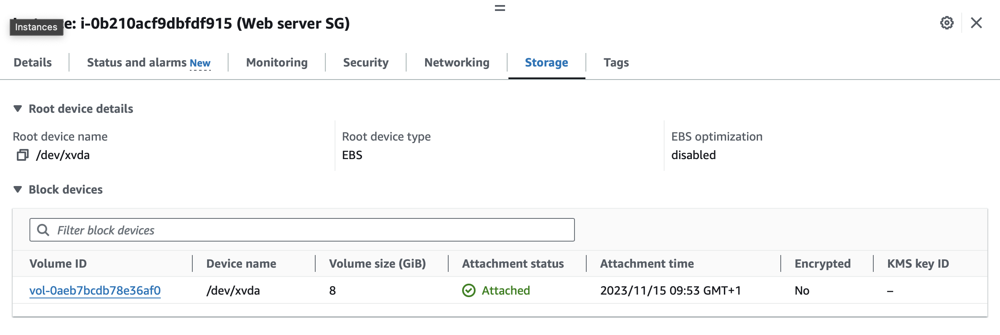
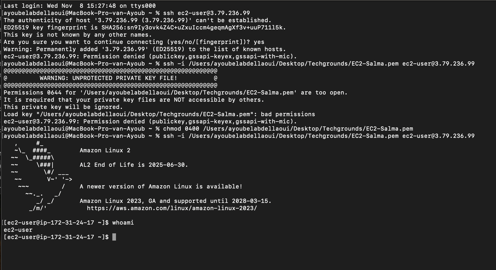
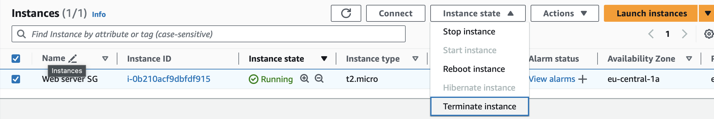

# EC2
The service with which you can run Virtual Machines in AWS is called EC2. These VMs can be used for anything a regular server is used for. Since they’re located at a remote location, connecting to the machine has to be done via the internet. 

When creating an EC2 instance, you first need to select an Amazon Machine Image (AMI). An AMI is a blueprint for your machine. It contains a template for the OS among other things. 

EC2 can have different sizes, called instance types. Every instance type has a different amount of (virtual)CPUs, memory, and network performance.

1. __Instances__  
Virtual servers.
2. __Amazon Machine Images (AMIs)__
Preconfigured templates for your instances that package the components you need for your server (including the operating system and additional software).
3. __Instance types__
Various configurations of CPU, memory, storage, networking capacity, and graphics hardware for your instances.
4. __Key pairs__
Secure login information for your instances. AWS stores the public key and you store the private key in a secure place.
5. __Instance store volumes__
Storage volumes for temporary data that is deleted when you stop, hibernate, or terminate your instance.
6. __Amazon EBS volumes__
Persistent storage volumes for your data using Amazon Elastic Block Store (Amazon EBS).
7. __Regions, Availability Zones, Local Zones, AWS Outposts, and Wavelength Zones__    

   Multiple physical locations for your resources, such as instances and Amazon EBS volumes.
8. __Security groups__
A virtual firewall that allows you to specify the protocols, ports, and source IP ranges that can reach your instances, and the destination IP ranges to which your instances can connect.
9. __Elastic IP addresses__
Static IPv4 addresses for dynamic cloud computing.
10. __Tags__
Metadata that you can create and assign to your Amazon EC2 resources.
11. __Virtual private clouds (VPCs)__
Virtual networks you can create that are logically isolated from the rest of the AWS Cloud. You can optionally connect these virtual networks to your own network.

### Sources
* https://docs.aws.amazon.com/AWSEC2/latest/UserGuide/concepts.html 
* https://docs.aws.amazon.com/AWSEC2/latest/UserGuide/connect-to-linux-instance.html?icmpid=docs_ec2_console
* https://www.youtube.com/watch?v=iHX-jtKIVNA

### Results
I created my first EC2 instance using the settings provided by Techgrounds. The following screenshots showcase the configuration of my EC2 instance, demonstrating that it is now up and running. 

 
 
 
  

I logged into my EC2 instance using the SSH key that I generated during the EC2 instance creation process. The following screenshot illustrates the steps I took to successfully log in via my terminal and also demonstrates how to terminate the EC2 instance. 

  
