# EBS
Amazon Elastic Block Store (Amazon EBS) provides block level storage volumes for use with EC2 instances. EBS volumes behave like raw, unformatted block devices. You can mount these volumes as devices on your instances. EBS volumes that are attached to an instance are exposed as storage volumes that persist independently from the life of the instance.

Amazon EBS is recommended for data that must be quickly accessible and requires long-term persistence. EBS volumes are particularly well-suited for use as the primary storage for file systems, databases, or for any applications that require fine granular updates and access to raw, unformatted, block-level storage.

Amazon EBS provides the following volume types: General Purpose SSD (gp2 and gp3), Provisioned IOPS SSD (io1 and io2), Throughput Optimized HDD (st1), Cold HDD (sc1), and Magnetic (standard). 

You can create your EBS volumes as encrypted volumes, in order to meet a wide range of data-at-rest encryption requirements for regulated/audited data and applications. When you create an encrypted EBS volume and attach it to a supported instance type, data stored at rest on the volume, disk I/O, and snapshots created from the volume are all encrypted.

You can attach multiple EBS volumes to a single instance. The volume and instance must be in the same Availability Zone. Depending on the volume and instance types, you can use Multi-Attach to mount a volume to multiple instances at the same time.

### Sources
* https://www.youtube.com/watch?v=VJBtqORxNLU 
* https://docs.aws.amazon.com/AWSEC2/latest/UserGuide/ebs-volumes.html
* https://www.youtube.com/watch?v=r4-l_ES7Zpk
* https://docs.aws.amazon.com/AWSEC2/latest/UserGuide/ebs-using-volumes.html
* https://docs.aws.amazon.com/AWSEC2/latest/UserGuide/ebs-creating-snapshot.html 

### Trouble shooting 
[Geef een korte beschrijving van de problemen waar je tegenaan bent gelopen met je gevonden oplossing.]

### Results
I created another EC2 instance with the default settings, similar to the one specified in the EC2 file. During the creation of this EC2 instance, I included an EBS volume with the necessary conditions as specified. Additionally, I created a separate EBS volume and attached it to the EC2 instance. All the steps are illustrated in the following screenshots:

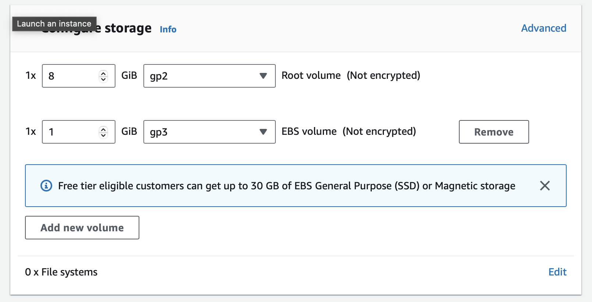

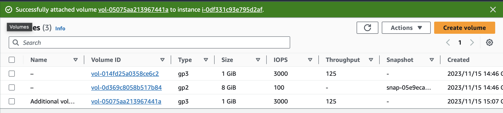

The first screenshot depicts the creation of the EBS volume when setting up the EC2 instance. The second screenshot illustrates the attachment of the EBS volume to the instance.

In the next screenshot, the volumes are displayed with their device names, which are crucial for the next steps.

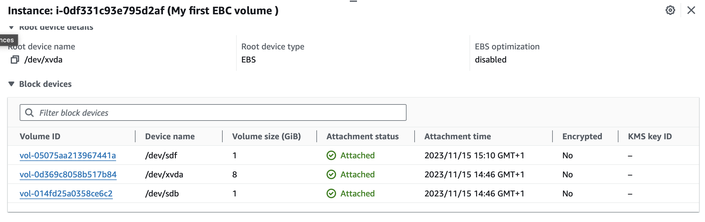

The following screenshot showcases how I list the devices, set up a file system, create a mount point, and generate a file in the EBS volume.

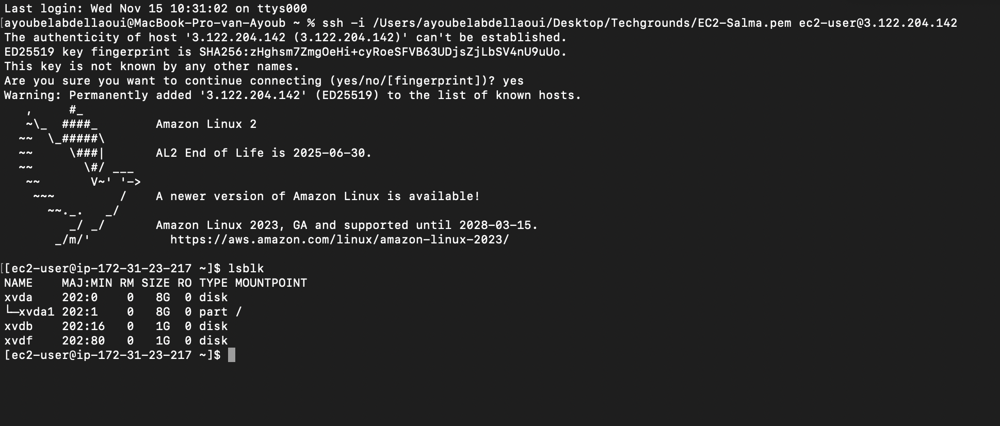
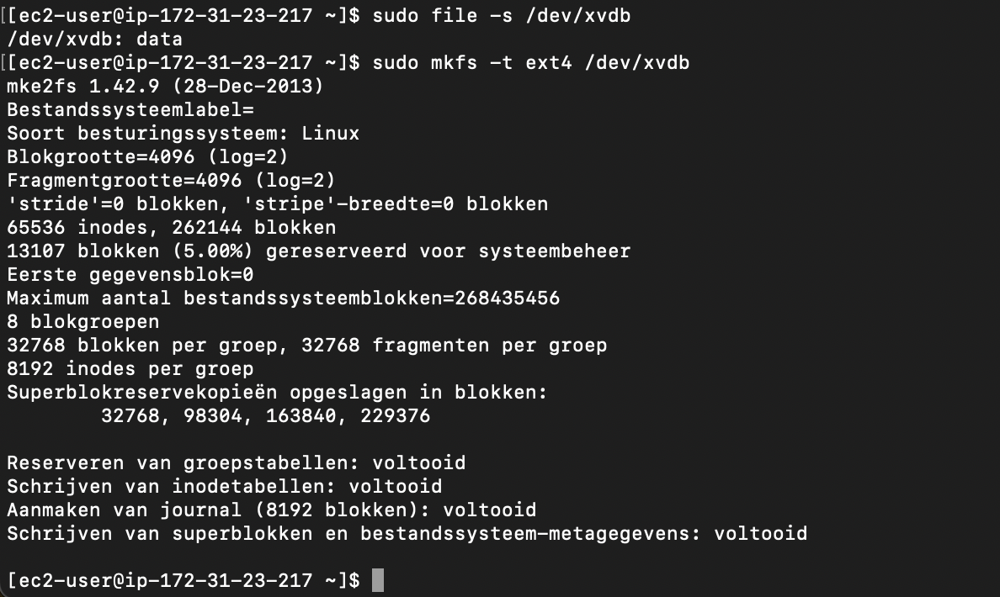
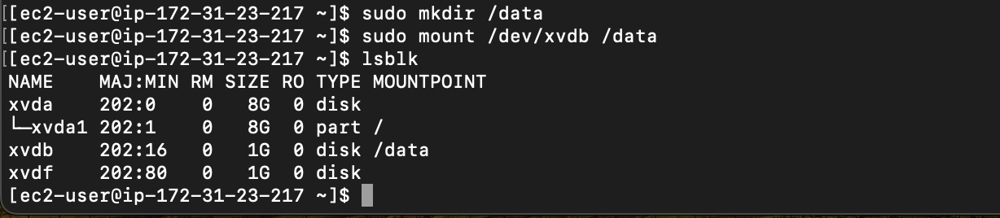
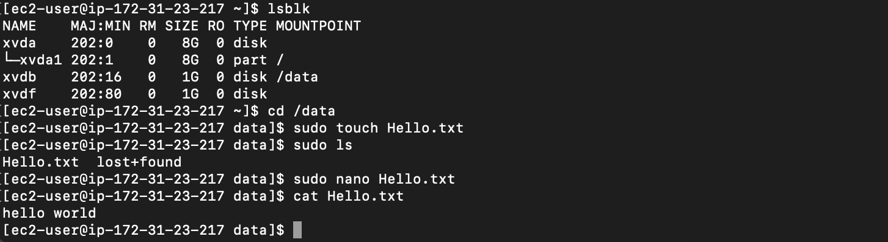   

For the next assignment, I created a snapshot of my existing EBS volume. Subsequently, I removed the file I had created (after taking the screenshot) and generated a new volume from the snapshot. I detached my original EBS, attached the new volume (and mounted it), and eventually needed to locate the file I had created in the original volume in the snapshot volume.

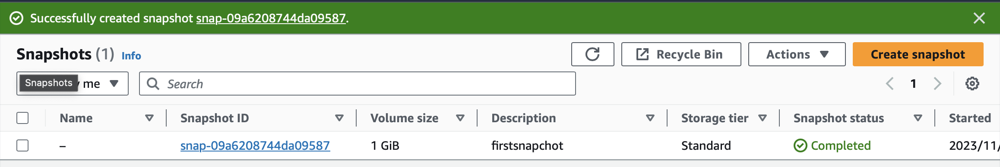 
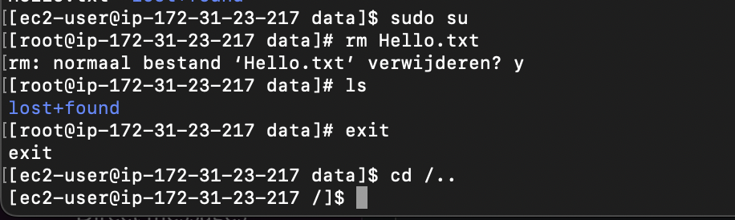 
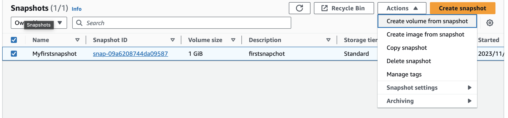 
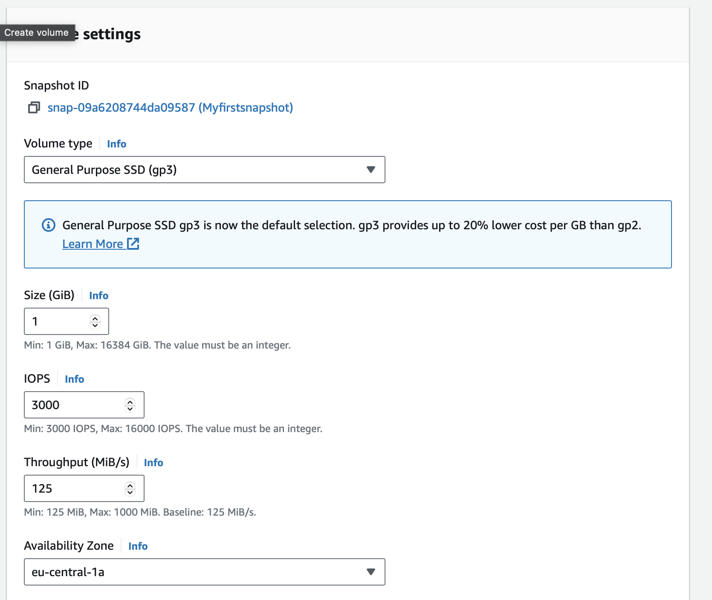 
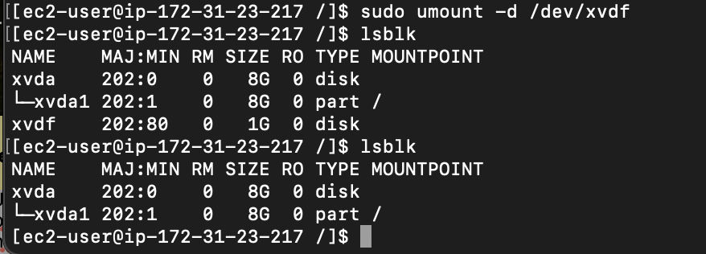 
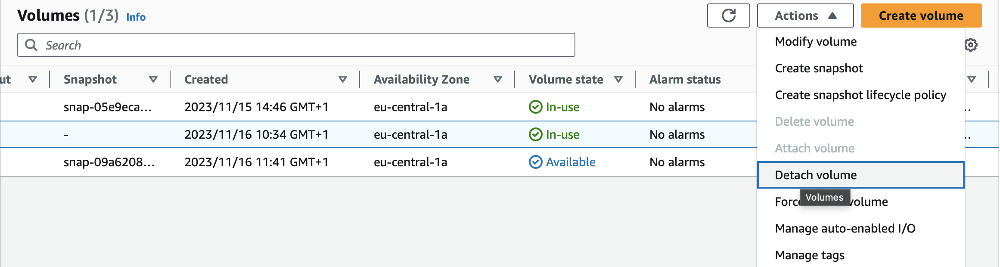 
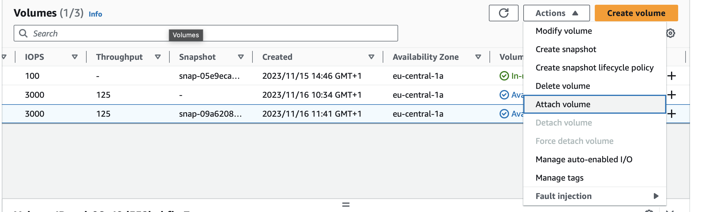 
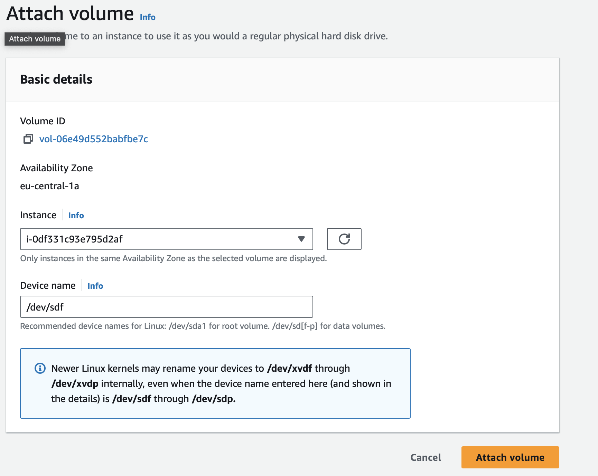  
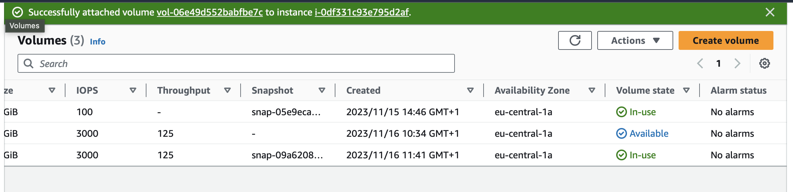 
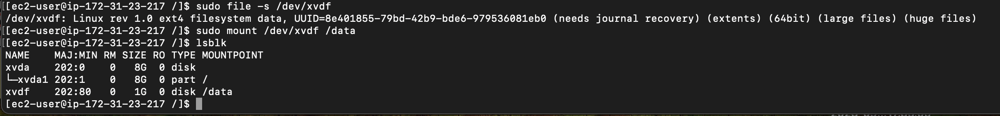 
 

