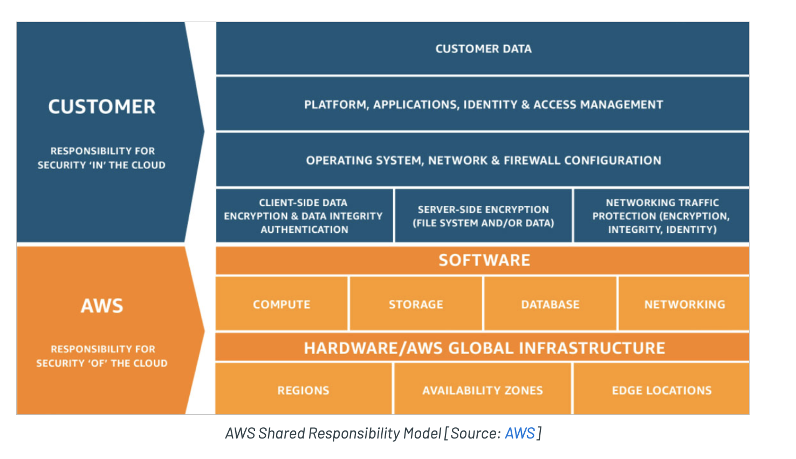

# The Shared Responsibility Model
Many modern organizations are migrating their infrastructure and systems to the cloud. AWS, like other cloud providers, has a “Shared Responsibility Model” that determines which cloud components AWS is responsible for securing and which are the customer’s responsibility to secure.

As a rule of thumb, AWS is responsible for security of the cloud, and the customer is responsible for security in the cloud.

Breaking that down, AWS is responsible for the host operating system, the virtualization layer and the physical security of the cloud servers. The customer is responsible for protecting the rest -- which is not a trivial amount of security ownership -- including network controls, configurations, IAM and customer data.

 

### Sources
* https://ermetic.com/blog/aws/the-aws-shared-responsibility-model-everything-you-need-to-know 

