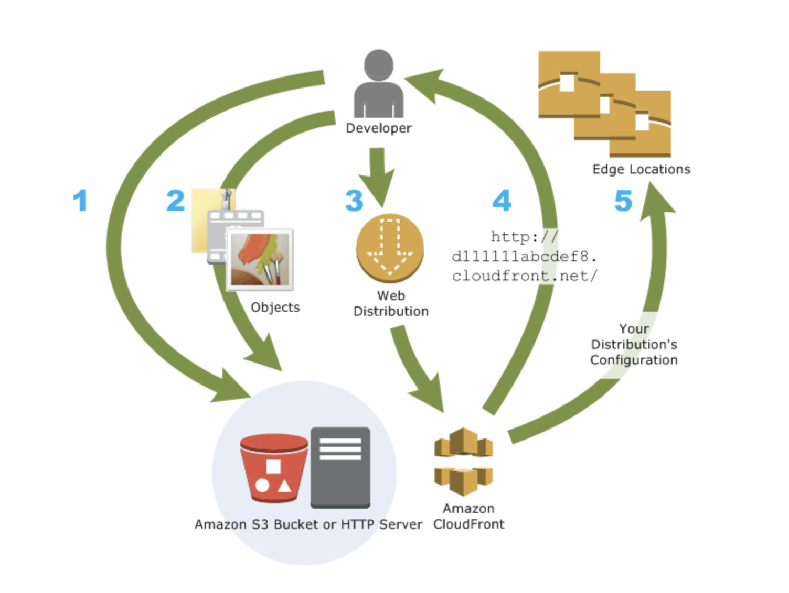
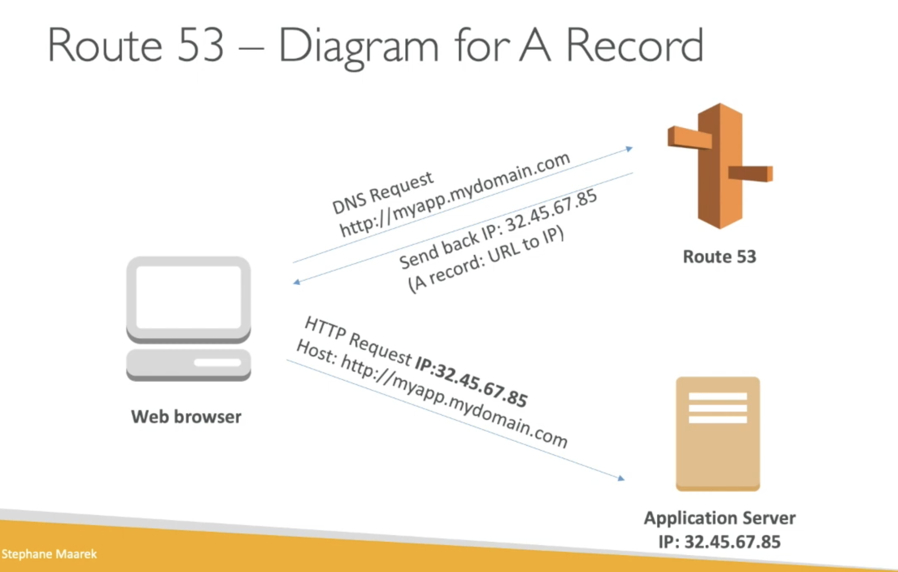
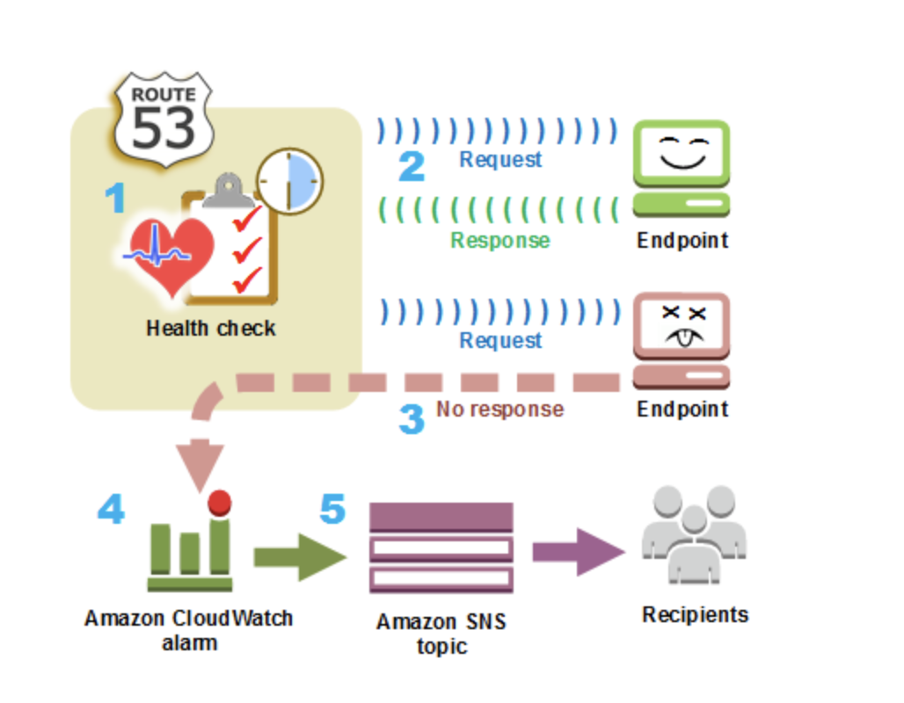

# Theoretical and practical experience in AWS

### CloudFront 

Amazon CloudFront is a globally distributed network of servers that can deliver content to users. The netowrk has edges (servers) in many locations around the world. The servers cache content closer to the users to improve access speed. Creation of new distributions can be automated.

Caching data in multiple locations also provide data redundancy, improving reliability of access. Amazon CloudFront uses RTMP protocol for video streaming and HTTP or HTTPS for web content.

Amazon CloudFront speeds up distribution of your static and dynamic web content, such as .html, .css, .php, image, and media files. When users request your content, CloudFront delivers it through a worldwide network of edge locations that provide low latency and high performance.  

 

### Route 53  
Amazon Route 53 is a highly available and scalable Domain Name System (DNS) web service. You can use Route 53 to perform three main functions in any combination: domain registration, DNS routing, and health checking.  
  
1. __Register domain names:__  

   Your website needs a name, such as example.com. Route 53 lets you register a name for your website or web application, known as a domain name.

2. __Route internet traffic to the resources for your domain:__  

   When a user opens a web browser and enters your domain name (example.com) or subdomain name (acme.example.com) in the address bar, Route 53 helps connect the browser with your website or web application.    

 

3. __Check the health of your resources:__  

   Route 53 sends automated requests over the internet to a resource, such as a web server, to verify that it's reachable, available, and functional. You also can choose to receive notifications when a resource becomes unavailable and choose to route internet traffic away from unhealthy resources.  

   

### Sources
* https://www.w3schools.com/whatis/whatis_aws_cloudfront.asp 
* https://docs.aws.amazon.com/cloudfront/
* https://www.youtube.com/watch?v=BujVA_Jg6W0
* https://cloud.contentraven.com/awspartners/w3schools/content-viewer/517004/1/11/0 
* https://docs.aws.amazon.com/Route53/latest/DeveloperGuide/Welcome.html 
* https://www.youtube.com/watch?v=10JKpg-eqZU

### Practical experience with AWS services

