# Theoretical and practical experience in AWS

### CloudFront 

Amazon CloudFront is a globally distributed network of servers that can deliver content to users. The netowrk has edges (servers) in many locations around the world. The servers cache content closer to the users to improve access speed. Creation of new distributions can be automated.

Caching data in multiple locations also provide data redundancy, improving reliability of access. Amazon CloudFront uses RTMP protocol for video streaming and HTTP or HTTPS for web content.

Amazon CloudFront speeds up distribution of your static and dynamic web content, such as .html, .css, .php, image, and media files. When users request your content, CloudFront delivers it through a worldwide network of edge locations that provide low latency and high performance.  

 

### Route 53  
Amazon Route 53 is a highly available and scalable Domain Name System (DNS) web service. You can use Route 53 to perform three main functions in any combination: domain registration, DNS routing, and health checking.  
  
1. __Register domain names:__  

   Your website needs a name, such as example.com. Route 53 lets you register a name for your website or web application, known as a domain name.

2. __Route internet traffic to the resources for your domain:__  

   When a user opens a web browser and enters your domain name (example.com) or subdomain name (acme.example.com) in the address bar, Route 53 helps connect the browser with your website or web application.    

 

3. __Check the health of your resources:__  

   Route 53 sends automated requests over the internet to a resource, such as a web server, to verify that it's reachable, available, and functional. You also can choose to receive notifications when a resource becomes unavailable and choose to route internet traffic away from unhealthy resources.  

   

### Sources
* https://www.w3schools.com/whatis/whatis_aws_cloudfront.asp 
* https://docs.aws.amazon.com/cloudfront/
* https://www.youtube.com/watch?v=BujVA_Jg6W0
* https://cloud.contentraven.com/awspartners/w3schools/content-viewer/517004/1/11/0 
* https://docs.aws.amazon.com/Route53/latest/DeveloperGuide/Welcome.html 
* https://www.youtube.com/watch?v=10JKpg-eqZU
* https://www.w3schools.com/aws/aws_cloudessentials_amazonelasticfilesystem.php
* https://docs.aws.amazon.com/efs/latest/ug/whatisefs.html
* https://docs.aws.amazon.com/AWSEC2/latest/UserGuide/AmazonEFS.html 
* https://www.w3schools.com/aws/aws_cloudessentials_amazonrds.php 
* https://docs.aws.amazon.com/AmazonRDS/latest/UserGuide/CHAP_GettingStarted.html 
* https://www.youtube.com/watch?v=tLp8pPNdDXQ 
* https://www.youtube.com/watch?v=ZCt3ctVfGIk 

### Practical experience with AWS services

#### Elastic File System (EFS)

Amazon Elastic File System (Amazon EFS) provides serverless, fully elastic file storage so that you can share file data without provisioning or managing storage capacity and performance. Amazon EFS is built to scale on demand to petabytes without disrupting applications, growing and shrinking automatically as you add and remove files. 

Amazon EFS offers the following storage class options for different use cases:

* __Standard storage classes:__   
(Recommended) – EFS Standard and EFS Standard–Infrequent Access (Standard–IA), which offer Multi-AZ resilience and the highest levels of durability and availability.
* __One Zone storage classes:__   
 – EFS One Zone and EFS One Zone–Infrequent Access (EFS One Zone–IA), which offer you the choice of additional savings by choosing to save your data in a single Availability Zone  

 ##### Exercise 

 1. Create an EFS file system using Amazon EFS Quick Create when making an EC2

 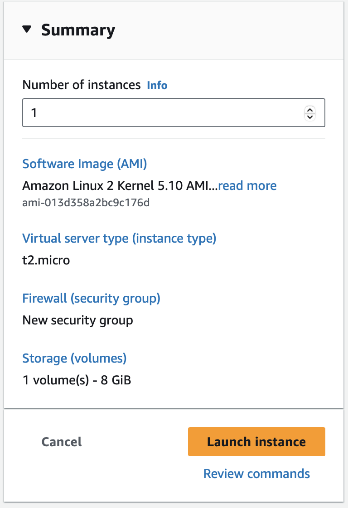
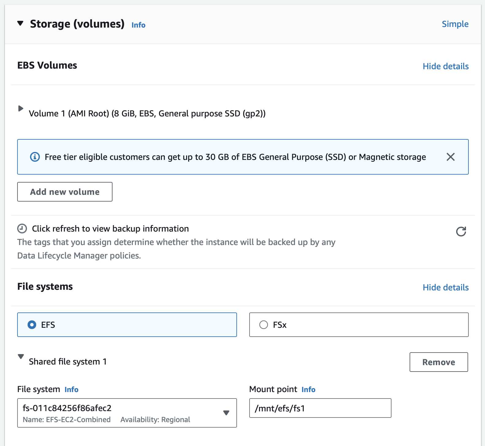
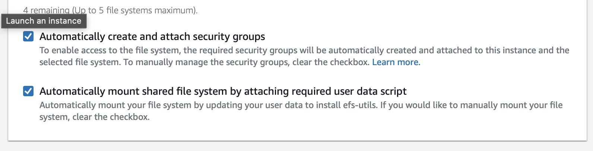
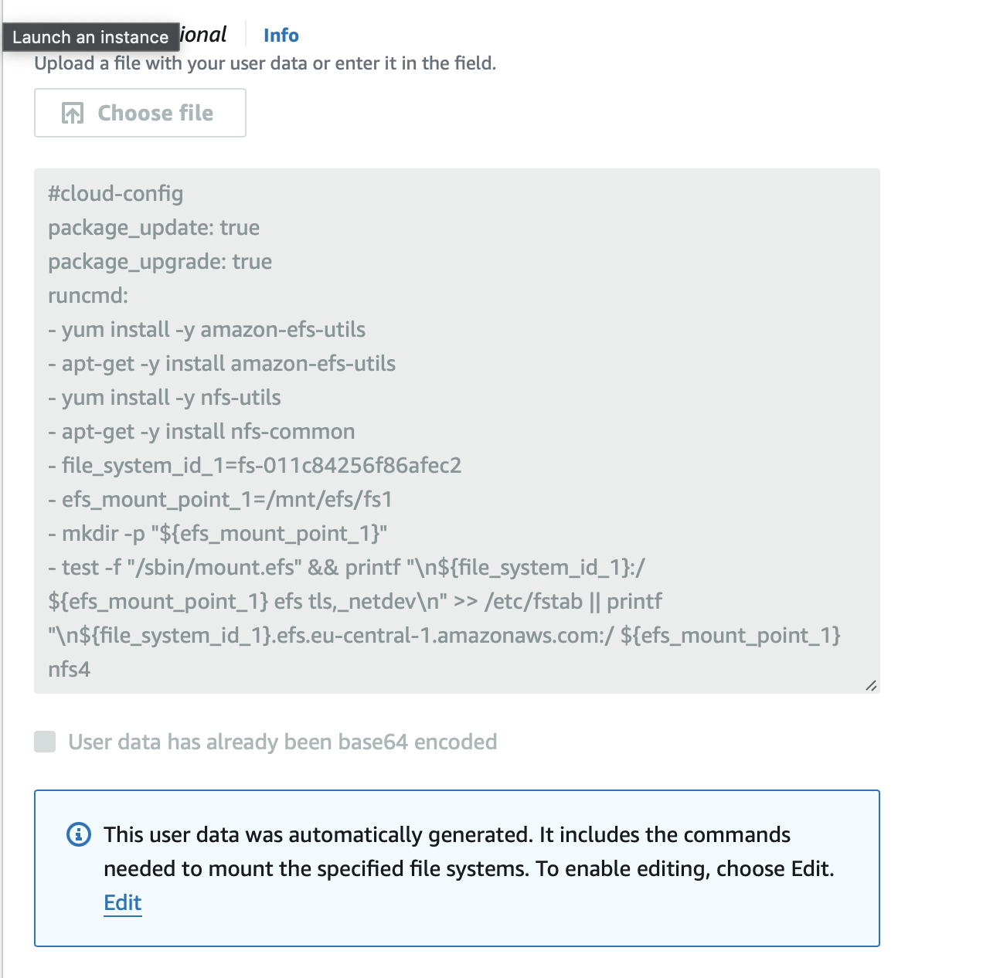
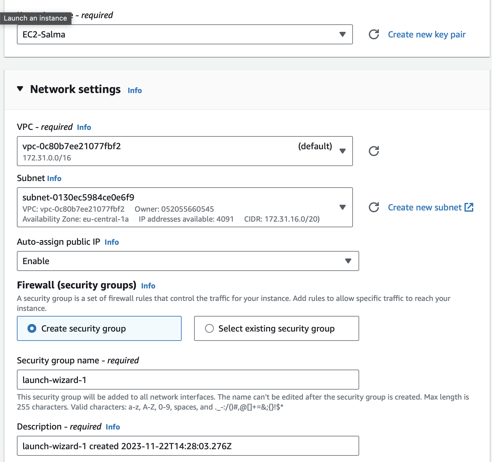
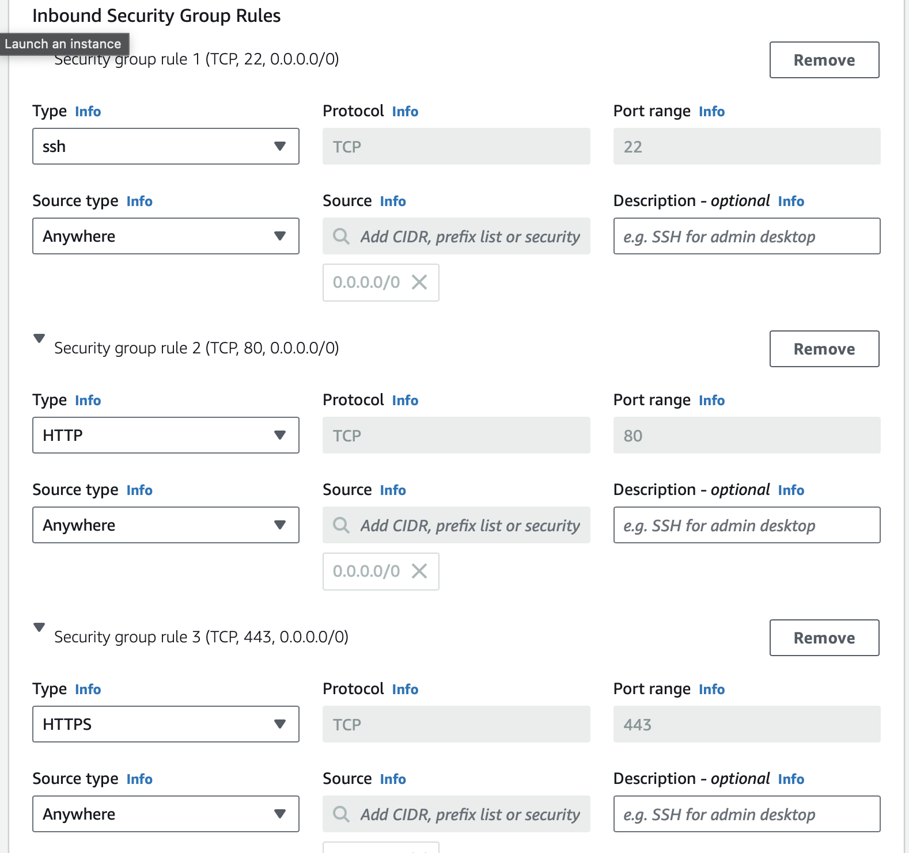

 2. Test the EFS file system

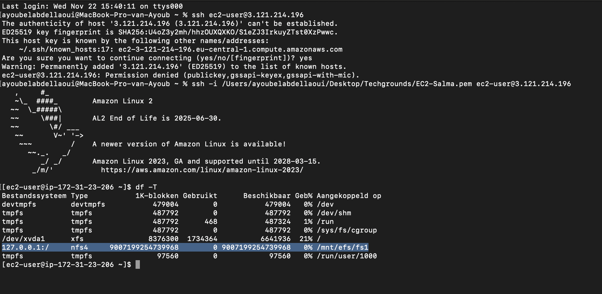

3. Delete the EFS file system
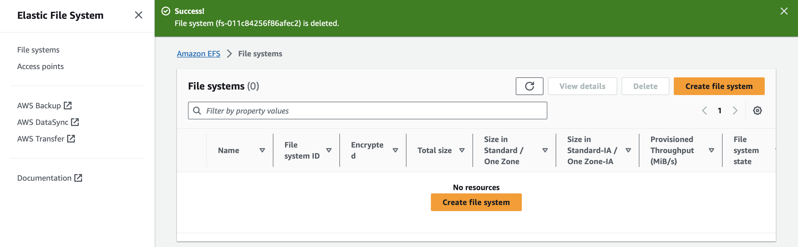 

#### RDS and Aurora 
AWS RDS is also called AWS Relational Database Service. RDS is a service that automates database tasks. It enables running relational databases in AWS Cloud.

Amazon RDS is responsible for hosting the software components and infrastructure of DB instances and DB cluster. You are responsible for query tuning, which is the process of adjusting SQL queries to improve performance.

Amazon Aurora is a relational database ideal for large organizations and enterprises. It offers high availability of data. It is excellent for managing large amounts of data. It is five times faster than a MySQL database. It is three times faster than a PostgreSQL database. 

Amazon Aurora creates six copies of data across three Availability Zones and a data backup on Amazon S3. It ensures the data is available at all times. 

##### Excercise

1. Configure your own RDS Aurora Serverless MySQL instance in the AWS console.   

Instead of provisioning and managing database servers, I specify Aurora capacity units (ACUs). Here, load is CPU utilization and the number of connections. When capacity is constrained by either of these, Aurora Serverless v1 scales up. 

Furthermore, I specified the capacity range, the serverless Aurora, and I enealed the API which allows me to interact with my database. The VPC that is used, is the default one with the three subnets. 

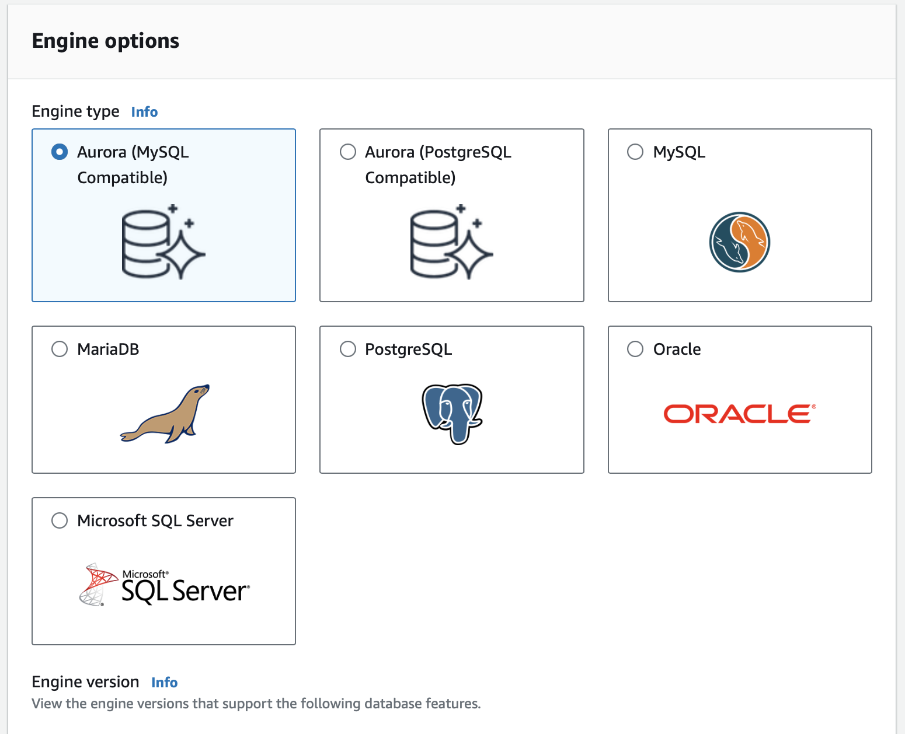 
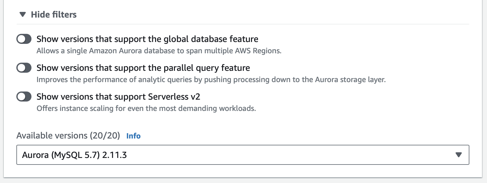 
 
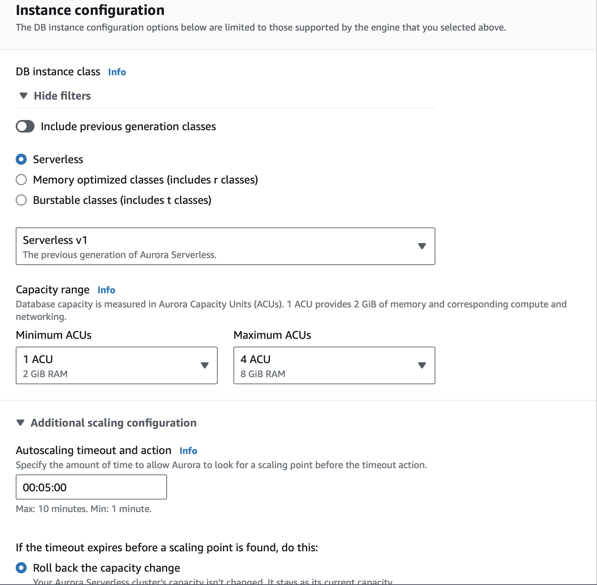 
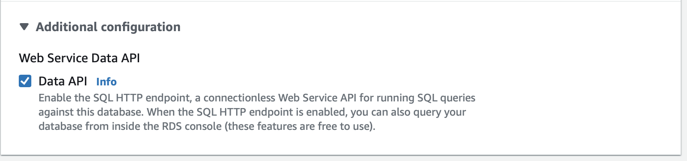 
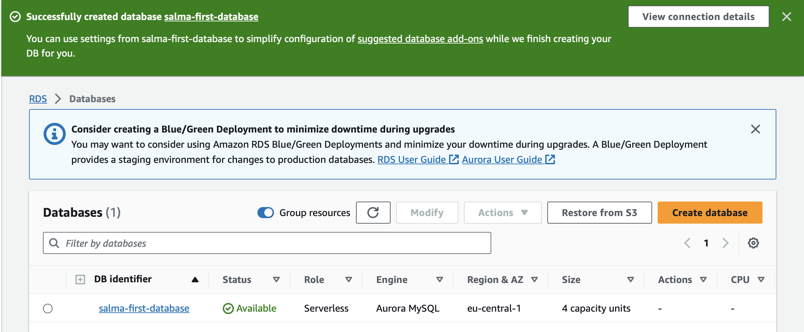 

