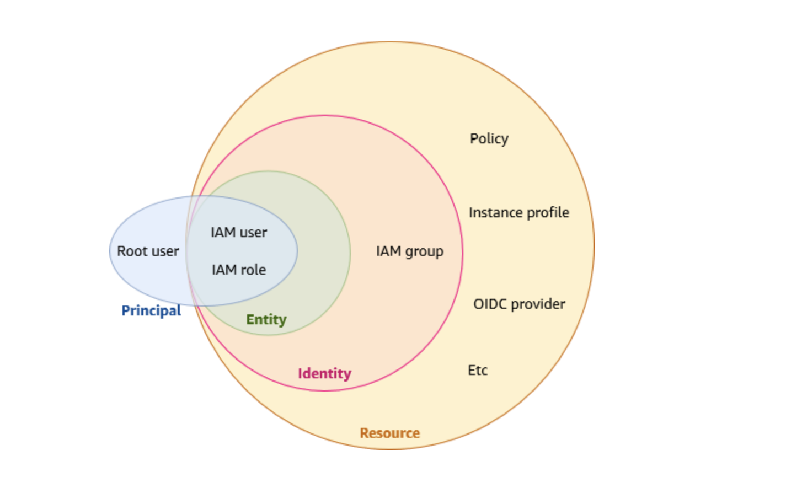

# AWS Identity and Access Management (IAM)
With IAM, you can centrally manage permissions that control which AWS resources users can access. You use IAM to control who is authenticated (signed in) and authorized (has permissions) to use resources.    
    
When you create an AWS account, you begin with one sign-in identity that has complete access to all AWS services and resources in the account. This identity is called the AWS account root user and is accessed by signing in with the email address and password that you used to create the account.

__How you use IAM differs, depending on the work that you do in AWS.__

1. Service user –   
If you use an AWS service to do your job, then your administrator provides you with the credentials and permissions that you need. As you use more advanced features to do your work, you might need additional permissions. Understanding how access is managed can help you request the right permissions from your administrator.
2. Service administrator –   
If you're in charge of an AWS resource at your company, you probably have full access to IAM. It's your job to determine which IAM features and resources your service users should access. You must then submit requests to your IAM administrator to change the permissions of your service users. Review the information on this page to understand the basic concepts of IAM.
3. IAM administrator –   
If you're an IAM administrator, you manage IAM identities and write policies to manage access to IAM.

    

### Sources
* https://docs.aws.amazon.com/IAM/latest/UserGuide/introduction.html

### Practical Exercise 
[Omschrijf hoe je weet dat je opdracht gelukt is (gebruik screenshots waar nodig).]