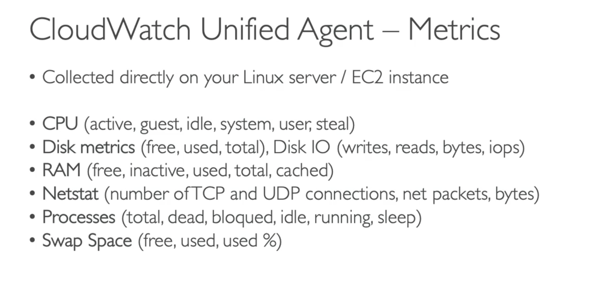
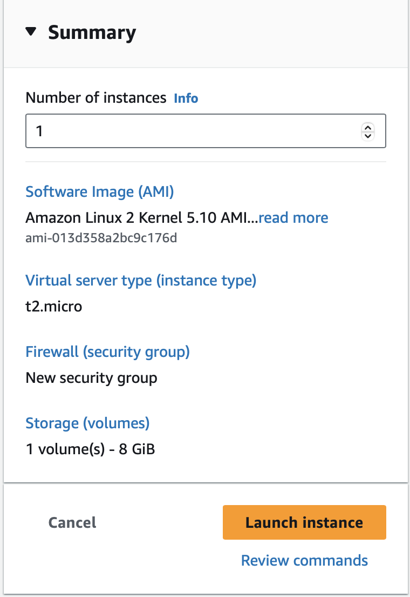
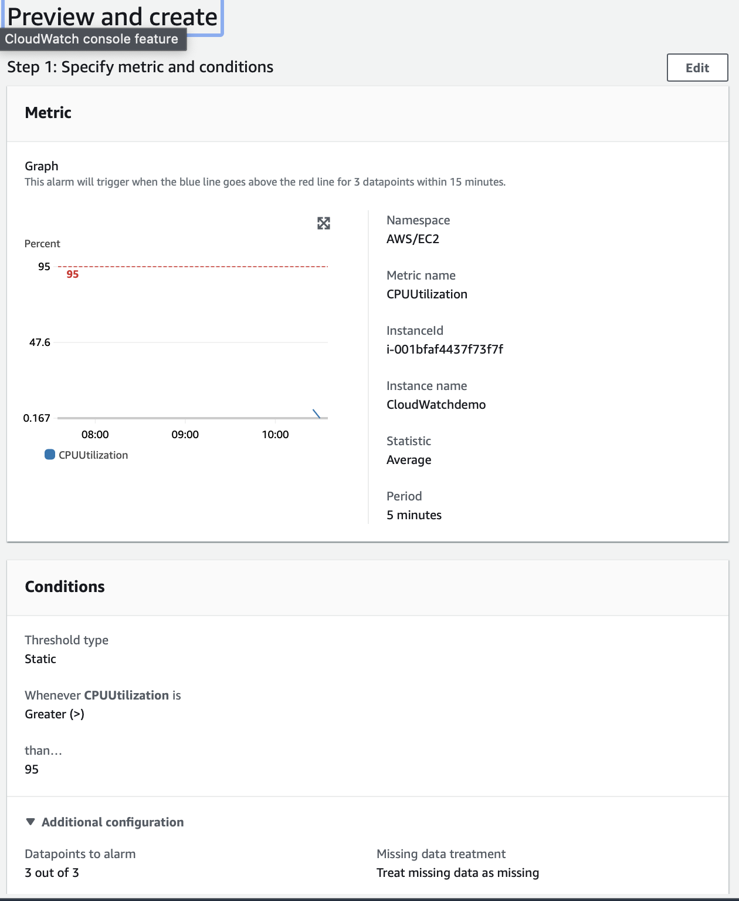
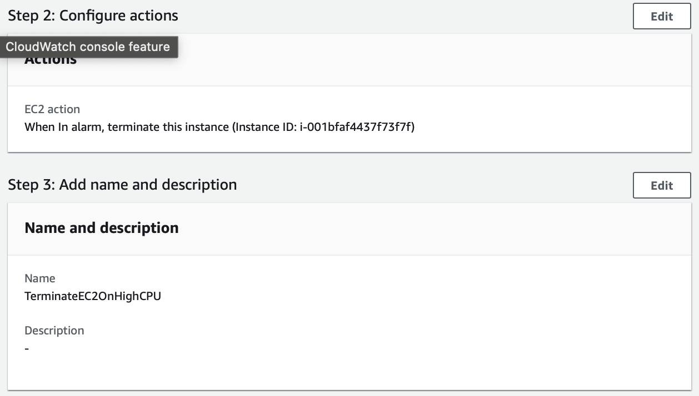
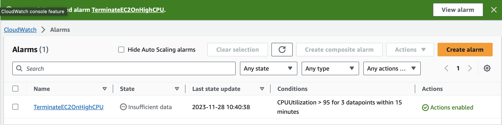
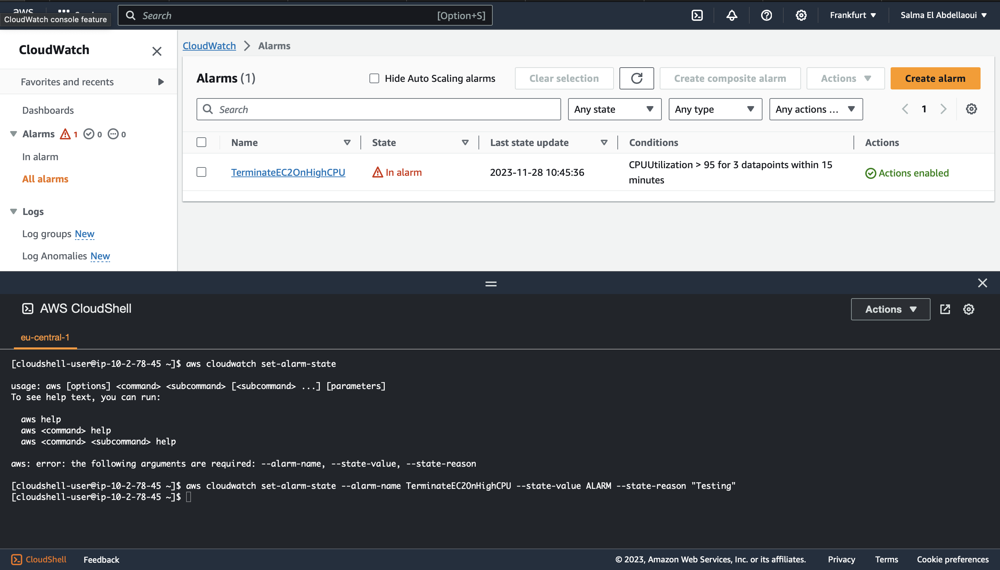
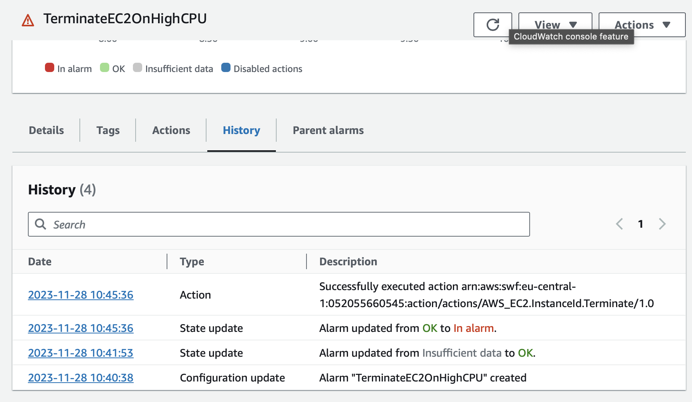
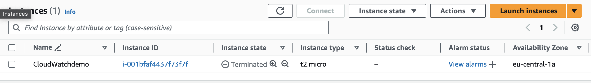

# AWS Cloudwatch 
Amazon CloudWatch monitors your Amazon Web Services (AWS) resources and the applications you run on AWS in real time. You can use CloudWatch to collect and track metrics, which are variables you can measure for your resources and applications.

You can create alarms that watch metrics and send notifications or automatically make changes to the resources you are monitoring when a threshold is breached. With CloudWatch, you gain system-wide visibility into resource utilization, application performance, and operational health.

__Related AWS services__ 

1. __Amazon Simple Notification Service (Amazon SNS):__  
 You use Amazon SNS with CloudWatch to send messages when an alarm threshold has been reached.
 2. __Amazon EC2 Auto Scaling:__   
 You can use a CloudWatch alarm with Amazon EC2 Auto Scaling to scale your EC2 instances based on demand.
 3. __AWS CloudTrail:__  
 When CloudTrail logging is turned on, CloudWatch writes log files to the Amazon S3 bucket that you specified when you configured CloudTrail.
 4. __AWS Identity and Access Management (IAM):__  
 Setting up the Identity and access management for Amazon CloudWatch.

The following terminology and concepts are central to understanding and use of the Amazon CloudWatch:  

#### Namespace
A namespace is a container for CloudWatch metrics. Metrics in different namespaces are isolated from each other, so that metrics from different applications are not mistakenly aggregated into the same statistics.

#### Metrics

A metric represents a time-ordered set of data points that are published to CloudWatch. Metrics exist only in the Region in which they are created. Metrics cannot be deleted, but they automatically expire after 15 months if no new data is published to them. Metrics are uniquely defined by a name, a namespace, and zero or more dimensions. Each data point in a metric has a time stamp, and (optionally) a unit of measure.

  

#### Time stamps

Each metric data point must be associated with a time stamp.  If you do not provide a time stamp, CloudWatch creates a time stamp for you based on the time the data point was received.

#### Dimensions
A dimension is a name/value pair that is part of the identity of a metric. You can assign up to 30 dimensions to a metric. 

There are more terms within Cloudwatch, everything can be found in the link provided in the source. 

### Sources
* https://docs.aws.amazon.com/AmazonCloudWatch/latest/monitoring/cloudwatch_architecture.html 
* https://www.udemy.com/course 
* https://docs.aws.amazon.com/cli/latest/reference/cloudwatch/set-alarm-state.html 

### Practical Exercise 
1. Create an alarm that will terminate the EC2 instance using Cloudwatch.

Make an EC2: 
 

Make an Alarm (terminate EC2 option has been selected)
 
 
   

Via the cloudshell the alarm has been triggered and set to ALARM state. 
 
   

Reaction was to terminate the EC2: 
 

