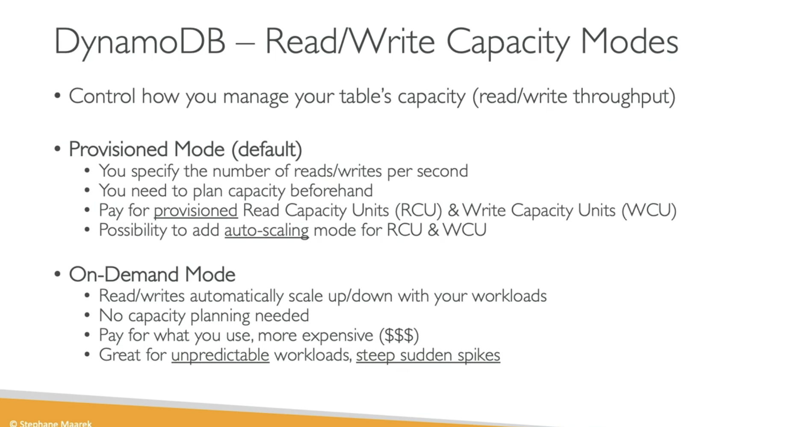
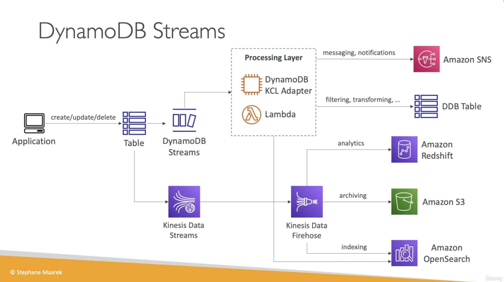

# DynamoDB
DynamoDB is a fast and flexible nonrelational database service for any scale. DynamoDB enables customers to offload the administrative burdens of operating and scaling distributed databases to AWS so that they don’t have to worry about hardware provisioning, setup and configuration, throughput capacity planning, replication, software patching, or cluster scaling.  

DynamoDB automatically scales throughput capacity to meet workload demands, and partitions and repartitions your data as your table size grows. Also, DynamoDB synchronously replicates data across three facilities in an AWS Region, giving you high availability and data durability.

DynomDB contains the following features:  

1. With DynamoDB, you can create __database tables__ that can store and retrieve any amount of data and serve any level of request traffic. You can scale up or scale down your tables' throughput capacity without downtime or performance degradation.

2. DynamoDB provides __on-demand backup capability__. It allows you to create full backups of your tables for long-term retention and archival for regulatory compliance needs. 

3. You can create on-demand backups and __enable point-in-time recovery__ for your Amazon DynamoDB tables. Point-in-time recovery helps protect your tables from accidental write or delete operations.

4. DynamoDB allows you to __delete expired items from tables automatically__ to help you reduce storage usage and the cost of storing data that is no longer relevant.

 

__DynamoDB can work with the following servers:__   

 

### Sources
* https://aws.amazon.com/dynamodb/faqs/ 
* https://docs.aws.amazon.com/amazondynamodb/latest/developerguide/Introduction.html 
* https://www.udemy.com/course 
* https://www.youtube.com/watch?v=2mVR_Qgx_RU 

### Results
[Omschrijf hoe je weet dat je opdracht gelukt is (gebruik screenshots waar nodig).]