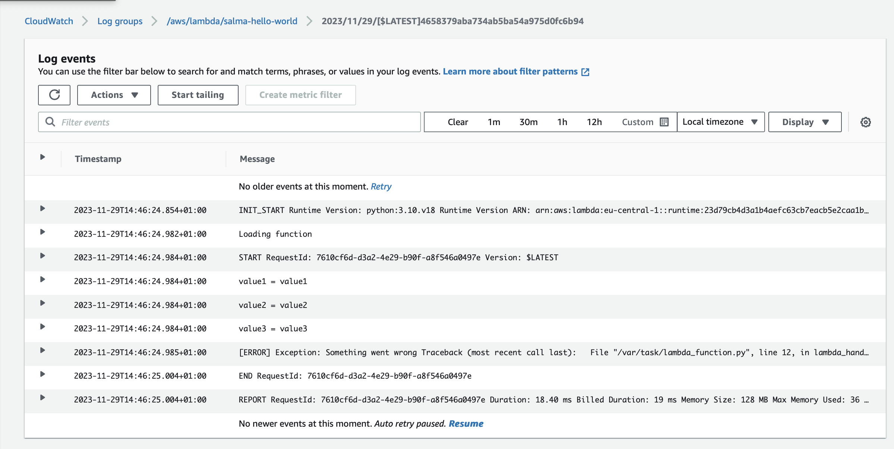

# Lambda
AWS Lambda lets you run code without provisioning or managing servers. You pay only for the compute time you consume - there is no charge when your code is not running. With Lambda, you can run code for virtually any type of application or backend service - all with zero administration.

Serverless computing allows you to build and run applications and services without thinking about servers. With serverless computing, your application still runs on servers, but all the server management is done by AWS.

__What is the difference between EC2 and Lambda?__

* With Amazon EC2 you are responsible for provisioning capacity, monitoring fleet health and performance, and designing for fault tolerance and scalability. With Lambda, you do not have to provision your own instances; Lambda performs all the operational and administrative activities on your behalf, including capacity provisioning, monitoring fleet health, applying security patches to the underlying compute resources, deploying your code, running a web service front end, and monitoring and logging your code

AWS Lambda provides easy scaling and high availability to your code without additional effort on your part. Lambda provides a programming model that is common to all of the runtimes. The programming model defines the interface between your code and the Lambda system.

Lambda is integrated with the whole AWS suite of services and it is integrated with many programming languages. 

### Sources
* https://aws.amazon.com/lambda/faqs/
* https://docs.aws.amazon.com/lambda/latest/dg/foundation-console.html 
* https://www.udemy.com/course 
* https://www.youtube.com/watch?v=seaBeltaKhw 

### Practical Exercise 
1. Create a function in Lambda 

 
 

2. Test the code and also create an error 

 
 

3. Look for the logs 
  

* Logs in Cloudwatch

This is the log information from the error.
 

4. What role has cloudwatch?

- It can create a group and in that group it can show the log streams and the events.   

 