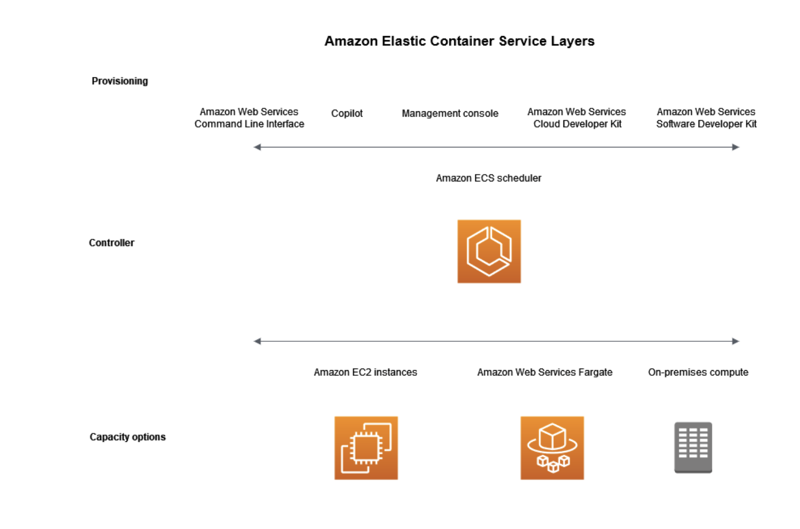

# ECS
Amazon ECS (Elastic Container Service) is like a manager for your containers. Containers are a way to package and run applications. With ECS, you can easily run and manage these containers on the cloud. 

1. __Containers:__  
 Think of containers as lightweight, portable units that contain everything your application needs to run, like the code, libraries, and settings. They are like tiny, independent packages for your software.
2. __ECS Cluster:__  
 An ECS cluster is a group of computers (virtual servers) that can run your containers. ECS takes care of organizing and managing these computers so that your containers can run smoothly.
3. __Task Definition:__  
 You tell ECS what your application needs using a task definition. It's like giving instructions about how many containers to run, what resources they need, and how they should work together.
4. __Service:__  
 If you want your application to always be available, you use an ECS service. A service ensures that a certain number of containers are always running, and if any fail, new ones are automatically started.
5. __Load Balancer:__   
 ECS can work with a load balancer, which helps distribute incoming traffic among your containers. This ensures that no single container is overwhelmed with too much work.
6. __Elastic Load Balancing:__  
 This is like a traffic cop that directs incoming requests to the right container so that your application can handle lots of users without crashing.
7. __Fargate (optional):__  
 If you don't want to worry about managing the underlying computers, ECS can use Fargate. It's like having someone else take care of the servers for you.
8. __Task Placement Strategies:__    
ECS provides different strategies for placing tasks on instances, such as the spread strategy for high availability or the binpack strategy to optimize resource utilization.
9. __Integration with Amazon ECR:__  
ECS easily integrates with Amazon ECR (Elastic Container Registry), AWS's managed container registry service, allowing you to store, manage, and deploy Docker container images.
10. __Logging and Monitoring:__  
ECS integrates with AWS CloudWatch for logging and monitoring. You can monitor the performance of your containers, set up alarms, and collect log data.
11. __Security:__  
ECS provides security features such as IAM roles for tasks, VPC networking, and integration with AWS Key Management Service (KMS) for encrypting data.
12. __Task Scheduling:__  
ECS supports task scheduling using Amazon CloudWatch Events, enabling you to schedule tasks at specific times or in response to events.

Amazon ECS is suitable for a wide range of containerized applications, from simple microservices to complex, multi-container applications. It offers flexibility and scalability, allowing you to deploy and manage containers effectively based on your application's needs.

There are three layers in Amazon ECS:

* Capacity - The infrastructure where your containers run
* Controller - Deploy and manage your applications that run on the containers
* Provisioning - The tools that you can use to interface with the scheduler to deploy and manage your applications and containers

### Sources
* https://chat.openai.com 
* https://docs.aws.amazon.com/AmazonECS/latest/developerguide/Welcome.html
* https://www.udemy.com/course

