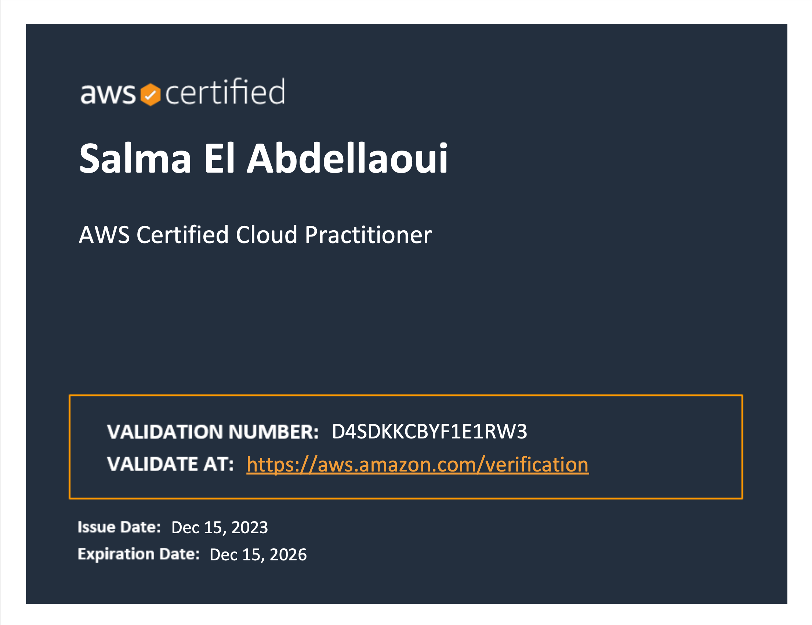

## Certified Cloud Practicioner 
On December 15th, I achieved my first AWS cloud certification after successfully completing my Beginners project and dedicating two consecutive weeks to focused study.

 I am eager to obtain the AWS Solution Architect Associate certification to further enhance my expertise in cloud technologies.

 

 