# Bash Scripts
Protocollen in netwerkdata zijn gestandaardiseerde regels en afspraken die bepalen hoe gegevens worden uitgewisseld en gecommuniceerd in computernetwerken. Ze spelen een cruciale rol in netwerkcommunicatie door te zorgen voor consistentie en interoperabiliteit tussen verschillende apparaten en systemen, ongeacht hun fabrikant of locatie. 

## Key-terms
* __Shell:__    
Een shell is een opdrachtregelinterface (CLI) voor interactie met een besturingssysteem. Het is een programma of omgeving waarmee gebruikers opdrachten kunnen invoeren en direct met het besturingssysteem kunnen communiceren. Shells worden vaak gebruikt in tekstgebaseerde omgevingen zoals Linux, Unix en macOS, maar ze bestaan ook in andere besturingssystemen.    
  
  Met de volgende commando kan men achterhalen welke shell er gebruikt wordt in de terminal/ vm. 
```
Commando: echo $SHELL
```
* __Path variabel:__    
In de terminal of opdrachtregelomgeving verwijst de "PATH"-variabele naar een lijst met directory-paden waarin het besturingssysteem op zoek gaat naar uitvoerbare bestanden wanneer een gebruiker een opdracht invoert zonder een specifiek pad op te geven.  
  
  Je kunt de huidige inhoud van de PATH-variabele in je terminal bekijken door het volgende commando in te voeren:  

```
Commando: echo $PATH
``` 

* __httpd:__    
HTTPD staat voor "Hypertext Transfer Protocol Daemon". In de context van de terminal of opdrachtregelomgeving verwijst HTTPD naar de HTTP-serversoftware. Een HTTP-server is een softwaretoepassing die HTTP-verzoeken van clients ontvangt, verwerkt en webpagina's en andere bronnen naar deze clients retourneert. HTTPD-opdrachten worden meestal gebruikt door systeembeheerders om de webserver te beheren en te configureren.  


## Opdracht  
Maak een map aan waarin alle scripts geplaatst gaan worden. Voeg de scripts toe aan de PATH-variabel. Maak een script dat een regel tekst toevoegt aan een tekstbestand telkens wanneer het wordt uitgevoerd. Maak een script dat het httpd-pakket installeert, httpd activeert en httpd inschakelt. Uiteindelijk moet je script de status van httpd in de terminal weergeven.   
    
 Maak een script dat een willekeurig getal genereert tussen 1 en 10, dit getal opslaat in een variabele, en vervolgens dit getal toevoegt aan een tekstbestand.  
    
Maak een script dat een willekeurig getal genereert tussen 1 en 10, dit getal opslaat in een variabele, en voegt dit getal vervolgens toe aan een tekstbestand, maar alleen als het getal groter is dan 5. Als het getal 5 of kleiner is, zou het in plaats daarvan een tekstregel moeten toevoegen die zegt "het getal is 5 of kleiner" aan dat tekstbestand.  

### Gebruikte bronnen
* https://chat.openai.com   

### Resultaat
__Opdracht 1__  

In de volgende screenshot is te zien hoe de directory 'scripts' is gemaakt. Ook kan je in deze screenshot zien hoe ik een file verplaats in een directory.     

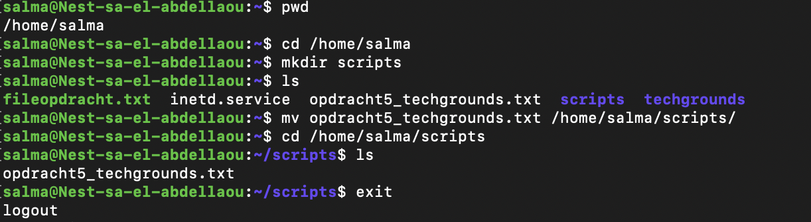    
  
In de volgende screenshot laat ik zien welke shell ik heb in mijn VM middels de commando echo $SHELL en maak ik een file aan met een bashscript extentie.   
  
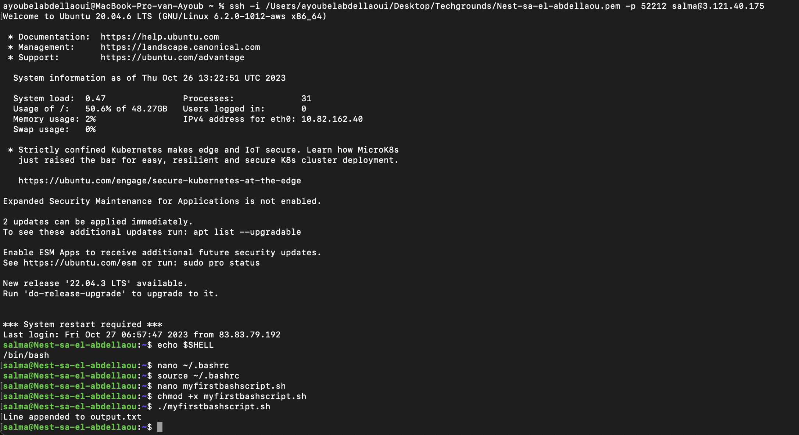   
  
Om de directory genaamd scripts toe te voegen aan de PATH-variable heb ik de volgende stappen genomen (ook te zien in de screenshot hierboven):  

```
nano ~/.bashrc
```     
Na het uitvoeren van deze stap opent de editor genaamd 'nano'. Vervolgens plaats ik in deze file de volgende line: export PATH="/home/salma/scripts:$PATH"   
  
Vervolgens zorg je ervoor dat de file met de veranderingen meteen uitgevoerd wordt middels de volgende commando:  
```
source ~/.bashrc
```  
De volgende stap is het aanmaken van een file met een bash extentie en het dient de volgende script te bevatten:   

 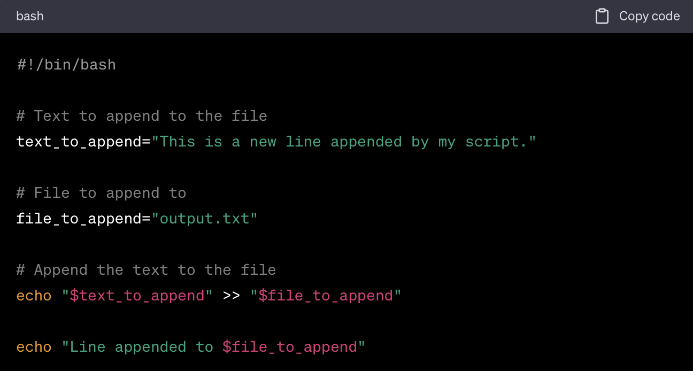   
   
  Vervolgens dien je de file executable te maken door middel van de chmod +x commando. Vervolgens kan je de inhoud van de bash script met behulp van de volgende commando:   
  ```
./<my_script.sh>
```   
In de volgende screenshot is te zien hoe ik de httpd-paket installeer/ activeer en inschakelt.   
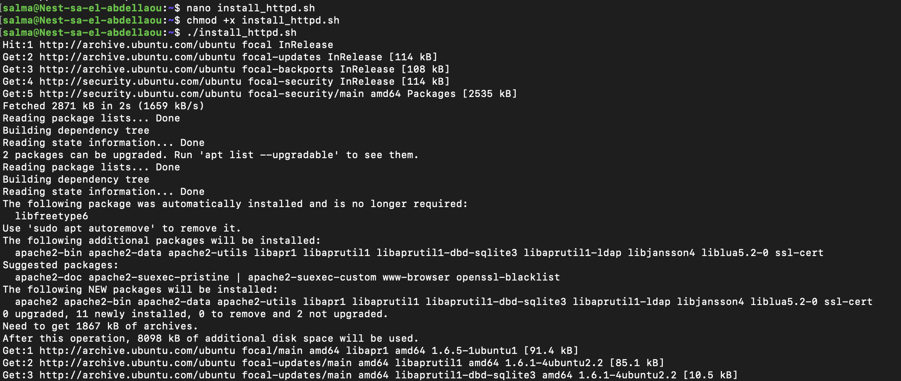  

In de text file die aangemaakt is en die install_httpd.sh heet, bevat de volgende script:   
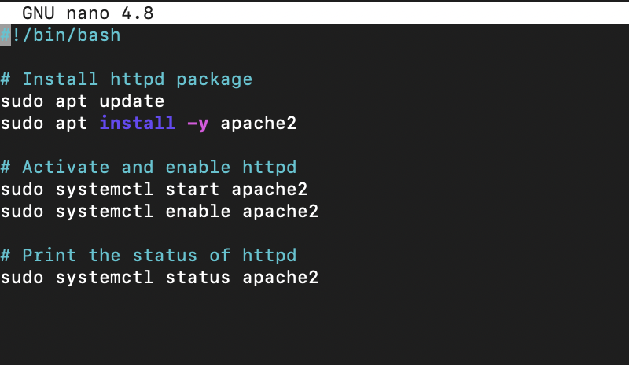    
  
Om de status van de httpd pakket aan te tonen is in de volgende screenshot te zien welke commando is gebruikt en wat het resultaat daarvan is:  
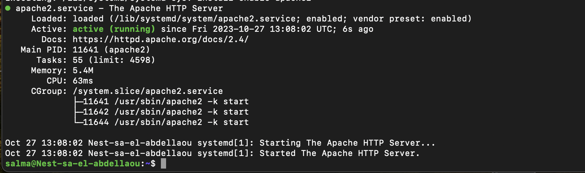   
  
__Opdracht 2__  

In de volgende screenshot is te zien hoe ik een file aanmaak met bash extentie, deze  maak ik executable en voer ik vervolgens uit:  
 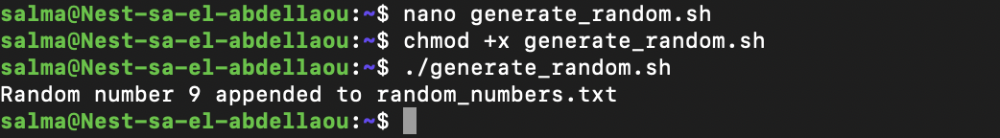  
   
  De textfile die ik hierboven heb aangemaakt bevat de volgende tekst: 
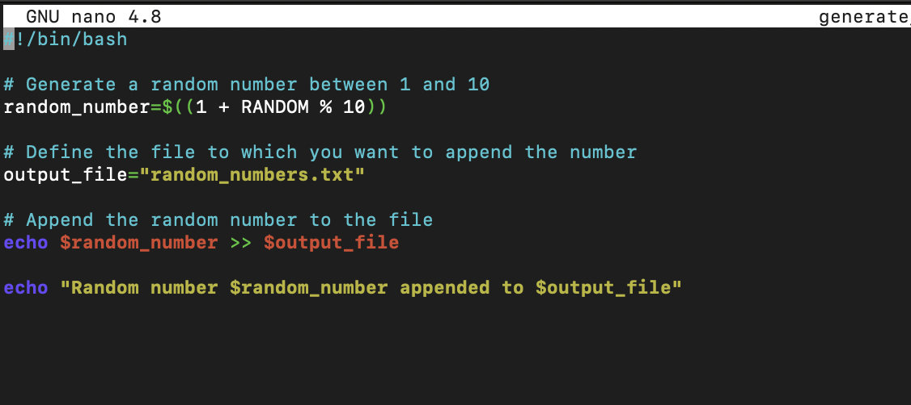    
  

__Opdracht 3__  
  
In de voolgende screenshot is te zien welk commando's ik gebruik voor het maken van een nano script met bash extentie, die ik vervolgens executabel maak, waarna ik de script uitvoer.   
  
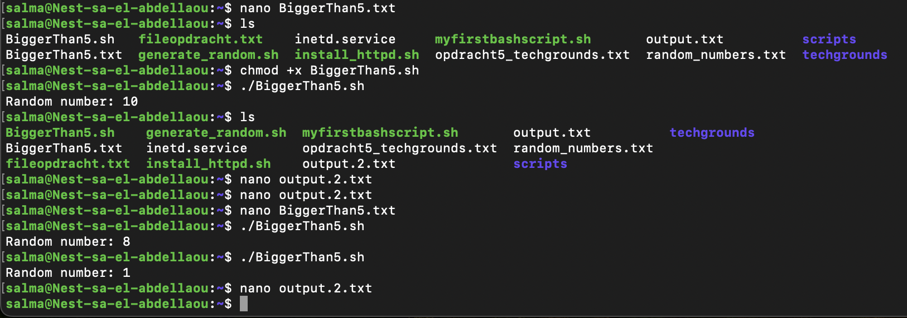    
  
In de volgende screenshot is te zien welke script ik heb gebruikt om dit te bewerkstelligen.  
  
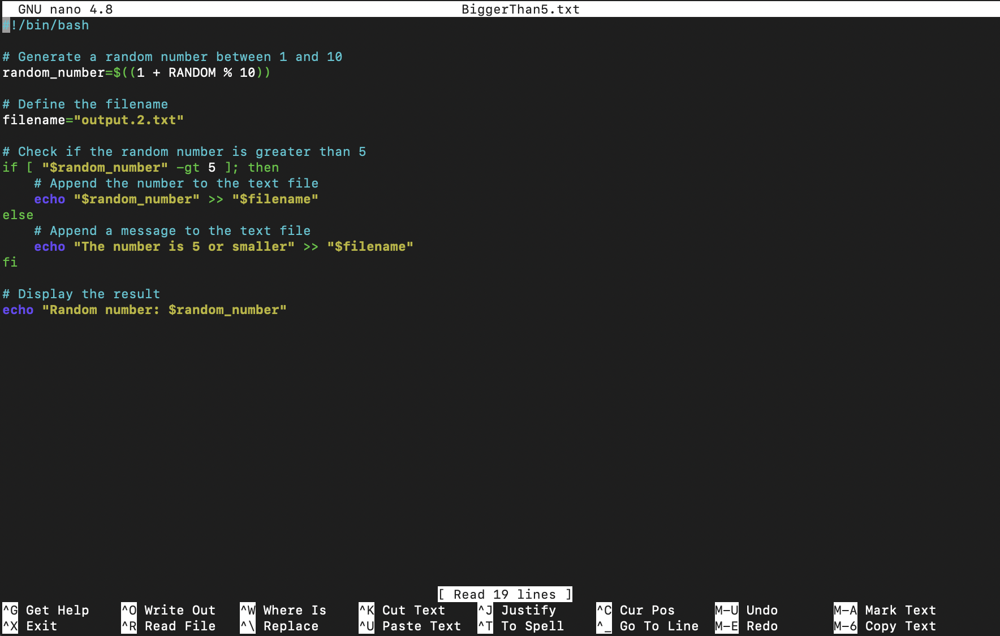   

In de volgende screenshots is te zien wat de uitkomst is als het getal groter is dan 5 en als het getal kleiner is dan 5.   
  
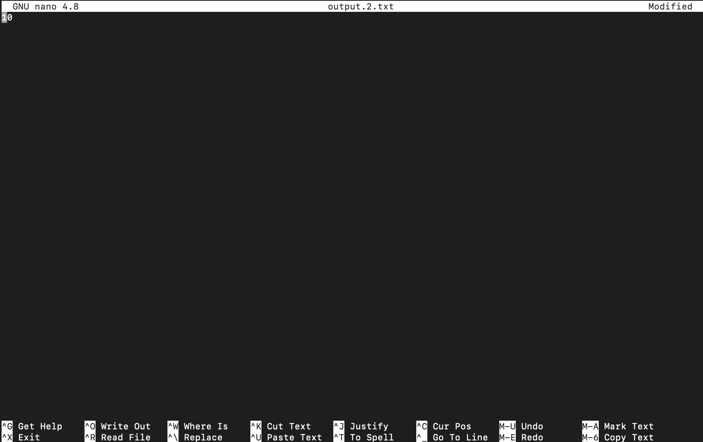  
  
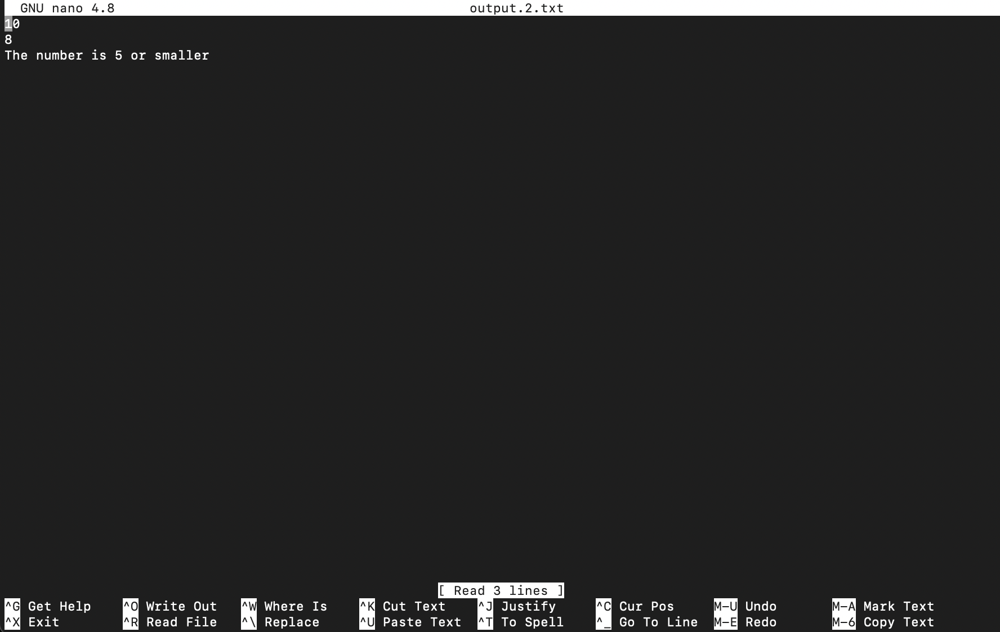  
  


