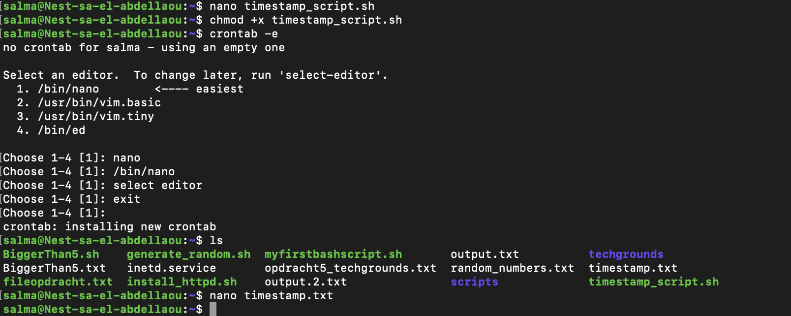
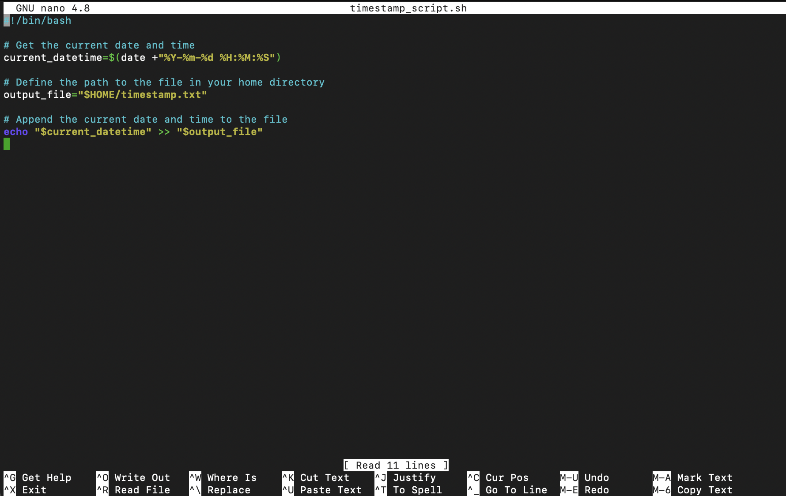
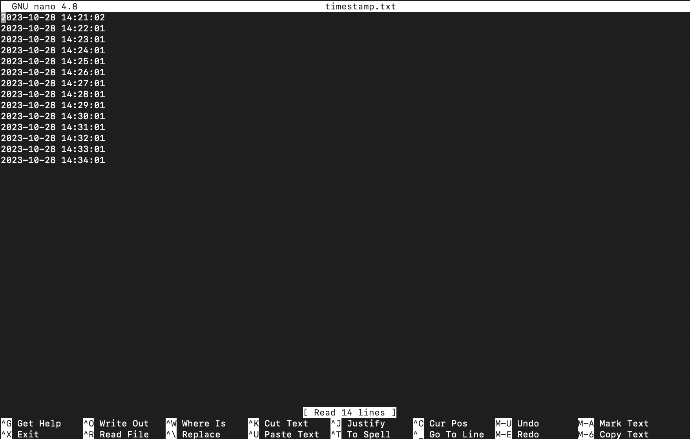
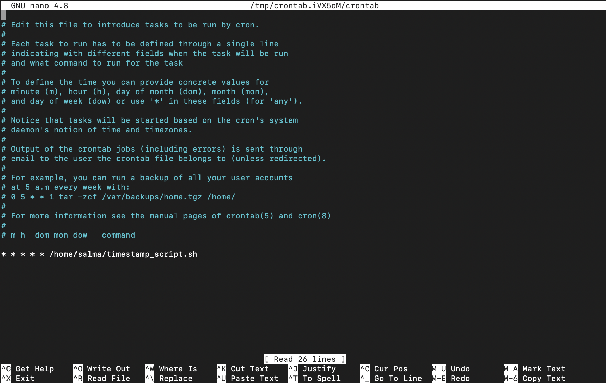
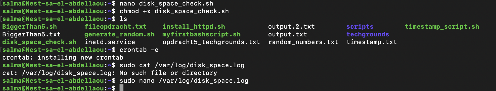
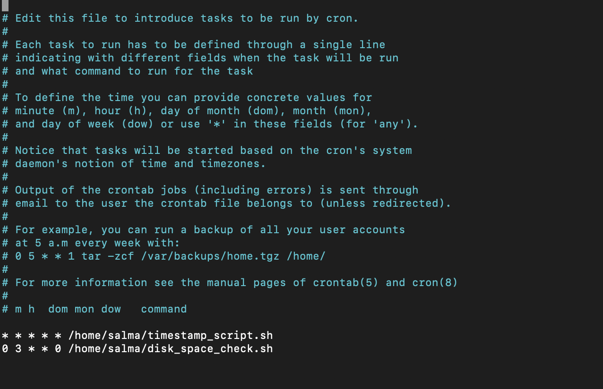

# Cron Jobs
Cronjobs zijn geautomatiseerde taken of scripts die op regelmatige tijdstippen worden uitgevoerd in een Unix-achtig besturingssysteem. Ze worden gebruikt om herhaalde taken te plannen zonder dat handmatige interventie nodig is.

## Key-terms
* Crontab-bestand: Cronjobs worden beheerd via een crontab-bestand. Elke gebruiker kan zijn eigen crontab-bestand hebben.
* Tijdsschema: In het crontab-bestand definieer je wanneer en hoe vaak de taak moet worden uitgevoerd. Dit gebeurt met vijf tijdspecificaties: minuut, uur, dag van de maand, maand en dag van de week.
* Uit te voeren opdracht: Je specificeert de opdracht of het script dat moet worden uitgevoerd op het gespecificeerde tijdstip.
* Automatisering: Cronjobs worden gebruikt voor allerlei geautomatiseerde taken, zoals het maken van back-ups, het bijwerken van gegevens, het sturen van e-mails, en meer.  
  
Door cronjobs te gebruiken, kun je routineuze taken vereenvoudigen en automatiseren, wat handig is voor systeembeheerders en ontwikkelaars. Het crontab-bestand kun je bewerken met commando's zoals crontab -e om nieuwe taken toe te voegen of te bewerken.

## Opdracht  
Creëer een Bash-script dat de huidige datum en tijd schrijft naar een bestand in je thuismap.
Registreer het script in je crontab zodat het elke minuut wordt uitgevoerd.
Maak een script dat beschikbare schijfruimte schrijft naar een logbestand in '/var/logs'. Gebruik een cron-taak zodat het wekelijks wordt uitgevoerd.  

### Gebruikte bronnen
* https://chat.openai.com   
* https://crontab.guru 
 

### Resultaat
In de volgende screenshot is te zien hoe ik een file aanmaak genaamd 'timestamp' met een bash extentie, die ik ook executabel maak. Vervolgens registreer ik de script in de crontab file.     

  
  
Ik heb de volgende script gebruikt om het bovenstaande uit te voeren: 
    
  
In de volgende screenshot is te zien wat de output is:   

     

 In de volgende screenshot is te zien hoe ik de script heb geregistreerd in crontab:  
   
     

In de volgende screenshot is te zien hoe ik een file aanmaak genaamd 'disk space check' met een bash extentie, die ik ook executabel maak. Vervolgens registreer ik de script in de crontab file.   
  
    

Ik heb de volgende script gebruikt om het bovenstaande uit te voeren:    
  
    
  
 In de volgende screenshot is te zien hoe ik de script heb geregistreerd in crontab:    
   
  

Output is nog niet aanwezig omdat dit gaat om een wekelijkse check. 