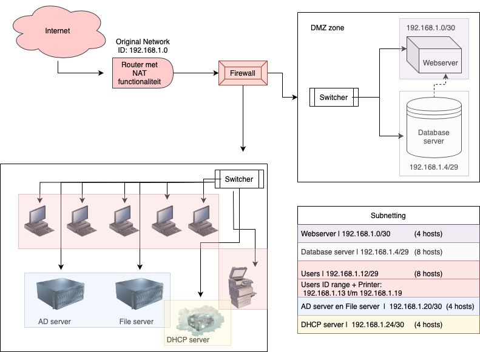

# Network Case Study
 In een casestudie combineren we eerder verworven kennis met een voorbeeld uit het echte leven (of een fictief voorbeeld dat sterk lijkt op een echte situatie). In deze casestudie neem je de rol aan van een netwerkbeheerder die een netwerk opzet in het nieuwe kantoor van een kleine e-commercebedrijf.

## Key-terms
X

## Opdracht  
Ontwerp een netwerkarchitectuur voor het bovenstaande gebruiksscenario.
Leg je ontwerpbeslissingen uit.  
  
__Case:__ 

In deze casestudie neem je de rol aan van een netwerkbeheerder die een netwerk opzet in het nieuwe kantoor van een kleine e-commercebedrijf. Er zijn natuurlijk meerdere manieren om dit probleem aan te pakken, maar dit bedrijf heeft specifiek aangegeven dat netwerkbeveiliging voor hen zeer belangrijk is.

Het kantoor bevat de volgende apparaten:

Een webserver waar onze webshop wordt gehost
Een database met inloggegevens voor gebruikers van de webshop
5 werkstations voor kantoormedewerkers
Een printer
Een AD-server
Een bestandsserver met interne documenten  

### Gebruikte bronnen
* https://chat.openai.com  
* https://app.diagrams.net  
* https://www.youtube.com/watch?v=ecCuyq-Wprc   
* https://www.informatiebeveiligingsdienst.nl/wp-content/uploads/2021/12/netwerksegmentering3.png   
* https://nl.jf-parede.pt/what-are-network-devices  

### Ervaren problemen
Ik heb hier geen problemen ervaren.

### Resultaat

  
  
__In de bovenstaande diagram is het volgende te zien:__

* De router fungeert als een interface tussen je interne netwerk en het internet, en voert NAT uit om al het uitgaande verkeer via één publiek IP-adres te routeren.
* De firewall beschermt het interne netwerk tegen ongeautoriseerde toegang vanaf het internet.
* De webserver en database server bevinden zich in een DMZ (Demilitarized Zone, extra beveiliging), die toegankelijk is vanaf internet maar beperkte toegang heeft tot het interne netwerk.
* De werkstations zijn aangesloten op interne switches.
* De printer, AD-server en file server zijn allemaal onderdeel van het interne netwerk.
* DHCP-server helpt bij naamresolutie en het toewijzen van IP-adressen binnen het interne netwerk.  
  
__Subnetting:__
  
* Webserver: De webserver kan een /30-subnet krijgen (bijvoorbeeld 192.168.1.0/30) om slechts twee hostadressen te hebben (één voor de webserver en één voor de verbinding met de router).
* Database: Voor de database met inloggegevens kunt u een /29-subnet toewijzen (bijvoorbeeld 192.168.1.4/29) om maximaal zes hostadressen te ondersteunen.
* Workstations: Voor de vijf werkstations kunt u een /29-subnet gebruiken (bijvoorbeeld 192.168.1.12/29) om vijf hostadressen te ondersteunen.
* Printer: De printer kan in hetzelfde subnet als de werkstations worden geplaatst, omdat deze vaak in hetzelfde kantoornetwerk wordt gebruikt.
* AD-server: De Active Directory-server kan een /30-subnet krijgen (bijvoorbeeld 192.168.1.20/30) om slechts twee hostadressen te hebben.
* File server: De file server kan in hetzelfde subnet als de AD-server worden geplaatst, omdat deze vaak in hetzelfde kantoornetwerk wordt gebruikt.  
* DHCP-server: /30-subnet (bijvoorbeeld 192.168.1.24/30). Met deze indeling heeft de DHCP-server twee beschikbare IP-adressen in zijn subnet voor de toewijzing van dynamische IP-adressen aan de apparaten in het netwerk. 
