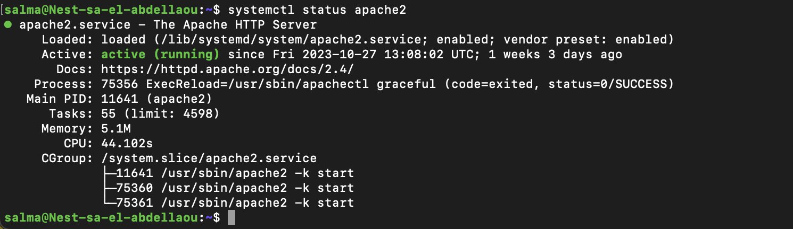
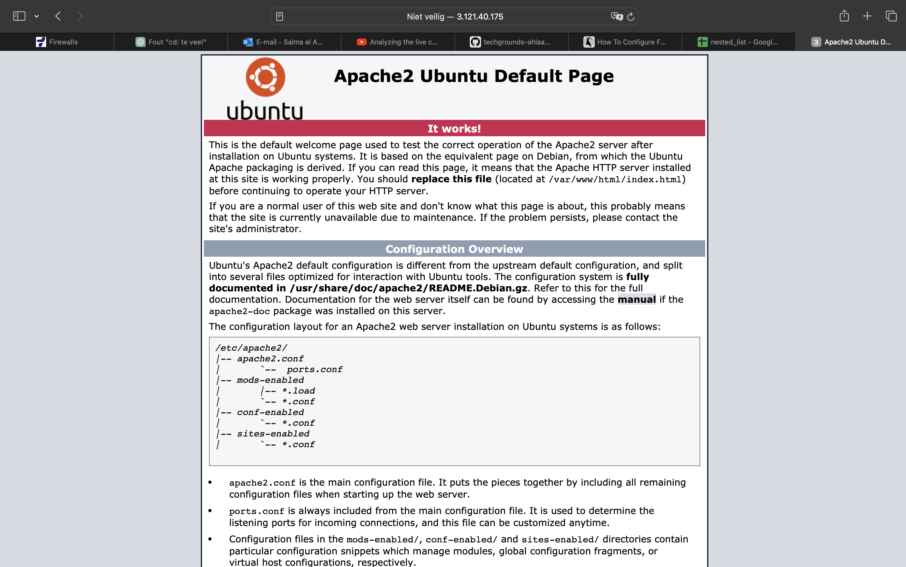
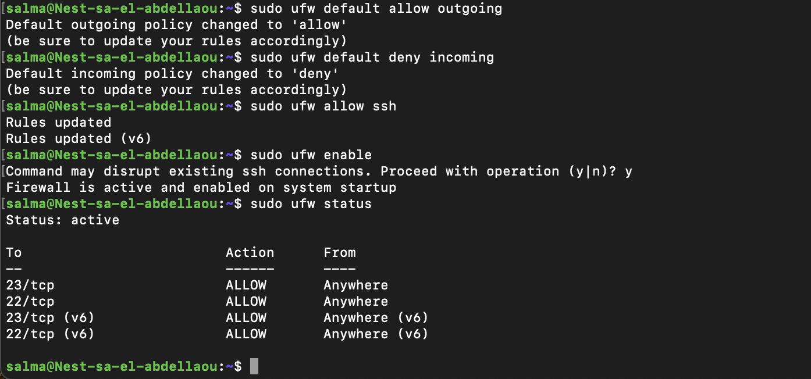
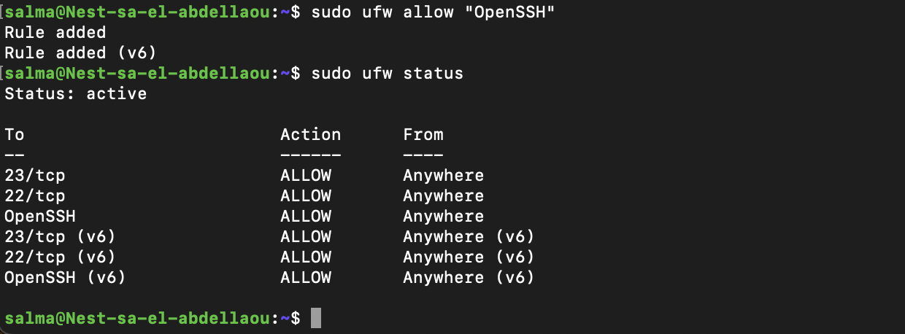
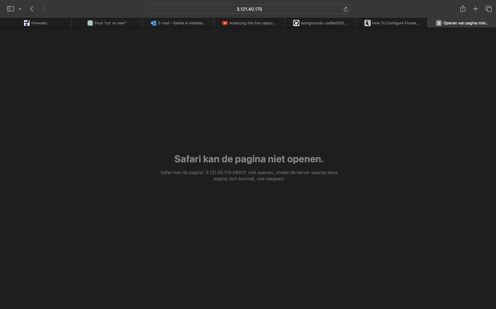

# Firewalls
In een virtuele machine (VM) is een firewall een beveiligingsmaatregel die wordt gebruikt om het inkomende en uitgaande netwerkverkeer te beheren en te controleren. Het doel van een firewall is om ongeautoriseerd of schadelijk verkeer te blokkeren en alleen legitiem verkeer toe te staan.

## Key-terms
Er zijn verschillende soorten firewalls die op basis van hun verschillende kenmerken ingedeeld kunnen worden. Hier onder worden er enkele benoemd:

* __Stateful Firewall:__ Een stateful firewall houdt de status en context van actieve verbindingen bij. Het houdt rekening met de toestand van de verbindingen en kan onderscheid maken tussen inkomend en uitgaand verkeer. Dit maakt het mogelijk om te bepalen of een inkomend pakket legitiem is in de context van een bestaande verbinding.
* __Stateless Firewall:__ Een stateless firewall daarentegen houdt geen informatie bij over de toestand van verbindingen. Het beoordeelt elk inkomend pakket onafhankelijk, zonder rekening te houden met eerdere verbindingen. Stateless firewalls zijn doorgaans eenvoudiger en minder geavanceerd dan stateful firewalls.
* __Hardware Firewall:__ Een hardwarematige firewall is een fysiek apparaat dat zich tussen het interne netwerk en externe netwerken bevindt. Het is een op zichzelf staand apparaat dat netwerkverkeer kan filteren en beheren. Hardwarematige firewalls worden vaak gebruikt om volledige netwerken te beschermen.
* __Software Firewall:__ Een softwarematige firewall is een programma dat op een computer of server wordt geïnstalleerd. Het wordt gebruikt om specifieke hosts of toepassingen te beschermen. Softwarematige firewalls zijn flexibel en kunnen worden geconfigureerd voor individuele apparaten. 
 
De keuze tussen stateful en stateless firewalls, evenals hardware- en softwarefirewalls, hangt af van de specifieke behoeften en vereisten van een netwerk of systeem. Stateful firewalls zijn doorgaans effectiever in het bieden van geavanceerde beveiliging, terwijl stateless firewalls eenvoudiger zijn. Hardwarefirewalls zijn geschikt voor het beschermen van hele netwerken, terwijl softwarefirewalls geschikt zijn voor individuele apparaten. 

## Opdracht  
Installeer een webserver op je VM.
Bekijk de standaardpagina die met de webserver geïnstalleerd is via je browser op je pc/laptop.
Stel de firewall zo in dat je webverkeer blokkeert, maar wel ssh-verkeer toelaat.
Controleer of de firewall zijn werk doet.  

### Gebruikte bronnen
* https://chat.openai.com  
* https://www.cyberciti.biz/faq/how-to-configure-firewall-with-ufw-on-ubuntu-20-04-lts/#Block_ports_with_ufw 
* https://www.youtube.com/watch?v=-CzvPjZ9hp8 

### Ervaren problemen
Geen problemen ervaren bij deze opdracht. 

### Resultaat
De installatie van de webserver heeft al plaatsgevonden in de opracht van Bash scripts. Die kan je vinden in de volgende map: 01_7_BashScripts. Hieronder laat ik alleen maar zien dat het actief is. 

  

Middels mijn publieke IPv4 adres en mijn webport kan ik de standaardpagina die middels de webserver is geïnstalleerd openen via mijn browser. Dit ziet er als volgt uit:  
  
    


De gebruikte IPv4 is 3.121.40.175 en mijn webport is 58012. Dit heb ik als volgt in mijn browser geplaatst: 3.121.40.175:58012   
  
Om de firewall zo te installeren dat het webverkeer blokkeert maar wel de SHH-verkeer toelaat is er het volgende gedaan:  

```
sudo ufw default allow outgoing
```

```
sudo ufw default deny incoming
```
Hetgeen hierboven is bewerkstelligd met de gegeven commando's is het volgende: 

1. Het systeem kan verzoeken naar de buitenwereld sturen
2. De firewall blokkeert alle ongevraagde binnenkomende verbindingen

Maar om ervoor te zorgen dat ik nog binnen mijn VM kan komen middels mijn ssh key, gebruik ik de volgende commando:
```
sudo ufw allow ssh 
```

Met de bovengenoemde commando worden de SSH TCP port 22 en 23 geopend.

```
sudo ufw allow "OpenSSH"
```
Middels de hierboven genoemde commando worden alle SSH porten geopend. Hoe je dit in de terminal kunt weergeven en het verschil kunt zien doe je door gebruik te maken van de volgende commando: 

```
sudo ufw status
```  
Om de firewall te activeren gebruik je de volgende commando:

```
sudo ufw enable
```  
In de volgende screenshot is te zien hoe ik de bovengenoemde commando's heb gebruikt en wat daaruit is voortgekomen:


  
  
Nu ik de firewall heb geactiveerd kan ik er via mijn webverkeer niet meer in.

 
