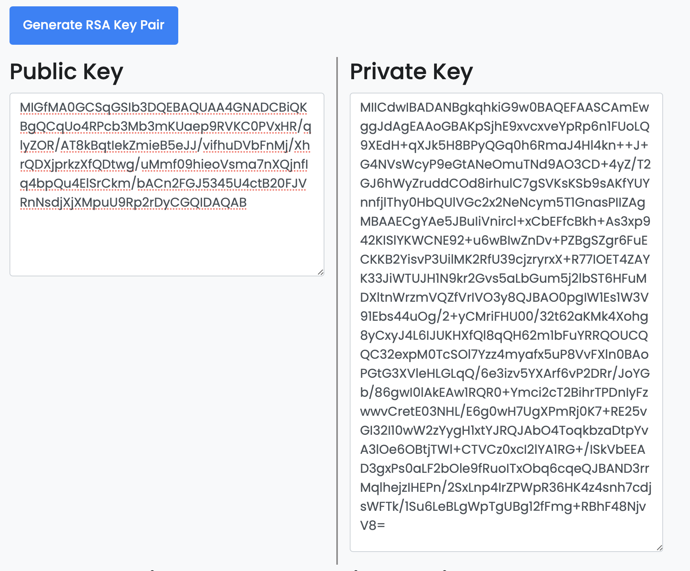
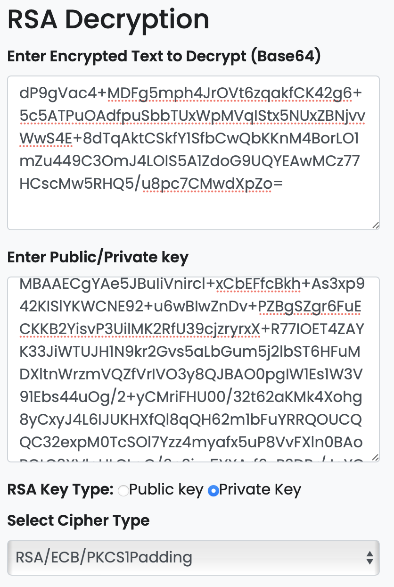
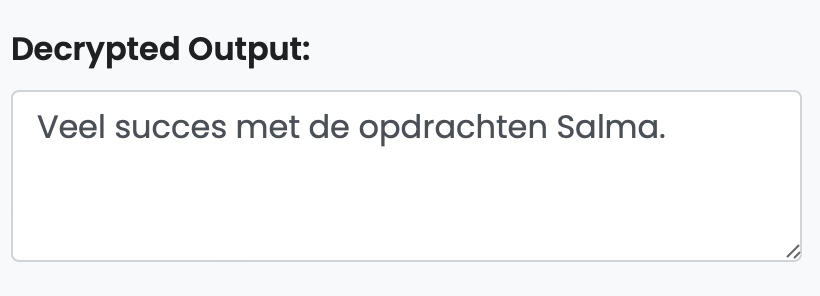

# Asymmetrical Encryption
Encryptie is van essentieel belang als het gaat om gegevensbeveiliging en privacy. Het doel van encryptie is om gegevens onleesbaar te maken voor onbevoegden door ze om te zetten in een gecodeerde vorm met behulp van algoritmen.

## Key-terms
__Asymmetrische Encryptie:__ Hierbij worden twee verschillende sleutels gebruikt: een openbare sleutel voor versleuteling en een privésleutel voor ontsleuteling. Voorbeelden zijn RSA en ECC (Elliptic Curve Cryptography).  
  
* __Cipher text:__  
Ciphertext (of cipher text) is de gecodeerde vorm van gegevens nadat ze zijn versleuteld met behulp van een encryptie-algoritme en een sleutel. Ciphertext is bedoeld om onleesbaar te zijn voor iedereen behalve degenen met de juiste decryptiesleutel.

## Opdracht  
Genereer een sleutelpaar.
Verstuur een asymmetrisch versleuteld bericht naar een van je collega's via het openbare Slack-kanaal. Ze moeten in staat zijn om het bericht te decoderen met een sleutel. De ontvanger moet in staat zijn om het bericht te lezen, maar het moet een geheim blijven voor iedereen anders. Je mag geen privéberichten of andere communicatiekanalen gebruiken, behalve het openbare Slack-kanaal. Analyseer het verschil tussen deze methode en symmetrische encryptie.  

### Gebruikte bronnen
* https://chat.openai.com
* https://www.youtube.com/watch?v=Z3FwixsBE94 
* https://www.youtube.com/watch?v=AQDCe585Lnc     
* https://www.techtarget.com/whatis/definition/ciphertext#:~:text=Ciphertext%20is%20encrypted%20text%20transformed,the%20ciphertext%20back%20into%20plaintext.
* https://en.wikipedia.org/wiki/Vigenère_cipher#:~:text=The%20Vigenère%20cipher%20is%20therefore,until%201863%2C%20three%20centuries%20later.  
* https://vpndiensten.nl/security/wat-is-een-cipher/

### Ervaren problemen
Ik heb hier geen problemen ervaren. 

### Resultaat
Ik heb de volgende sleutelpaar gegenereerd middels de volgende website: https://www.devglan.com/online-tools/rsa-encryption-decryption   

   

Ahlaam heeft vervolgens via de slack account haar asymmetrische encryptie gestuurd en ik heb haar mijn public key opgestuurd. Daaruit is het volgende gekomen:

 

Ik heb dus haar encrypted text gebruikt en mijn private key om haar text te ontcijferen. Dit is wat eruit is gekomen:

    
  

