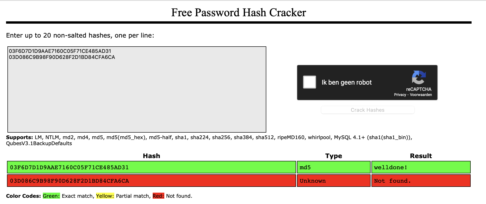
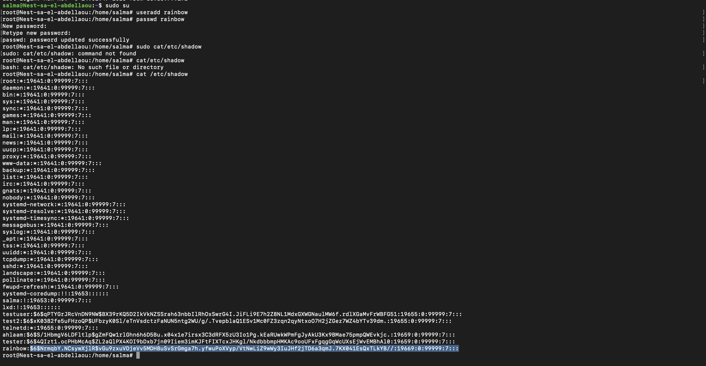
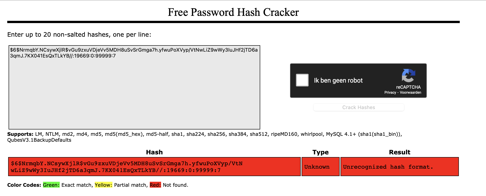
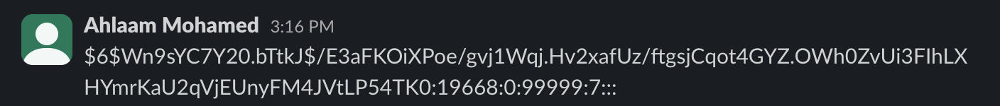

# Passwords
Wat betreft authenticatiefactoren vallen wachtwoorden in de categorie 'iets wat je weet'.
Aan de voorkant kunnen wachtwoorden worden geraden. Dit kan moeilijker worden gemaakt. Bepaalde strategieën maken het moeilijker om je eigen wachtwoorden te onthouden. Wachtwoordbeheerders zijn gemaakt om dit probleem op te lossen. Aan de achterkant moeten wachtwoorden veilig worden opgeslagen. Als je database (of het /etc/shadow-bestand in Linux) wordt gelekt of gestolen, wil je niet dat iedereen zomaar wachtwoorden in platte tekst kan lezen. Daarom worden de meeste opgeslagen wachtwoorden gehasht. Hackers zullen proberen Rainbow Tables te gebruiken om gehashte wachtwoorden te kraken.

## Key-terms
* __Hashed wachtwoorden:__ Hashing is een methode van cryptografie die elke vorm van gegevens omzet in een unieke tekenreeks. In een hashing-proces wordt op een willekeurige hoeveelheid gegevens een hashing-algoritme toegepast. Het algoritme genereert een reeks uitvoergegevens die de ‘hash’ of ‘hash-waarde’ wordt genoemd. Alle gegeven — van tekst en audio tot video en uitvoerbare bestanden — kunnen gehasht worden. De gegenereerde hashes zijn altijd even lang, ongeacht de hoeveelheid gegevens die je invoert.
De kernfunctie van hashing is het voorkomen dat er met informatie of een bestand wordt geknoeid.
* __Rainbow table:__   een regenboogtafelaanval is een cyberaanval die zich richt op wachtwoorden. Het is een methode die wordt gebruikt om wachtwoord-hashes in een database te kraken met behulp van een unieke tabel die bekend staat als de "regenboogtabel". We begrijpen dat alle wachtwoorden die in applicaties zijn opgeslagen of online zijn opgeslagen, nooit in leesbare tekst zijn. In plaats daarvan zult u merken dat alle toegangscodes in hash-vorm worden opgeslagen als een coderingsmethode.

## Opdracht  
1. Ontdek wat hashen is en waarom het de voorkeur heeft boven symmetrische versleuteling voor het opslaan van wachtwoorden.
2. Onderzoek hoe een Rainbow Table kan worden gebruikt om gehashte wachtwoorden te kraken.
3. Hieronder staan twee MD5-wachtwoordhashes. De ene is een zwak wachtwoord, de andere is een reeks van 16 willekeurig gegenereerde tekens. Probeer beide hashes op te zoeken in een Rainbow Table.
```
03F6D7D1D9AAE7160C05F71CE485AD31
03D086C9B98F90D628F2D1BD84CFA6CA
```  

4. Maak een nieuwe gebruiker in Linux met het wachtwoord 12345. Zoek de hash op in een Rainbow Table.
5. Ondanks het zwakke wachtwoord en het feit dat Linux gangbare hashalgoritmen gebruikt, zul je geen overeenkomst vinden in de Rainbow Table. Dit komt doordat het wachtwoord is gezouten. Om te begrijpen hoe zouten werkt, zoek een collega op die hetzelfde wachtwoord heeft in /etc/shadow en vergelijk de hashes.  

### Gebruikte bronnen
* https://chat.openai.com 
* https://crackstation.net 
* https://nordvpn.com/nl/blog/hashen/#:~:text=Betekenis%20hashen%3A%20het%20Engelse%20woord,omzet%20in%20een%20unieke%20tekenreeks.  
* https://fastestvpn.com/nl/blog/wat-is-een-regenboogtafelaanval/#:~:text=Kortom%2C%20een%20regenboogtafelaanval%20is%20een,staat%20als%20de%20%22regenboogtabel%22.
* https://www.cyberciti.biz/faq/understanding-etcshadow-file/

### Resultaat
__Wat is Hashing?__ Hashing is het proces waarbij gegevens worden omgezet in een vaste lengte van willekeurige tekens, die meestal een reeks cijfers en letters zijn. Deze gegenereerde tekenreeks staat bekend als een "hashwaarde" of "hashcode." Het belangrijkste kenmerk van hashing is dat het een eenrichtingsproces is, wat betekent dat het erg moeilijk is om de oorspronkelijke gegevens vanuit de hashwaarde te reconstrueren.  
  
__Waarom hashing wordt verkozen boven symmetrische versleuteling voor het opslaan van wachtwoorden:__  
  
1. Eenrichtingsproces: Hashing is een eenrichtingsproces, wat betekent dat je vanuit de hashwaarde niet terug kunt komen naar het oorspronkelijke wachtwoord. Hierdoor is het veiliger voor het opslaan van wachtwoorden, omdat zelfs als de hashwaarde wordt blootgesteld, een aanvaller niet direct het wachtwoord kan achterhalen.
2. Snelheid: Hashing is sneller dan symmetrische versleuteling, wat belangrijk is bij het verifiëren van wachtwoorden tijdens het inlogproces.
3. Veelgebruikt voor wachtwoorden: Hashfuncties zijn geoptimaliseerd voor wachtwoordopslag. Bij het opslaan van wachtwoorden wordt vaak een zout (een extra willekeurige waarde) toegevoegd aan het wachtwoord voordat het wordt gehasht. Dit verhoogt de beveiliging.
4. Bescherming tegen aanvallen: Hashing beschermt tegen zogenaamde "rainbow table" aanvallen, waarbij een aanvaller vooraf berekende hashes voor veelvoorkomende wachtwoorden probeert te gebruiken om de hashwaarde te achterhalen.

In het kort, hashing is gunstig voor het opslaan van wachtwoorden omdat het een efficiënte en eenrichtingsmethode is om wachtwoorden te beveiligen, wat de gegevensbescherming verhoogt.  

__Hoe wordt een regenboog tabel gebruikt:__

Om te kunnen werken, moet een hacker toegang krijgen tot en controle krijgen over elk uitgelekt gehasht wachtwoord. Eenmaal gecompromitteerd, wordt een regenboogaanval geïnduceerd. Dit is meestal het geval wanneer een wachtwoorddatabase niet goed genoeg is beveiligd of wanneer de cyberaanvaller toegang krijgt tot Active Directory. Een andere reden waarom regenboogtafelaanvallen werken, is wanneer ze controle krijgen via verschillende Phishing technieken om toegang te krijgen tot de wachtwoorddatabase waartoe ze toegang hebben. Hackers kunnen ze waarschijnlijk op het dark web vinden telkens wanneer gebruikers een wachtwoord invoeren of zich aanmelden voor een onbekende service. Wanneer een wachtwoord-hash wordt gecompromitteerd, wordt een regenboogtafelaanval ingesteld. Dit is echter niet het geval als de toegangscode-hashes gezouten zijn.   
  
__Ik heb de volgende Hashing codes gekraakt middels de regenboog tabel:__

 

De ene was zwak, zoals aangegeven in de opdracht, die is dus ook makkelijk te kraken. De ander niet.   
  
In de volgende screenshot is te zien hoe ik een nieuwe user aanmaak genaamd 'rainbow' en vervolgens een wachtwoord geef '12345', waarna ik de lijst opvraag met wachtwoorden die getoond worden in een hash formaat. 



Vervolgens heb ik de hash wachtwoord ingevoerd in een rainbow tabel en dit was de uitkomst:

   
  
De reden dat het niet achterhaald kan worden, is omdat het gezout is. De $6 wat je ziet in mijn hash wachtwoord houdt in dat we te maken hebben met een algoritme prefix SHA-512 hash (512 bits). Het stukje wat gezout is in mijn wachtwoord is als volgt: NrmqbY.NCsywXjlR, dit is het eerste stukje wat na de $6 komt tot de volgende dollar teken. 

De volgende hash wachtwoord is van mijn peer:
   
Je ziet dat ook hier de $6 algoritme wordt gebruikt en dat het gezout is. Verder zie je dat de opvolgende tekens verschillen met die van mij, dat is ook wat je verwacht. 