# VPC
With Amazon Virtual Private Cloud (Amazon VPC), you can launch AWS resources in a logically isolated virtual network that you've defined. This virtual network closely resembles a traditional network that you'd operate in your own data center, with the benefits of using the scalable infrastructure of AWS.

1. __Virtual private clouds (VPC)__
A VPC is a virtual network that closely resembles a traditional network that you'd operate in your own data center. After you create a VPC, you can add subnets.
2. __Subnets__
A subnet is a range of IP addresses in your VPC. A subnet must reside in a single Availability Zone. After you add subnets, you can deploy AWS resources in your VPC.
3. __IP addressing__
You can assign IP addresses, both IPv4 and IPv6, to your VPCs and subnets. You can also bring your public IPv4 and IPv6 GUA addresses to AWS and allocate them to resources in your VPC, such as EC2 instances, NAT gateways, and Network Load Balancers.
4. __Routing__
Use route tables to determine where network traffic from your subnet or gateway is directed.
5. __Gateways and endpoints__
A gateway connects your VPC to another network. For example, use an internet gateway to connect your VPC to the internet. Use a VPC endpoint to connect to AWS services privately, without the use of an internet gateway or NAT device.
6. __Peering connections__
Use a VPC peering connection to route traffic between the resources in two VPCs.
7. __Traffic Mirroring__
Copy network traffic from network interfaces and send it to security and monitoring appliances for deep packet inspection.
8. __Transit gateways__
Use a transit gateway, which acts as a central hub, to route traffic between your VPCs, VPN connections, and AWS Direct Connect connections.
9. __VPC Flow Logs__  

   A flow log captures information about the IP traffic going to and from network interfaces in your VPC.
10. __VPN connections__  
Connect your VPCs to your on-premises networks using AWS Virtual Private Network (AWS VPN).

### Sources
* https://www.youtube.com/watch?v=7_NNlnH7sAg
* https://docs.aws.amazon.com/vpc/latest/userguide/what-is-amazon-vpc.html 
* https://www.youtube.com/watch?v=AKQ7FdEuWz4

### Results
I allocated an Elastic IP address to my account. Which can be seen in the next screenshot:

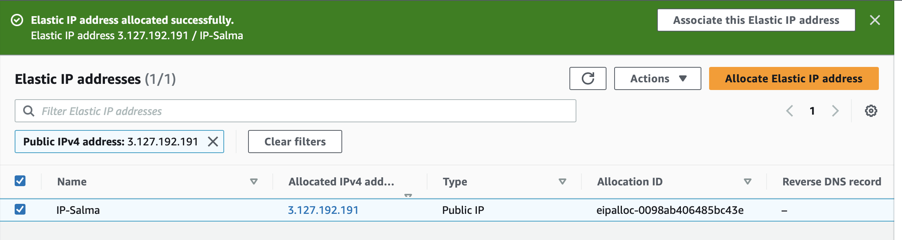 

I will need to use this IP adress in the upcoming assignments. 

In the following screenshots, you can observe the creation of a VPC in AWS, adhering to the requirements provided by Techgrounds.

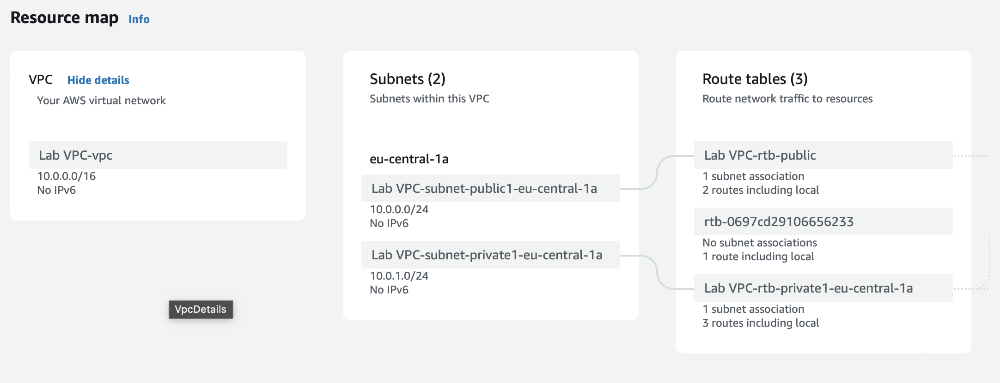 
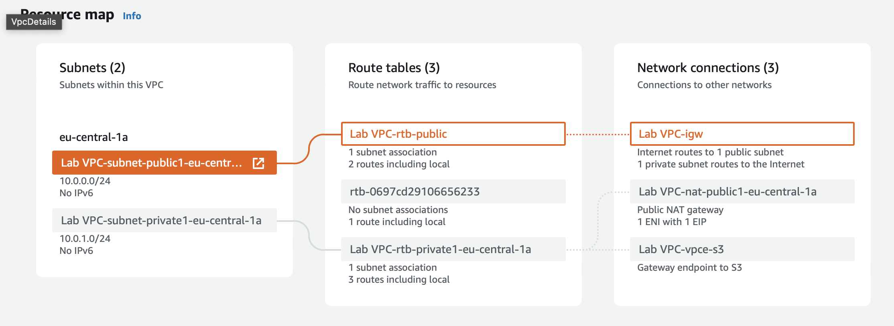 
 

I enhanced security by adding an S3 endpoint (though this wasn't specified in the assignment).

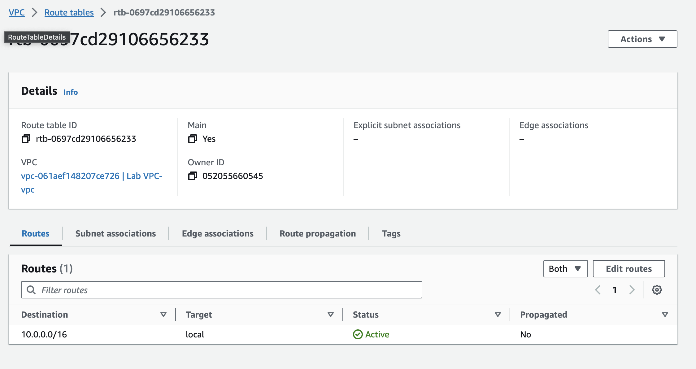 

In the following screenshots, new subnets have been created in different availability zones. The names/tags of the public route and private route have been updated, and the newly created subnets have been associated with the respective routes.

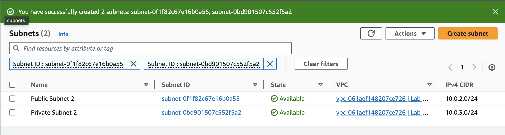
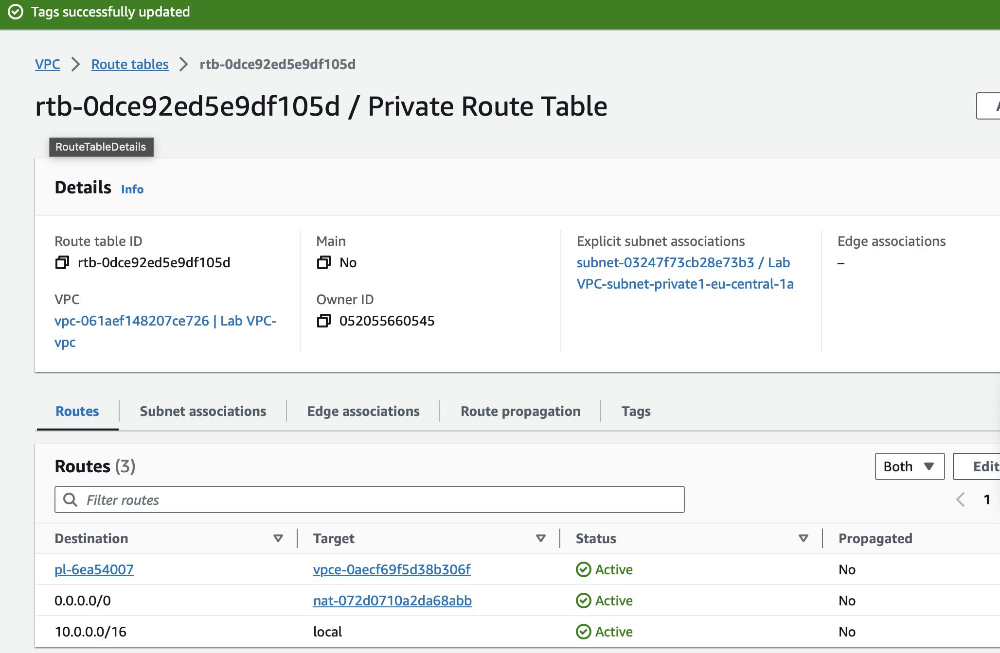
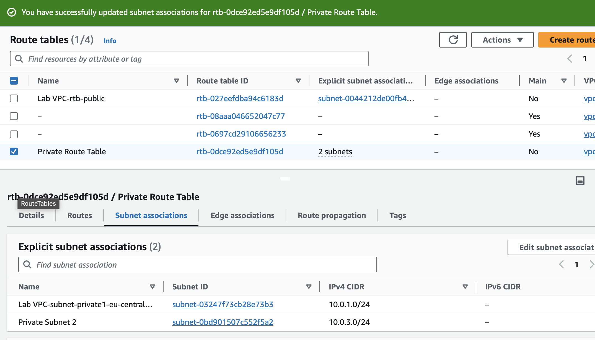
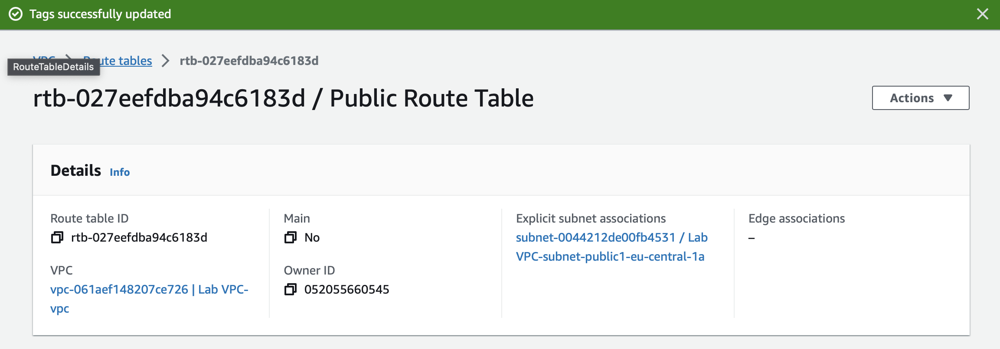
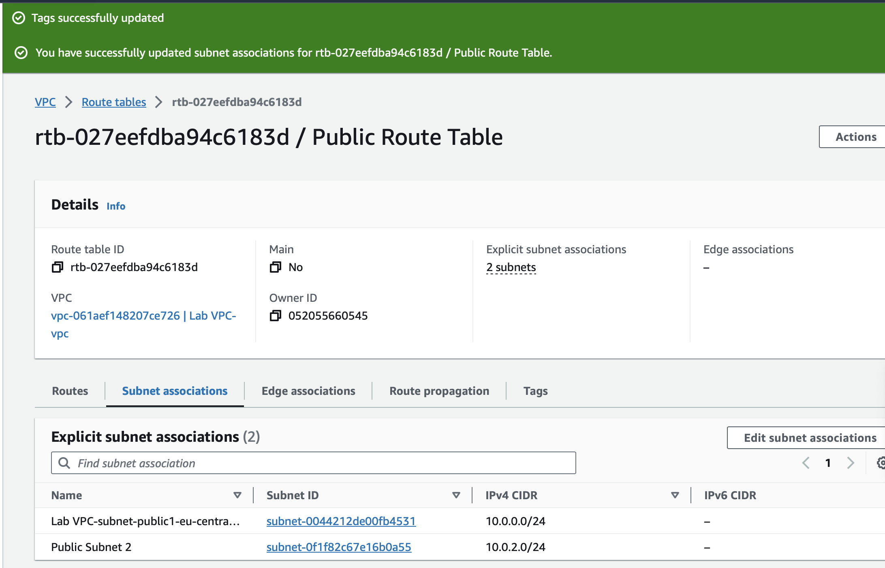

In the next screenshots a new security group has been made with the settings provided by Techgrounds. 

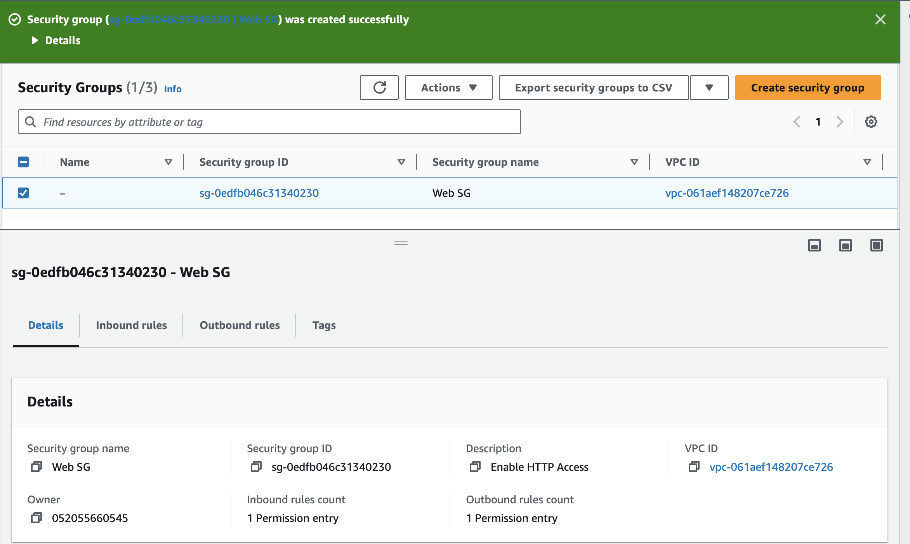
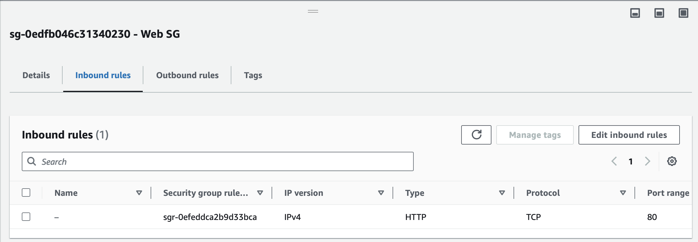
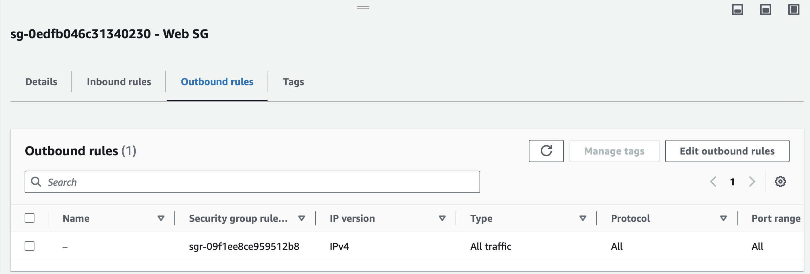

After creating the security group, a new EC2 instance was launched using the settings provided by Techgrounds. The 'Web SG' security group was associated with the EC2, and the following script was executed upon starting the EC2 instance.

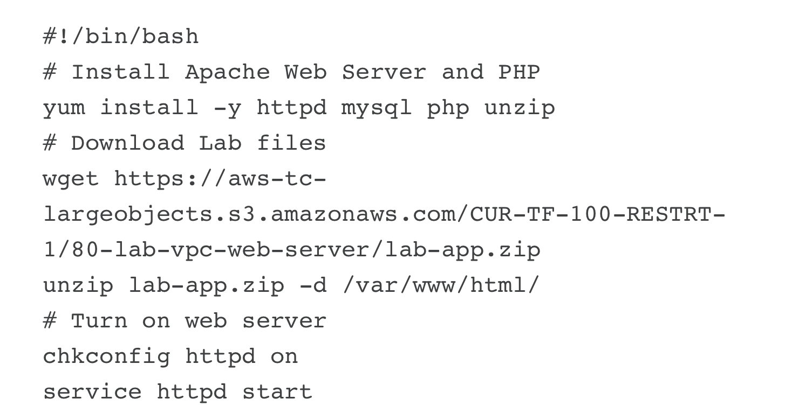
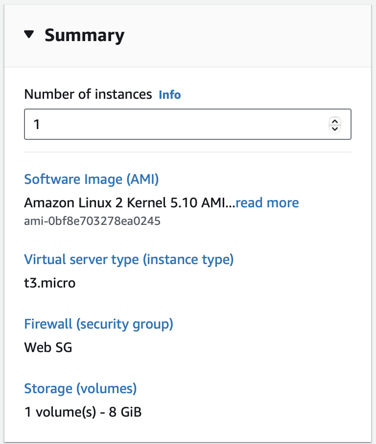
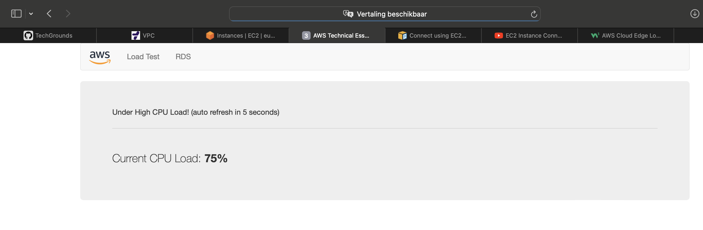 

The test site was initiated. 