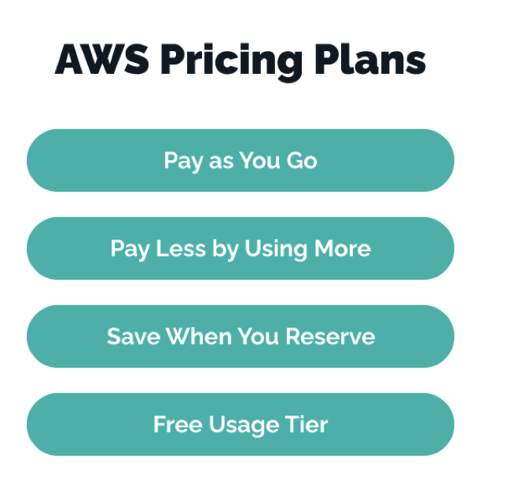
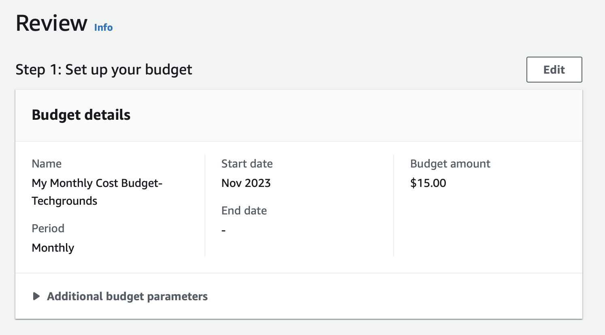

# AWS Pricing 
Using cloud solutions to meet your business goals and store valuable data safely is the right strategy. However, you should also consider the price for using them, correlate it with your financial plan, and clearly understand the perspective of a value proposition you get in exchange for your money.  
  
Amazon Web Services are built and offered according to the SaaS business model; that is, you may use the ready-made cloud solutions and pay for the storage and features you need and use to meet your business goal.

1. __AWS cost optimization:__ Before you even start using AWS, Amazon welcomes your business to think about your expense optimization in advance. According to the AWS cost optimization guide, you should start by analyzing your current business necessities, carefully matching the storage capacity with your demands, and paying attention to Saving Plans and EC2 Spot Instances. You are also welcome to carefully monitor how your business uses cloud services to find out the resource waste and optimize it immediately.
2. __Flexibility:__ Billing flexibility is one of the best features of using Software as a Service. In the case of AWS pricing, you may tailor the features of the chosen solution to your business needs and either use them on an on-demand basis or make a long-term commitment.
3. __Tiered pricing:__ Tiered pricing for certain services allows customers to use more of a particular service, they may qualify for lower prices per unit. These cost savings can increase usage and provide incentives for customers to scale their workloads on AWS.
4. __Variety of AWS pricing models:__ Depending on your business specifics, you can choose from five AWS pricing models.  
  

  
  
__AWS Free tier for:__

__S3:__ The free plan includes 5GB of Amazon S3 Storage. Additionally, you will receive S3 Standard Storage buckets with a monthly GET request limit of 20,000 and a maximum of 2,000 LIST, POST, COPY, or PUT requests per bucket. With a Data Transfer Out limit of up to 15 GB per month, Amazon completes the package.  
  
__EC2:__ As part of the AWS Free Tier, you can get started with EC2 for free. This includes 750 hours of Linux and Windows t2.micro instances (t3.micro for the regions in which t2.micro is unavailable), each month for one year. 

__Always free services:__ The AWS Free Tier provides customers the ability to explore and try out AWS services free of charge up to specified limits for each service. The Free Tier is comprised of three different types of offerings, a 12-month Free Tier, an Always Free offer, and short term trials.   
  
__What Is the Difference Between Capital and Operating Expenditures?__

 Capital expenditures, also known as CapEx, are costs that often yield long-term benefits to a company. CapEx assets often have a useful life of more than one year. Operating expenses (or OpEx) are costs that often have a much shorter-term benefit.

### Sources
* https://www.techmagic.co/blog/aws-pricing-model-overview/ 
* https://aws.amazon.com/ec2/pricing/ 
* https://www.nops.io/blog/aws-s3-pricing/
* https://aws.amazon.com/free/free-tier-faqs/ 
* https://www.investopedia.com/ask/answers/112814/whats-difference-between-capital-expenditures-capex-and-operational-expenditures-opex.
* https://www.youtube.com/watch?v=2XilJFirnWY

### Budget Alert
From Techground, I have been given a budget of 50 euros for my cloud usage in AWS (for the upcoming period). I have set up a monthly budget alert for this purpose, with a budget of 15 euros for each month. 

The settings of my budget can be seen in the following images:

  

  

As you can see I have set up a couple of alerts for my monthly budget. The alerts will be sent to my email. 