# ELB & Auto scaling
An EC2 Fleet contains the configuration information to launch a fleet—or group—of instances. In a single API call, a fleet can launch multiple instance types across multiple Availability Zones, using the On-Demand Instance, Reserved Instance, and Spot Instance purchasing options together.  

When you run an application with a spiky workload, you can host the application on a fleet of EC2 instances instead of a single server. When the demand for the application is high, Auto Scaling can automatically add instances to the fleet. When the demand is lower, it can similarly remove instances.

To make sure all servers are the same, Auto Scaling makes use of a (custom) AMI. Auto Scaling makes use of CloudWatch metrics to determine whether to add or remove instances.

Elastic Load Balancing automatically distributes your incoming traffic across multiple targets, such as EC2 instances, containers, and IP addresses, in one or more Availability Zones. It monitors the health of its registered targets, and routes traffic only to the healthy targets. Elastic Load Balancing scales your load balancer capacity automatically in response to changes in incoming traffic.

You configure your load balancer to accept incoming traffic by specifying one or more listeners. A listener is a process that checks for connection requests. It is configured with a protocol and port number for connections from clients to the load balancer.

1. __Application Load Balancer:__ 

   This ELB works using HTTP and HTTPS protocols (layer 7 of the OSI stack).
2. __Network Load Balancer:__   
This ELB works using TCP and UDP (layer 4 of the OSI stack).
2. __Classic Load Balancer:__   
This ELB is outdated and not recommended for use. AWS has (so far) almost never stopped supporting any services. The reason for this is that it can harm existing applications.
3. __Gateway Load Balancer:__   
This ELB acts as a gateway into your network, as well as a load balancer. It will first route traffic to a (3rd party) application that checks the traffic, like an IDS/IPS or Firewall. After the packet has been inspected, the GWLB acts like a NLB routing to your application. GWLB acts on layers 3 and 4 of the OSI stack.

### Sources
* https://docs.aws.amazon.com/AWSEC2/latest/UserGuide/ec2-fleet.html 
* https://docs.aws.amazon.com/AWSEC2/latest/UserGuide/instant-fleet.html 
* https://www.youtube.com/watch?v=YO4L_9poF3g 
* https://docs.aws.amazon.com/elasticloadbalancing/latest/userguide/what-is-load-balancing.html
* https://docs.aws.amazon.com/autoscaling/ec2/userguide/create-launch-template.html 

### Results
In the following screenshots, the necessary EC2 instance was created using a script that includes the setup of Apache and the initiation of the load page. 

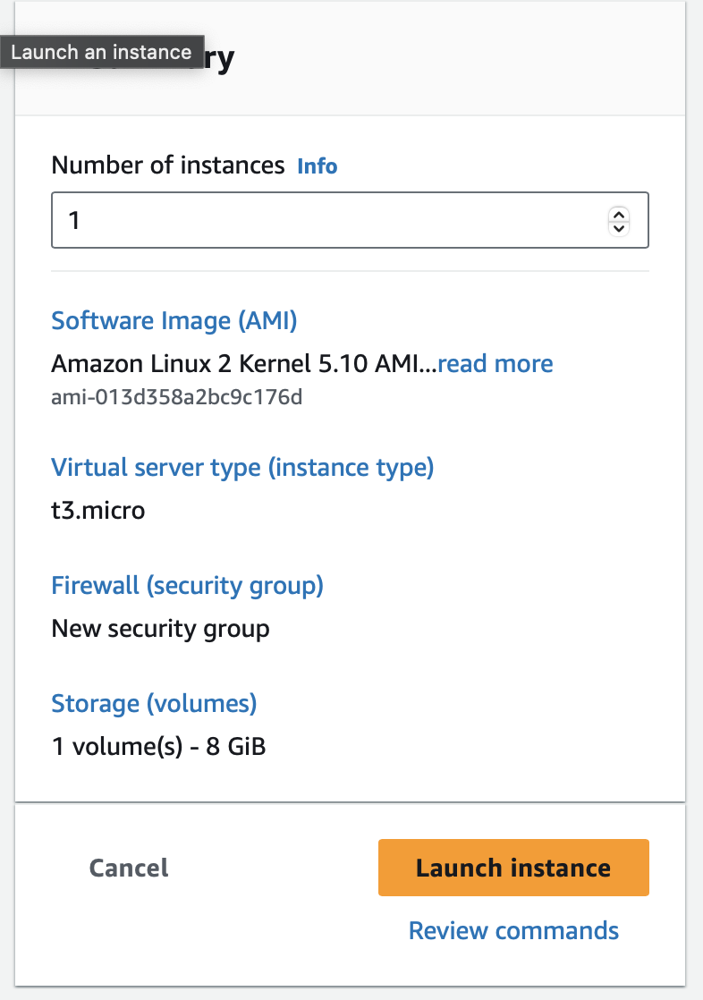 
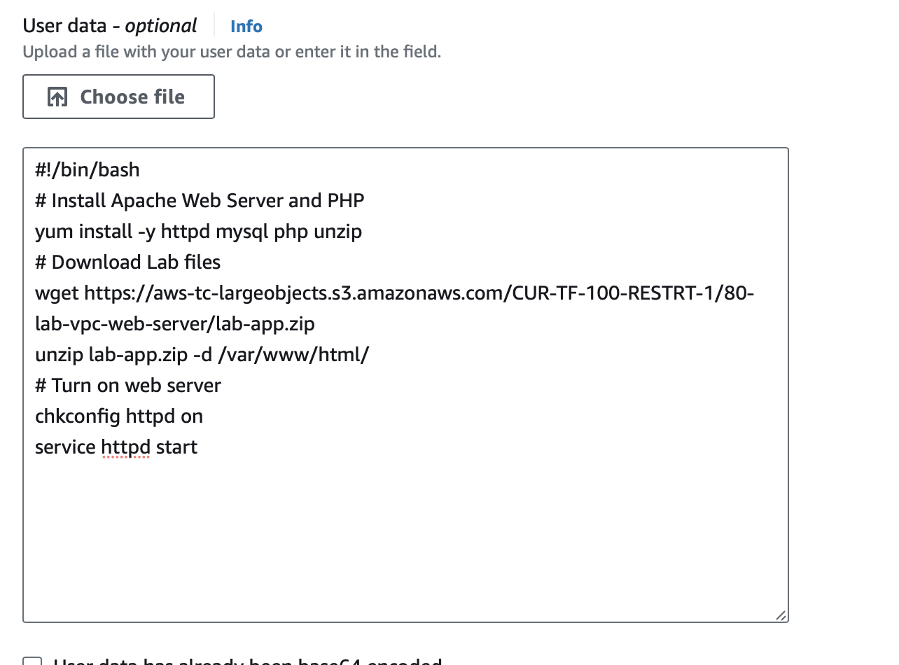 

From this instance an AMI was created. 

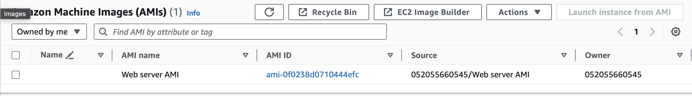 

To set up a load balancer, a security group and a target group were created. Subsequently, the load balancer was established. The requirements from Techgrounds have been incorporated into the development of the various services.

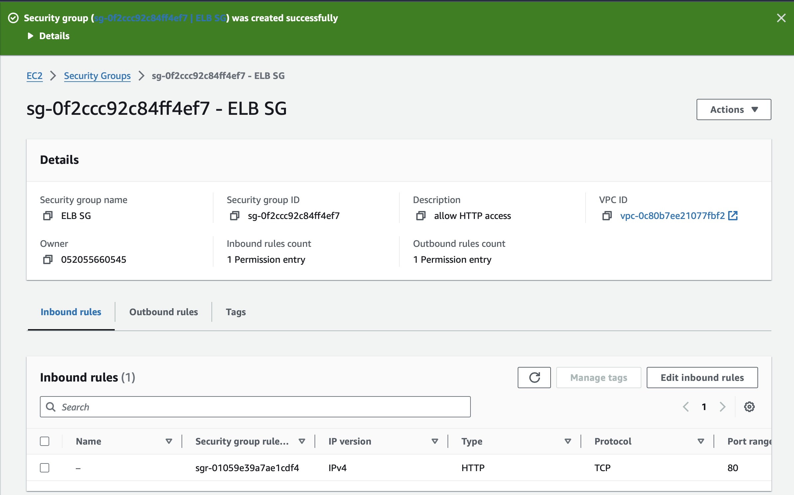
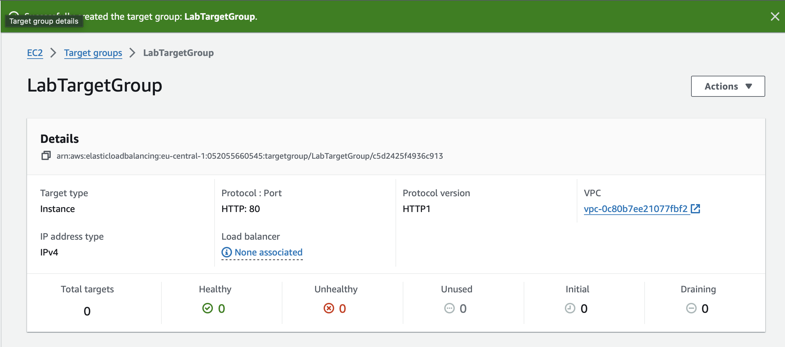
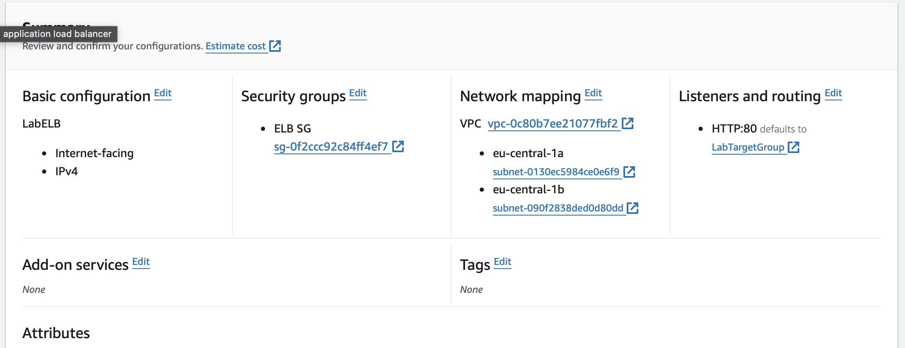

A configuration template has been made for the auto scaling group (which will be shown later on, because it is made after the configuration template). 

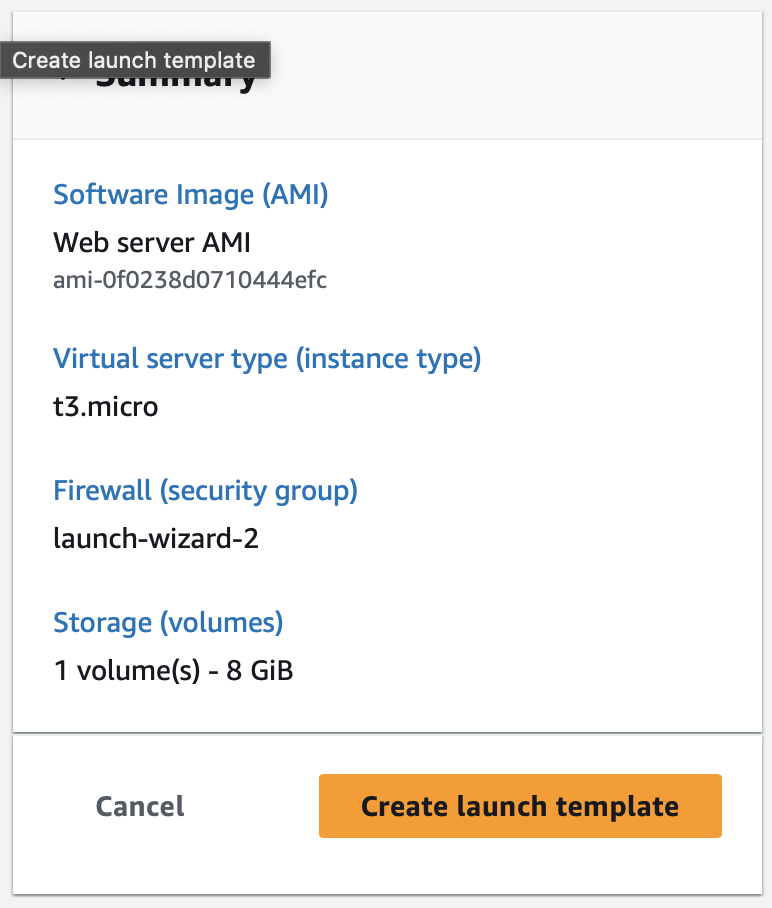

As you can see, the configuration has the same set up as the instance that is running and contains the AMI that I made of that instance. 

The next step is creating an auto scaling group with the following requirements:

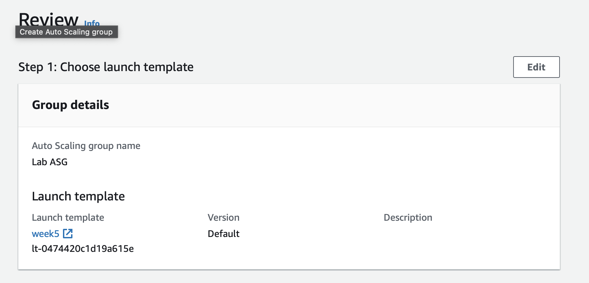
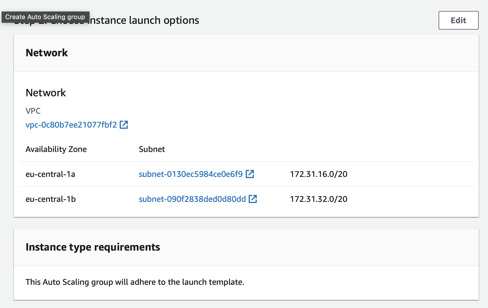
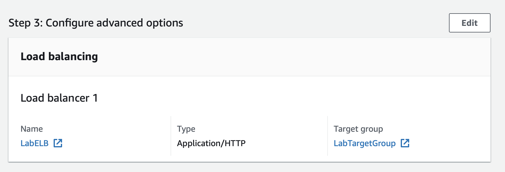
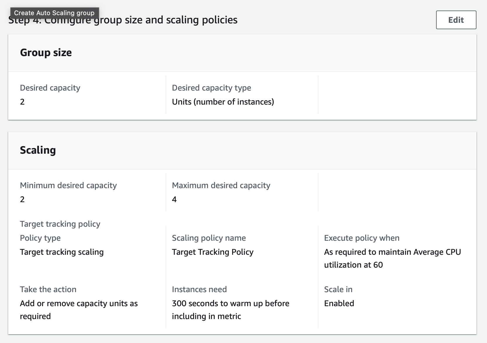

I checked that the EC2 instances are online and that they are part of the target group for the load balancer.

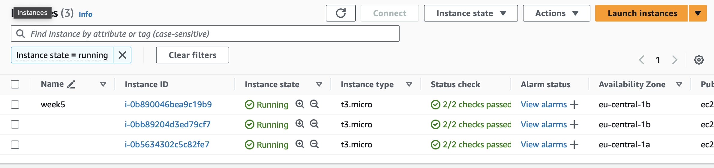
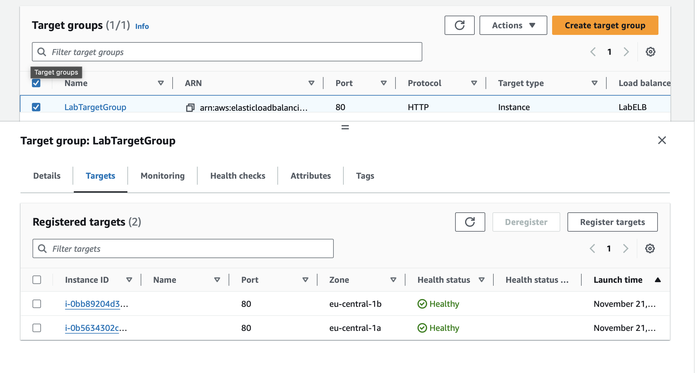

I accesed the server via the DNS name of the ELB. 
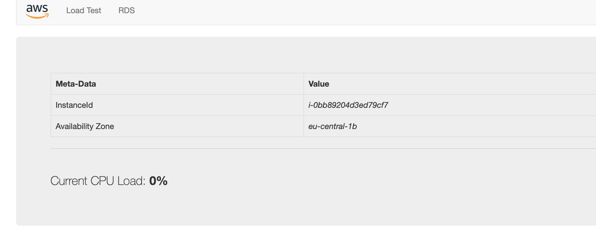
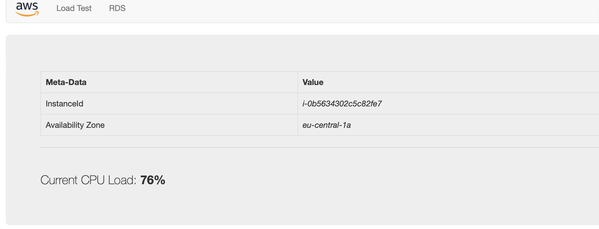 

I performed a load test by opening mutliple webbrowsers and activated the auto scaling. 

  

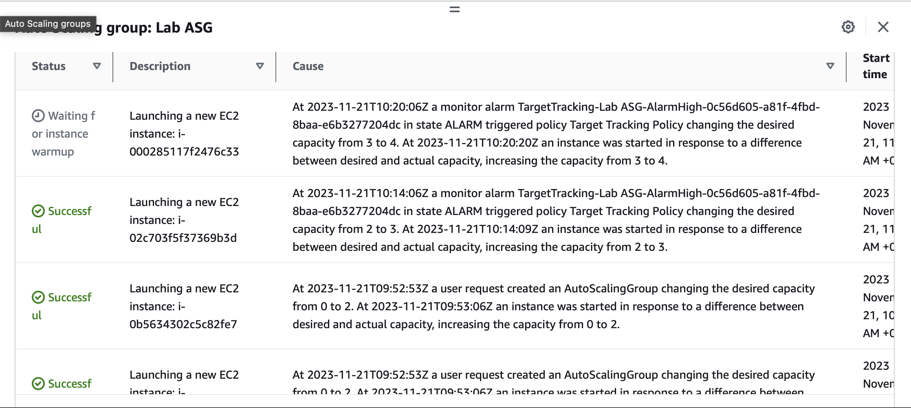

