# SNS, SQS and Event Bridge

## SNS

Amazon Simple Notification Service (Amazon SNS) is a managed service that provides message delivery from publishers to subscribers (also known as producers and consumers).

Clients can subscribe to the SNS topic and receive published messages using a supported endpoint type, such as Amazon Kinesis Data Firehose, Amazon SQS, AWS Lambda, HTTP, email, mobile push notifications, and mobile text messages (SMS).

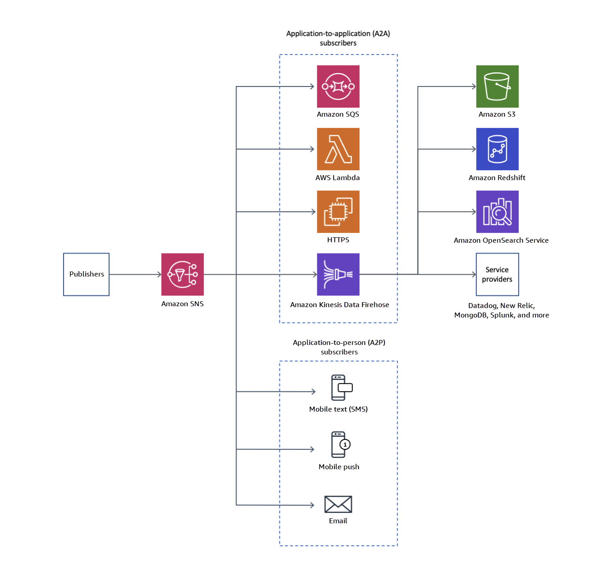  

## SQS

Amazon SQS provides several advantages over building your own software for managing message queues or using commercial or open-source message queuing systems that require significant upfront time for development and configuration.

Amazon SQS requires no administrative overhead and little configuration. Amazon SQS works on a massive scale, processing billions of messages per day. You can scale the amount of traffic you send to Amazon SQS up or down without any configuration. Amazon SQS also provides extremely high message durability, giving you and your stakeholders added confidence.

### Difference between SNS and SQS

Amazon SNS allows applications to send time-critical messages to multiple subscribers through a “push” mechanism, eliminating the need to periodically check or “poll” for updates. Amazon SQS is a message queue service used by distributed applications to exchange messages through a polling model, and can be used to decouple sending and receiving components. 

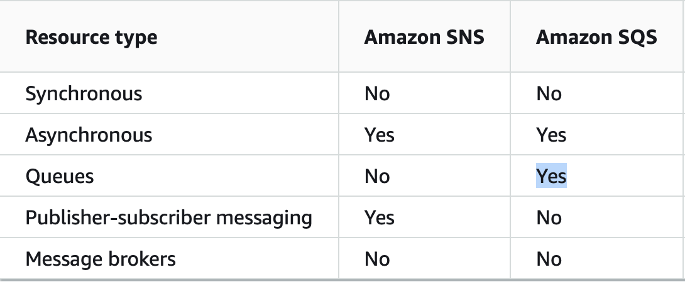 

## Amazon EventBridge

EventBridge is a serverless service that uses events to connect application components together, making it easier for you to build scalable event-driven applications. Event-driven architecture is a style of building loosely-coupled software systems that work together by emitting and responding to events. Event-driven architecture can help you boost agility and build reliable, scalable applications.

EventBridge is used to route events from sources such as home-grown applications, AWS services, and third-party software to consumer applications across organizations. 

 

EventBridge includes two ways to process events: event buses and pipes.

* Event buses are routers that receive events and delivers them to zero or more targets. Event buses are well-suited for routing events from many sources to many targets, with optional transformation of events prior to delivery to a target.
* Pipes EventBridge Pipes is intended for point-to-point integrations; each pipe receives events from a single source for processing and delivery to a single target. Pipes also include support for advanced transformations and enrichment of events prior to delivery to a target.

Pipes and event buses are often used together. A common use case is to create a pipe with an event bus as its target; the pipe sends events to the event bus, which then sends those events on to multiple targets.

 

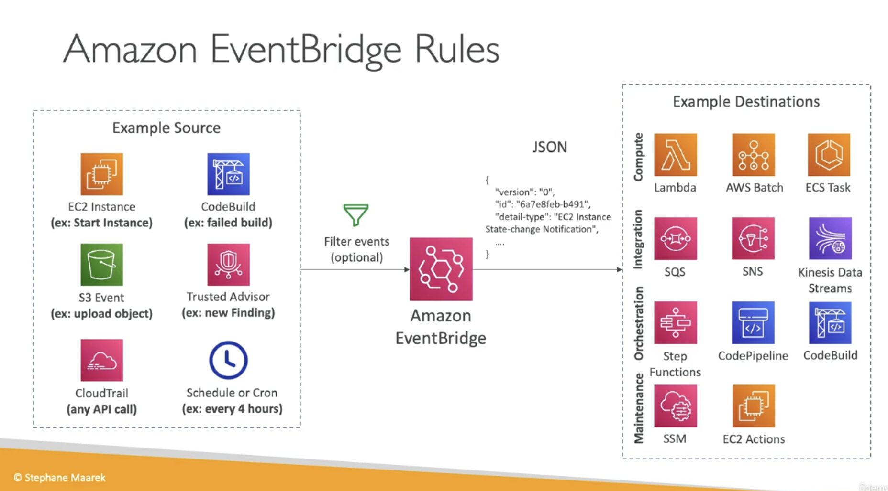 

### Sources
* https://aws.amazon.com/sqs/faqs/
* https://docs.aws.amazon.com/sns/latest/dg/welcome.html 
* https://docs.aws.amazon.com/eventbridge/latest/userguide/eb-what-is.html 
* https://www.udemy.com/course 
* https://www.youtube.com/watch?v=xyHLX1dUwuA 

### Practical Exercise
1. Create an Amazone SNS topic 

2. Create an Amazone SNS subscription

3. Create a rule in EventBridge

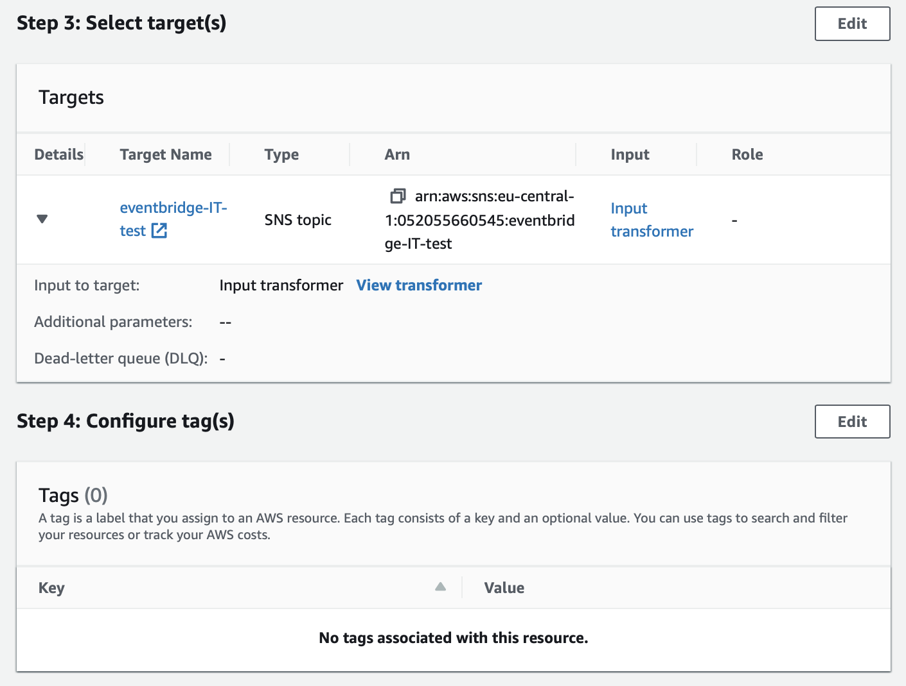
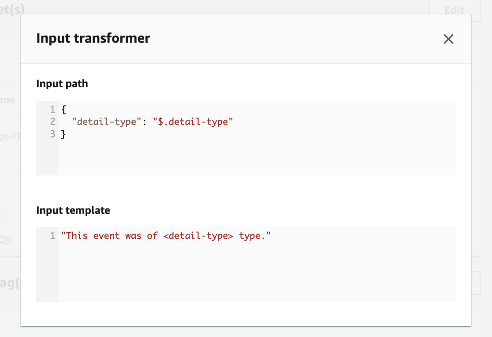
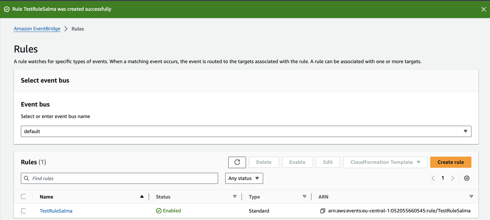

4. Send test event 

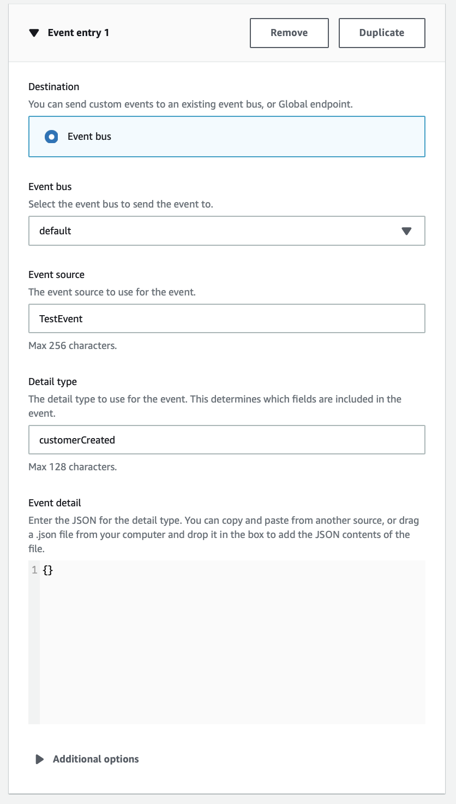
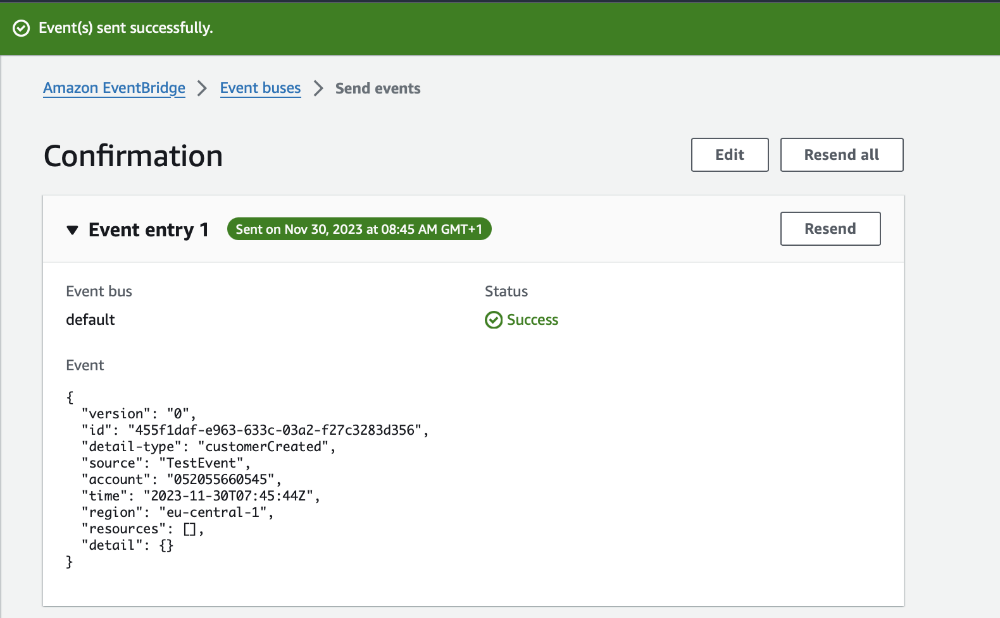

5. Confirm succes  

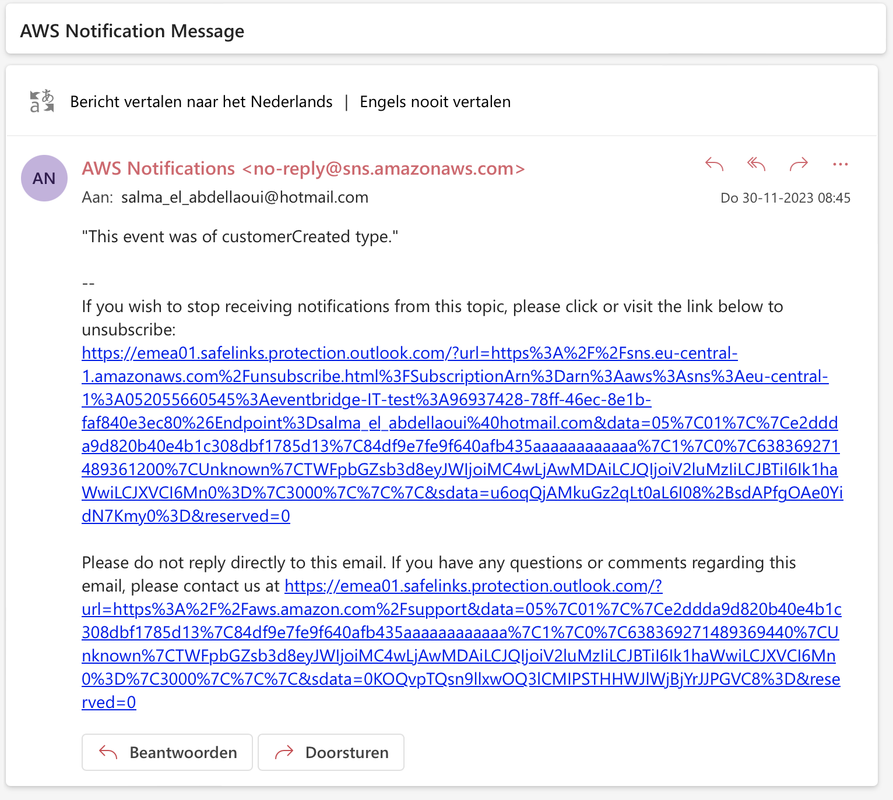

## SQS and Lamda

1. Create Lambda function 

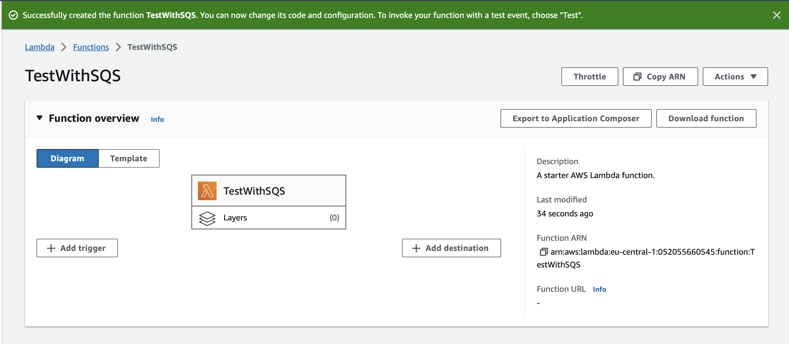

2. Create SQS queue

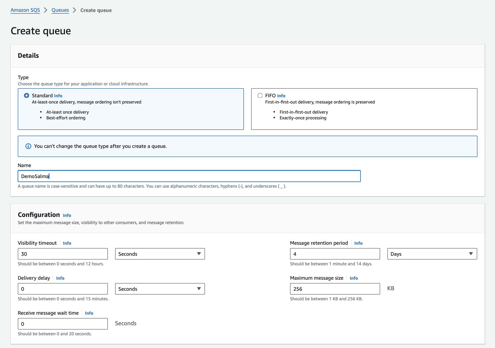
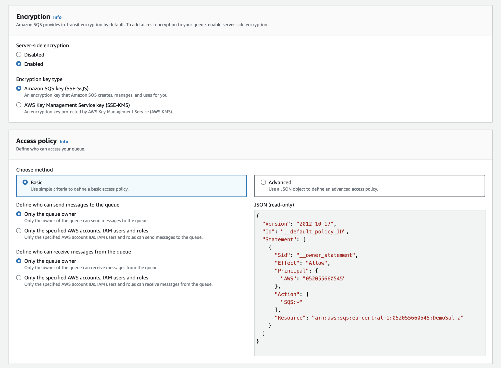

3. Add trigger to Lambda and connect with your SQS

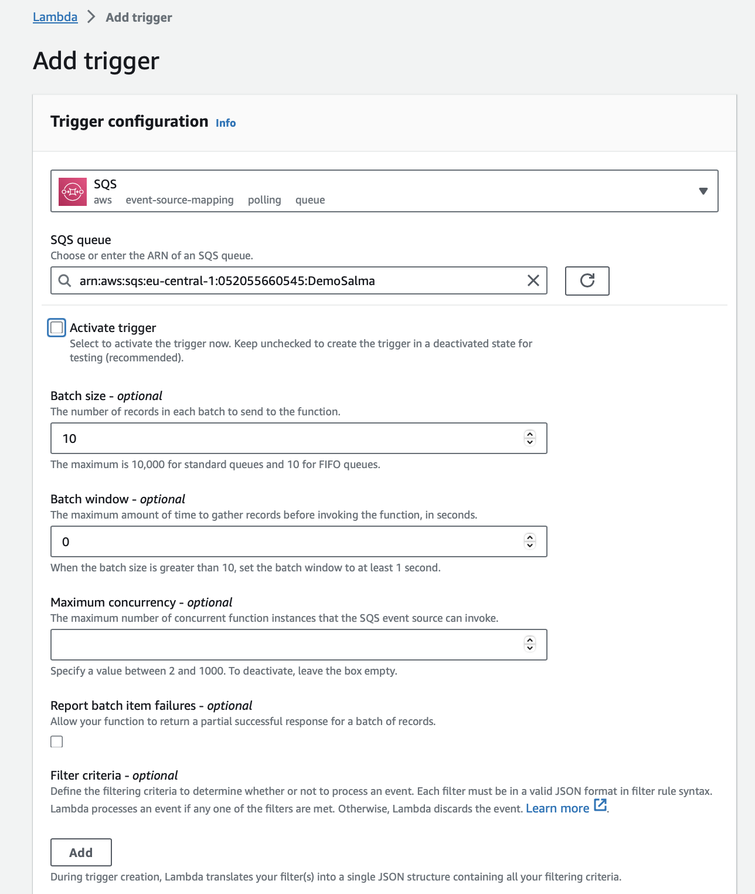
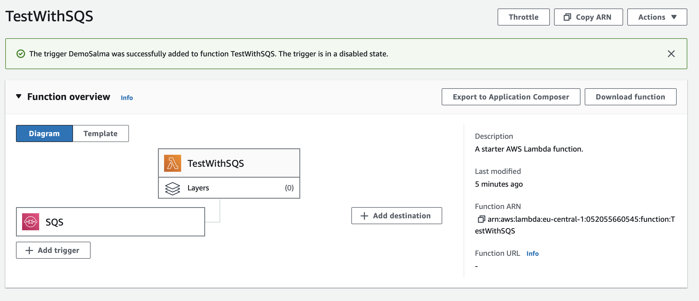  

4. Send Messages via SQS to Lambda

Message was recieved in the logs of cloudwatch
 
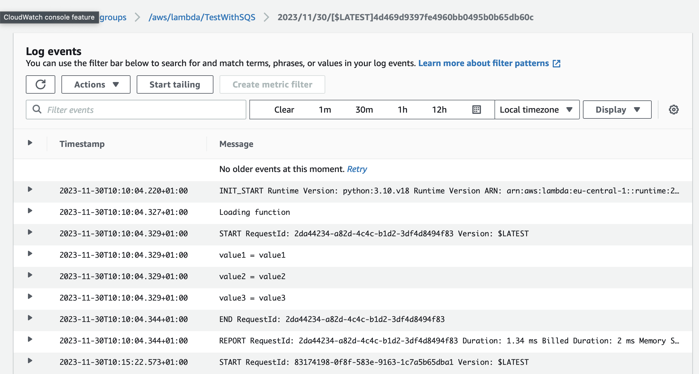

